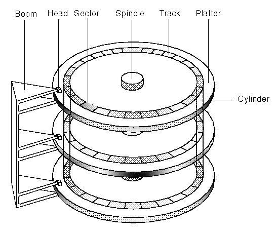
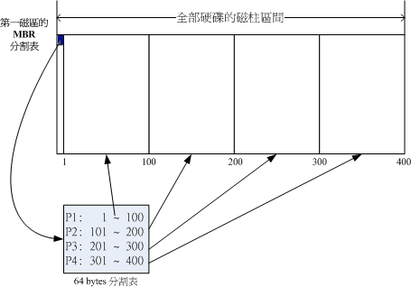
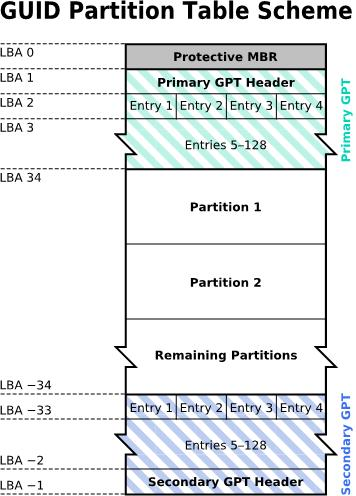
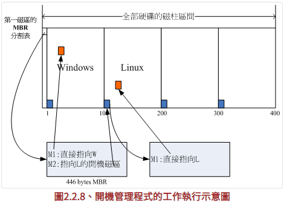
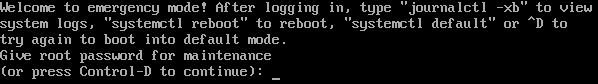

# 磁盘管理

在Linux系统上，从拿到一块新磁盘到使用磁盘、维护磁盘的过程，按照磁盘管理体系结构分5个层次，实际上也可以说是被分为5个操作步骤

**磁盘管理体系结构**

| 层次   | 功能               | 知识点                                                       |
| ------ | ------------------ | ------------------------------------------------------------ |
| 第五层 | 磁盘管理维护       | 管理磁盘命令                                                 |
| 第四层 | 格式化磁盘         | 格式化磁盘：格式化、文件系统、挂载知识，创建文件系统初始化inode和block |
| 第三层 | 磁盘分区           | 磁盘分区：分区知识，主、扩展、逻辑、分区表知识，分区命令fdisk、parted |
| 第二层 | 完成RAID LVM等操作 | 磁盘阵列知识：RAID知识、软硬RAID、LVM知识                    |
| 第一层 | 物理磁盘           | 物理磁盘知识：磁盘外部结构、接口、内部结构、工作原理、读写原理 |

## 一、磁盘结构

磁盘管理体系结构的第一层，首先是需要拿到一块新的磁盘

### 1.1 磁盘的外部结构

根据台式机与笔记本的区别，硬盘分为3.5和2.5英寸。一块机械硬盘主要由**盘片、机械臂、电子探头、主轴马达**组成。所有的实际数据由盘片保存，读写数据需要通过电子探头完成。实际运行时，主轴马达带动盘片转动，机械臂通过径向运动伸展电子探头在盘片上进行读写操作

### 1.2 磁盘的内部结构

- 磁头（Head）：磁头数量与盘面数量相同，采用径向运动读写数据
- 磁道（Track）：由多个同心圆组成，最外圈圆为0磁道。磁盘默认按照磁道查找数据，磁头的径向运动被称为寻道，径向运动属于机械运动，速度较慢
- 扇区（Sector）：扇区是**磁盘**最小的存储单位，block是**系统**最小的存储单位。默认磁盘扇区从1扇区开始，扇区大小为512字节
- 柱面（Cylinder）：不同盘面上相同的磁道组成的圆柱体，磁盘默认按照柱面进行读写。磁头之间的切换是电子切换，速度较快
- 单元块（Units）：表示单个柱面大小

磁盘查找数据时，会先从0磁道开始找，整个0磁道的单元块都找不到数据才会切换磁道，此间，柱面内切换盘片查找数据是电子切换，柱面间切换磁道查找数据属于机械运动。读写皆是以柱面为单位进行读写，整个柱面数据写完后才会切换磁盘写

扇区是物理层面的概念，是硬盘的最小存储单位，对于操作系统而言，由于扇区数量庞大，操作系统并不直接对扇区操作，block是操作系统读写数据的最小单位，也叫*磁盘簇*。操作系统将相邻的扇区组合在一起，形成一个block，每个block可以包括2、4、8、16或64个扇区

数据读写原理

1. 磁头开始读取 0磁头 0磁道 1扇区的数据（MBR 引导系统启动）
2. 磁头做电子运动，进行切换磁头，再读写数据 1磁头 0磁道
3. 磁头做机械运动（径向运动），移动磁头再读写数据 0磁头 1磁道



大部分磁道示意图都是指向同心圆的一条线，可能会给人一种错觉，就是那条线就是磁道。但磁道实际上不是*同心圆*，而是*同心圆环*。关于磁道上的扇区数量，早期的磁盘每个磁道上的扇区数目是一样的，限制了磁盘的容量；后来为了增大磁盘容量采用了新技术，越往外每磁道的扇区数目越多，但单个扇区大小始终一样

## 二、RAID、LVM

磁盘管理体系结构的第二层，对于新增磁盘容量的需求，此步骤实际上不是必要步骤。在个人PC场景下大多数时候是直接将新磁盘进行分区，而不需要进行RAID或LVM操作，即便在标准业务场景下，RAID或LVM也是按实际使用需求才会使用的技术。RAID和LVM属于在物理磁盘与文件系统之间构建了一个“逻辑抽象层”，主要解决了数据冗余、磁盘扩容的问题，两者都属于*虚拟磁盘技术*

### 2.1 RAID

RAID全称独立磁盘冗余阵列，是一种将多个物理磁盘组合成一个逻辑磁盘的技术，旨在提高存储性能、数据可靠性。RAID的类型又分为硬RAID和软RAID，在存储设备上因为硬盘较多，硬件RAID卡管理不便，所以使用的是软RAID，硬RAID仅在服务器上比较常见

#### 2.1.1 常见RAID级别

**RAID 0**：无差错校验的分条RAID，`RAID 0`的性能就是所有硬盘性能的总和，读写都是以分条为单位进行读写，但任意一块盘的损坏都会造成整个RAID数据不可用

**RAID 1**：镜像结构的RAID，数据写入`RAID 1`时需要经过镜像器，镜像器将一个IO下发写成两个IO下发；数据通过轮询的方式读取数据，读性能略有提升

**RAID 3**：带奇偶校验码的分条RAID，`RAID 3`使用单独的一块磁盘作为校验盘；每一块数据盘的一次IO都会导致校验盘的IO，在数据盘较多的场景下，每块数据盘的IO次数综合到一起都会为校验盘造成大量IO数据，导致校验盘实际比数据盘寿命更短，更换校验盘需要重构校验码，对数据盘产生开销，且计算出的校验数据实际对主机也没有任何用处；`RAID 3`由于检验盘的原因无法做到并发IO，数据盘可以做到并发IO，但每一块数据盘的每一次IO都会对校验盘有一次IO，并发场景下，校验盘的IO次数是数据盘的条带宽度的倍数，校验盘的IOPS将会累计到一个非常庞大的数量

**RAID 5**：分布式奇偶校验码的独立硬盘结构，与`RAID 3`不同的是`RAID 5`中不再分数据盘和校验盘，`RAID 5`中所有磁盘都是成员盘，`RAID 5`可以实现并发IO，但并发性能会受硬盘数量的影响，建议最好是4块盘以上组成`RAID 5`

**RAID 6**：具备两种校验算法的RAID类型（P+Q、DP），采用`N+2`个硬盘构成阵列；P+Q算法存储校验码与`RAID 5`类似，斜向存储校验码，DP算法存储校验码与`RAID 3`类似，单独将校验码存储在两个不同的磁盘里

**RAID 10**：混合RAID，组内做`RAID 1`，组间做`RAID 0`

#### 2.1.2 mdadm模拟RAID

mdadm是CentOS系统上的RAID管理软件，通过mdadm命令可以实现模拟各个RAID级别的效果，虽然通过mdadm创建的RAID也可以被称为软RAID，但需要注意的是，与上文提到的存储设备上的软RAID不同，mdadm仅用作模拟RAID的效果，一般在生产环境中不会使用mdadm创建RAID，所以此处mdadm命令仅作演示作用

```bash
# 创建一个RAID 5
[root@localhost ~]# mdadm --create /dev/md0 --level=5 --raid-devices=3 /dev/sdb /dev/sdc /dev/sdd
	--level (-l)：设置RAID级别
	--raid-devices (-n)：设置活动磁盘数量
	--spare-devices (-x)：设置备用磁盘数量
	--chunk：设置条带大小，默认512KB，此参数的调整会影响到IO性能
[root@localhost ~]# cat /proc/mdstat    # 查看实时同步进度
Personalities : [raid6] [raid5] [raid4] 
md0 : active raid5 sdd[3] sdc[1] sdb[0]
      209582080 blocks super 1.2 level 5, 512k chunk, algorithm 2 [3/2] [UU_]
      [=====>...............]  recovery = 25.1% (26387456/104791040) finish=10.1min speed=129176K/sec
      
unused devices: <none>
[root@localhost ~]# mdadm --detail /dev/md0    # 查看设备详细状态

# 模拟磁盘故障与更换
[root@localhost ~]# mdadm --manage /dev/md0 --fail /dev/sdb    # 标记sdb磁盘故障
[root@localhost ~]# mdadm --manage /dev/md0 --remove /dev/sdb    # 从RAID组中移除sdb磁盘
[root@localhost ~]# mdadm --manage /dev/md0 --add /dev/sde    # 添加新硬盘自动重建RAID
[root@localhost ~]# mdadm --detail /dev/md0

# 删除RAID阵列
[root@localhost ~]# umount /dev/md0
[root@localhost ~]# mdadm --stop /dev/md0
[root@localhost ~]# mdadm --zero-superblock /dev/sdb /dev/sdc /dev/sdd /dev/sde
```

### 2.2 LVM

在业务场景下使用标准分区在硬盘上创建文件系统时，随着时间的推移硬盘的可用空间会愈发接近红线，这种情况下就必须考虑更换更大容量的磁盘，此时就涉及到数据迁移问题。为了避免这种问题，LVM能够在无需重建整个文件系统的前提下，动态扩容存储空间，实现更简易的磁盘空间管理

LVM又称为逻辑卷管理，它将Linux系统上的真实分区或物理磁盘通过软件组合为一块逻辑上的存储空间池（VG），然后从这个存储空间池中划分需要使用的存储空间（LV），最后挂载使用。LVM有4个核心术语需要了解

- **Physical Volume，PV，物理卷**

  PV是LVM的最底层，Linux系统上的系统分区或磁盘都需要先经过pvcreate指令将其转换为LVM的PV后，才能对PV进行下一步动作，每个PV都会映射到系统分区或物理磁盘上

- **Volume Group，VG，卷组**

  多个PV集中在一起就形成一个VG，一个VG可以由来自不同系统分区、不同物理磁盘的PV组成，卷组提供了一组存储资源池，在64位的Linux操作系统上，理论上VG的存储资源池容量几乎没有上限

- **Logical Volume，LV，逻辑卷**

  LVM整体结构的最上层是LV，LV为Linux提供了创建文件系统的分区环境，用户最终使用的就是LV，每一个LV一定是从VG的资源池中提取的硬盘容量。为了便于管理员使用LVM管理系统，LV的设备名称通常指定为`/dev/vgname/lvname`样式

- **Physical Extent，PE，物理区块**

  PE是LVM的最小存储单元，LVM的所有数据写入都是借助PE实现的，PE对于LVM就类似于Block对于文件系统，调整PE的数量会直接影响到LVM的最大容量，每个LV的大小也与此LV内的PE数量有关

简而言之，用户真正能够直接当做硬盘空间使用的只有LV，对LV进行格式化后就能够挂载在系统上，而LV的容量又必须是从VG中获取，VG又由多个PV组成，PV的本质就是单个或多个不同的物理硬盘或系统分区


在以上结构图中还有一部分未使用的硬盘空间，通过LVM，管理员可以将这部分空间分配到已存在的VG中，既可以使用它创建一个新的LV、也可以在已存在的LV需要更多空间的时候用于扩展LV空间

#### 2.2.1 LVM的三个重要功能

LVM有两个版本，CentOS7上默认使用LVM2，LVM2可用于Linux内核2.6版本，它在标准的LVM1的基础上提供了几个额外功能

1. 快照

   LVM1仅允许创建只读快照，一旦创建快照后就不能够继续写入数据，LVM2允许创建在线LV的可读写快照

2. 条带化

   LVM将文件写入LV时，文件中的数据会被分散到多个硬盘上，每个后继的数据块会被写到下一个硬盘上。条带化有助于提高硬盘性能，因为同一个文件的多个数据块能够同时写入多个硬盘，这个功能也同样适用于读取顺序访问的文件，LVM能够同时从多个硬盘读取数据

   LVM的条带化不同于RAID条带化，LVM条带化不提供用于创建容错环境的校验信息，所以LVM条带化会增加文件因硬盘故障而丢失的概率，单个硬盘故障可能造成多个LV无法访问

3. 镜像

   为了避免因断电或磁盘故障导致文件系统损坏无法恢复，LVM镜像是这个问题的解决办法之一。LVM镜像是一个实时更新的LV的完整副本，管理员创建一个LV时，LVM也会将原始LV同步到镜像副本中，根据原始LV的大小，这可能会需要一些时间完成

   一旦原始同步完成，LVM会为文件系统的每次写操作执行两次写入，这个过程会降低系统的写入性能，但它能够保证数据的安全性

#### 2.2.2 LVM命令解析

1. 创建PV

   ```bash
   # 创建磁盘分区
   [root@localhost ~]# parted -s /dev/sdb mklabel gpt mkpart primary 0 100%
   [root@localhost ~]# parted /dev/sdb set 1 lvm on    # 将分区标识为lvm
   
   # 检查系统是否安装lvm2
   rpm -qa | grep "lvm"
   
   # 将分区创建为pv    
   [root@localhost ~]# pvcreate /dev/sdb1
   [root@localhost ~]# pvdisplay /dev/sdb1    # 查看已经创建的pv列表
   ```

2. 创建VG

   在Linux系统上创建多少VG没有既定的规则，可以将所有PV加入一个VG中，也可以结合不同的PV创建多个VG

   ```bash
   [root@localhost ~]# vgcreate vg01 /dev/sdb1    # 创建VG
   [root@localhost ~]# vgdisplay vg01    # 查看指定VG组的信息，不指定VG组名则查看所有VG列表
   ```

3. 创建LV

   ```bash
   # 创建LV
   [root@localhost ~]# lvcreate -l 100%FREE -n lv01 vg01    # 从VG中创建LV
       -l：从VG中按可用空间的百分比来分配LV的大小
       -L：从VG中按字节（KB、MB、GB）为单位来指定LV的大小
       -n：指定LV的名称
   [root@localhost ~]# lvdisplay vg01    # 查看VG中的LV信息
   ```

4. LV的扩容、缩容

   在手动增加或减小LV的大小时，LV中的文件系统需要另外再手动修正大小的改变，大多数文件系统都包含了能够重新格式化文件系统的程序，例如用于ext文件系统的resize2fs程序。LV的扩容与缩容动作完全相反且层层递进，扩容需要先增加LVM的容量再调整文件系统的大小，缩容则需要先调整文件系统的大小再减小LVM的容量

   ```bash
   # LV的扩容
   [root@localhost ~]# parted -s /dev/sdc mklabel gpt mkpart primary 0 100%    # 新建分区
   [root@localhost ~]# parted /dev/sdc set 1 lvm on      # 将分区标识为lvm
   [root@localhost ~]# pvcreate /dev/sdc1                # 新建PV
   [root@localhost ~]# vgextend vg01 /dev/sdc1           # 扩展VG容量
   [root@localhost ~]# lvextend -L +5G /dev/vg01/lv01    # 扩展LV容量
   [root@localhost ~]# resize2fs /dev/vg01/lv01          # 扩展文件系统
   
   # LV的缩容
   [root@localhost ~]# umount /dev/vg01/lv01           # LV缩容前必须先取消挂载
   [root@localhost ~]# e2fsck -f /dev/vg01/lv01        # 强制检查磁盘
   [root@localhost ~]# resize2fs /dev/vg01/lv01 10G    # 缩减文件系统
   [root@localhost ~]# lvreduce -L 10G /dev/vg01/lv01  # LV缩容
   [root@localhost ~]# vgreduce vg01 /dev/sdc1         # 将 /dev/sdc1 从 vg01 中移除
   [root@localhost ~]# pvremove /dev/sdc1              # 移除PV
   ```

5. LVM的移除

   ```bash
   # 删除LV
   [root@localhost ~]# lvremove /dev/vg01/lv01
   
   # 删除VG
   [root@localhost ~]# vgremove vg01
   
   # 删除PV
   [root@localhost ~]# pvremove /dev/sdb1
   ```

## 三、系统分区

现在常见的分区方式分2种：MSDOS与GPT。MSDOS分区方式中，磁盘的第一个扇区非常重要，该扇区保存重要数据，被称为MBR（Master Boot Record）格式，MSDOS出现比较早，此模式兼容大部分分区场景，但由于近年来磁盘容量不断增大，甚至部分大于2TB的硬盘分区让部分OS无法读写，因此后来推出了新的分区格式GPT

### 3.1 MSDOS（MBR）与GPT

通常文件系统的最小单位是柱面（Cylinder)，也就是分区时的最小单位，但近来GPT分区表可达到64bit记录功能，所以现在甚至可以使用扇区（sector）号来作为分区单位

#### 3.1.1 MSDOS分区表

早期Linux系统为兼容Windows的磁盘，使用了支持Windows的MBR方式处理开关机管理程序与分区表，开关机管理程序与分区表都放在磁盘的第一个扇区，该扇区通常是512Bytes（旧磁盘扇区都是512Bytes大小），这个扇区中保存2个数据：

- 主引导记录（MBR）：可以安装开关机管理程序的地方，446Bytes
- 分区表（partition table）：记录整个硬盘的分区状态，64Bytes
- 分区结束标识：55AA，2Bytes

由于分区表只有64Bytes，而每个分区需要16Bytes，因此最多能有4个分区，每个分区都会记录自身的起始与结束的柱面号



假设设备上有一块硬盘，且这块硬盘只有400个柱面，将此硬盘分出4个分区，假设每100个柱面为1个分区。该硬盘在系统中的设备名是`/dev/sda`，实际命名还会在这个设备名后面接一个数字，这个数字与分区有关，例如`/dev/sda1`隶属于第一个分区，第一个分区记录1到100号柱面范围，那么数据要写入`/dev/sda1`时就会写入到这个磁盘的1到100号柱面之间

由于分区表只有64Bytes，最多只能记录4个分区，这4个分区被称为主分区（Primary）或扩展分区（Extended），总结：

- 分区仅针对64Bytes的分区表进行设置
- 磁盘默认的分区表仅能记录4个分区
- 这4个分区被称为主分区或扩展分区
- 分区的最小单位通常是柱面
- 系统要写入磁盘时，一定会参考分区表，才能对某个分区进行数据处理

如果分区类型都是主分区，那么分区表仅能记录4个分区，通过扩展分区的方式能够扩大这个分区数量

[](https://imgse.com/i/xjtby6)

上图将扩展分区简化了，实际上扩展分区并不止占用一个分区，而是会分布在每个分区的最前面几个扇区用于记录分区信息。**扩展分区的实质是使用额外的扇区记录分区信息，扩展分区本身不能格式化**，由扩展分区分割出来的空间称为逻辑分区（logical partition），同时，由于逻辑分区是从扩展分区中分割出来的，所以逻辑分区可以使用的柱面范围只能是扩展分区设置的柱面范围。逻辑分区在系统中的设备名必须从`/dev/sda5`开始，因为`1~4`都是保留给主分区或扩展分区的。总结：

- 主分区最多存在4个分区
- 扩展分区最多存在1个分区
- 逻辑分区是由扩展分区延申的分区
- 扩展分区无法格式化，主分区和逻辑分区被格式化后能够用于读写数据

分区一般是以柱面为单位的连续的磁盘空间，如果要对一个磁盘完全分区并保留部分容量，那么P+P+P+E的分区方式是比较合适的，而考虑到磁盘的连续性，一般建议将扩展分区的柱面号码分配在最后面的柱面内

MBR分区表除了上述的主分区、扩展分区、逻辑分区需要注意以外，由于每组分区表只有16Bytes，容量相当有限，所以MBR分区表中的限制经常可以发下如下问题

- 操作系统无法识别2.2T以上的硬盘容量
- MBR仅有一个扇区，如果被破坏将无法或很难修复
- MBR内存放开关机管理程序的扇区仅446Bytes，无法容纳较多程序代码

#### 3.1.2 GPT分区表

GPT全称GUID partition table，过去一个扇区大小是512Bytes，现在已有4K的扇区设计出现，为了兼容所有磁盘，因此在扇区的定义上大多使用逻辑块地址（Logical Block Address，LBA）来处理。GPT将所有磁盘的扇区以LBA（预设为512Bytes）来规划，第一个LBA称为LBA0

GPT使用34个LBA扇区来记录分区信息，除了前面的34个LBA之外，磁盘最后33个LBA也用于备份，相比较MBR仅使用第一个512Bytes扇区来记录分区信息更加安全



- LBA0（MBR兼容扇区）

  与MBR模式相似，此扇区分为2部分，一是与MBR相同的存储开关机管理程序的446Bytes区域、二是原本MBR用于存储分区表的64Bytes，在这64Bytes里放入了一个特殊标识，用于表示此磁盘是GPT的分区格式。不支持GPT分区表的磁盘管理程序无法识别这个磁盘，除非用户有特殊要求要处理这个磁盘，否则管理程序不能修改分区信息

- LBA1（GPT表头记录）

  记录分区表本身的位置与大小，同时记录备份GPT分区表（磁盘末尾的33个扇区）的存放位置和分区表的校验机制码（CRC32），OS根据校验码判断GPT是否正确，如果错误可以通过这个扇区找到备份的GPT分区表来恢复GPT的正常运转

- LBA2\~33（实际记录分区信息）

  从LBA2扇区开始，**每个LBA可以记录4个分区信息，所以在默认情况下，共可以有4\*32=128个分区**。由于每个LBA有512Bytes，因此每个分区记录用到128 Bytes的空间，除了每个分区记录所需要的识别码与相关的信息之外，**GPT在每个分区记录中分别提供了64bits来记录开始/结束的扇区号**，因此GPT分区表对于单个分区的最大容量限制在*2^64 \* 512Bytes = 8ZB*

GPT分区模式可以提供128个分区，Linux的核心配置记录中，过去针对单一磁盘最多只能达到15个分区，现在由于Linux Kernel通过udev等方式的处理，已经没有这个限制。GPT分区模式没有主分区、扩展分区、逻辑分区的概念，每个分区都能够独立存在，所以每一个分区都被视为主分区

新版的Linux大多能够识别GPT分区表，但在磁盘管理工具上，fdisk不识别GPT，要使用GPT需要操作gdisk或parted工具，开关机管理程序上，grub第一版不识别GPT，需要grub2才识别。另外，不是所有的OS或硬件都能识别GPT，能否读写GPT格式又与开机检测程序有关，也就是BIOS与UEFI

#### 3.1.3 BIOS与UEFI

BIOS与UEFI都是开机检测程序，在计算机的世界里没有软件的硬件是无用的，为了硬件资源的合理分配而产生了操作系统这个软件，由OS控制所有硬件并提供核心功能，由此识别磁盘内的文件系统，进一步读取磁盘内的软件程序。但OS本身也只是个软件，硬件是如何识别并运行OS的？这就需要涉及到开机程序，目前主机在加载硬件驱动方面的程序主要有早期的BIOS与新的UEFI两种机制

##### 3.1.3.1 BIOS 搭配 MBR/GPT 的开机流程

BIOS是一套基本固件程序，这套程序被写死到主板的一块芯片中，主机开机时会主动执行的第一个程序就是BIOS。BIOS会读取主机的存储设备，以硬盘为例，BIOS会根据使用者的设置读取能够开机的硬盘，并**读取到该硬盘的第一个扇区的MBR位置，MBR这个仅有446Bytes的磁盘容量内放置了最基本的开机管理程序**，此时BIOS的工作完成，接下来就是MBR内的开机管理程序的工作

**开机管理程序的目的在于载入（load）核心程序**，开机管理程序是OS在安装时提供的，所以其识别磁盘内的的文件系统格式，因此能够读取核心程序，接下来就是核心程序的工作，开机管理程序与BIOS工作完成，之后就是OS的工作

总结简述整个开机流程到操作系统的动作：

1. BIOS：开机主动执行的固件，识别第一个可开机的设备（大概率是硬盘）
2. MBR：第一个可开机设备的第一个扇区内的主引导记录区，内含开机管理程序
3. 开机管理程序（boot loader）：一个可读取执行核心程序的软件
4. 核心程序：开始操作系统的功能

关于第2点，如果分区表是GPT格式，那么BIOS也能够从LBA0的MBR兼容区域读取到第一阶段的开机管理程序码，如果启动引导能够识别GPT的话，那么使用BIOS同样能够读取到正确的操作系统核心，如果开机管理程序无法识别GPT，例如Windows XP，则无法读取核心程序，开机失败

由此可知，BIOS与MBR都是硬件本身支持的功能，`Boot Loader`则是由OS安装在MBR上的一个软件。由于MBR仅有446Bytes，所以这个开机管理程序是非常小的，`Boot Loader`的主要功能有：

- 提供选单：用户可以选择不同的开机选项
- 加载核心程序：直接指向可开机的设备的核心程序来启动OS
- 转交其他loader：将开机管理程序的功能转交给其他loader负责

第3点是多系统的重要功能，表示主机内可以具备2个以上的开机管理程序。硬盘只有一个MBR，但是**开机管理程序除了可以安装在MBR以外，还可以安装在每个分区的启动扇区**

例如，电脑中仅一块硬盘，切成四个分区，分区一、二分别安装Windows及Linux，假设MBR内安装的是可同时识别Windows/Linux操作系统的开机管理程序，那么整个流程如下



MBR的开机管理程序提供两个选单，选单一（M1）直接加载Windows的核心程序开机；选单二（M2）将开机管理程序转交给第二个分区的启动扇区。用户开机时选择选单二时，整个开机管理工作就会交给第二个分区的开机管理程序，第二个开机管理程序启动后就只有一个开机选单，使用Linux核心程序开机。综上总结：

- 每个分区都有自己的启动扇区
- 实际可开机的核心程序放置在各自的分区内
- loader仅识别自己系统分区内的可开机核心程序，以及其他loader
- loader可以直接指向或者间接将管理权转交给另一个管理程序

> **补充：双系统安装建议**

安装双系统时建议先安装windows，因为windows安装时会主动覆盖掉MBR及自身所在分区的启动扇区，没有选择的机会。而Linux安装时可以选择将开机管理程序安装在MBR或各别分区的启动扇区，而且Linux的loader可以设置选单，可以在Linux的boot loader里加入windows的开机选项

先安装Linux再安装windows时，MBR的开机管理程序就只会有windows的程序，此时也不需要重新安装一遍Linux，只需要用尽各种办法处理MBR的内容即可

##### 3.1.3.2 UEFI BIOS 配合 GPT 开机的流程

目前可知GPT可以提供到64bit的寻址，也能够使用大区块来处理启动引导程序。但BIOS本身并不识别GPT，需要通过GPT提供兼容模式才能够读写磁盘设备，且BIOS只是一个16位元的程序，为了解决这些问题而产生了UEFI（Unified Extensible Firmware Interface）

UEFI主要是想取代BIOS这个固件界面，因此也称UEFI为UEFI BIOS，UEFI使用C语言，比使用组合语言的BIOS更容易开发，且由于使用C语言，可以使UEFI系统在开机阶段识别TCP/IP而直接联网，不需要进入操作系统

与传统BIOS不同，UEFI更像是一个低级的操作系统，甚至连主板上的硬件资源的管理，也跟操作系统相似，通过载入驱动程序操作硬件。一般使用UEFI界面的主机在开机速度上比BIOS更快，加载所有UEFI驱动后，系统会开启一个类似OS的shell环境，管理员可以在此环境中执行任意UEFI程序，但UEFI使用轮询（polling）的方式来管理硬件资源，与BIOS直接通知CPU以中断的方式管理硬件相比较，polling的效率较低，且UEFI不能提供完整的二级缓存功能，也无法提高运行效率

由于性能不佳，UEFI大多用于启动OS之前的硬件检测、开机管理、软件设置等目的，且由于早期常有人借助BIOS开机阶段来破环系统，并取得系统的控制权，因此UEFI加入了`secure boot`机制，此机制代表即将开机的操作系统必须被UEFI验证，否则无法顺利开机。不过也由于此机制导致许多OS无法顺利开机

相比较BIOS需要借助GPT提供的兼容模式，UEFI可以直接识别GPT的分区表，**不过最好依旧保留`BIOS boot`分区**，同时为了兼容Windows和提供第三方厂商使用的UEFI程序所需的存储空间，**需要格式化一个vfat的文件系统，大约提供512MB到1G的容量，便于执行其他UEFI程序**

> **BIOS boot补充**

前文中有提及GPT分区表的LBA0由2个部分组成，其中446Byte存储了第一阶段的开机管理程序，如果使用GPT格式分区，那么再使用类似grub的开机管理程序的话，就需要额外创建一个`BIOS boot`分区，此分区用于存放其他开机过程中需要的程序，在CentOS中，此分区通常仅占2MB

早期主板BIOS不支持大容量硬盘，启动分区不能放置在大于1024柱面之外，否则系统启动前常不能被BIOS识别，造成系统不可读。UEFI已经克服了BIOS的1024柱面问题，因此启动分区与核心可以放置在磁盘开始前的2TB位置内即可。`BIOS boot`分区加上vfat分区，导致/boot目录几乎是/dev/sda3之后的号码了

### 3.2 系统分区命令

#### 3.2.1 fdisk

fdisk一般不对容量大于2.2T的磁盘执行操作，因为大于2.2T的磁盘不支持MBR引导，使用fdisk对磁盘分区的修改会保存在内存中，直到执行fdisk的写入指令才会将变更写入磁盘

1. 查看系统块设备

   ```bash
   [root@localhost ~]# lsblk
   	-f：显示文件系统类型
   ```

2. 重新扫描磁盘

   重新扫描磁盘操作一般用于热插拔硬盘操作，在VMware虚拟机上热添加硬盘大概率无法直接被系统识别出来，重新扫描磁盘即可使系统识别到新硬盘，避免关机重启

   ```bash
   [root@localhost ~]# for i in /sys/class/scsi_host/host*/scan;do echo "- - -" > $i; done
   ```

3. 查看指定磁盘的分区

   ```bash
   [root@localhost ~]# fdisk -l /dev/sda
   
   Disk /dev/sda: 21.5 GB, 21474836480 bytes, 41943040 sectors
   #              磁盘大小  以字节为单位的容量大小      扇区总数
   Units = sectors of 1 * 512 = 512 bytes
   # 单元块的计算方式，其中声明每个扇区大小为512 bytes
   Sector size (logical/physical): 512 bytes / 512 bytes    # 扇区大小
   I/O size (minimum/optimal): 512 bytes / 512 bytes
   Disk label type: dos
   Disk identifier: 0x000aa37a
   
      Device Boot      Start         End      Blocks   Id  System
   /dev/sda1   *        2048     2099199     1048576   83  Linux
   /dev/sda2         2099200    41943039    19921920   8e  Linux LVM
   ```

4. 磁盘分区

   ```bash
   [root@localhost ~]# fdisk /dev/sdb  # 对/dev/sdb磁盘执行分区
   
   Command (m for help): m    # 显示帮助信息
   Command action
      c   toggle the dos compatibility flag        # 磁盘模式相关
      d   delete a partition                       # 删除分区
      g   create a new empty GPT partition table   # 创建一个GPT的分区表
      l   list known partition types               # 列出已知的分区类型
      n   add a new partition                      # 添加新分区
      p   print the partition table                # 显示分区表信息
      t   change a partition\'s system id          # 修改分区的类型
      v   verify the partition table               # 验证分区表。承载业务时尽量不要执行此操作，会加重磁盘的I/O负担
   
   # 新建一个主分区
   Command (m for help): n    # 添加新分区
   Partition type:
      p   primary (0 primary, 0 extended, 4 free)    # 主分区
      e   extended    #扩展分区
   Select (default p):     # 不选择分区类型时，默认创建主分区
   Partition number (1-4, default 1):     # 不输入分区编号时，默认从1开始逐渐累加。主分区编号最高只到4
   First sector (2048-41943039, default 2048):     # 第一个分区的起始扇区位置
   Using default value 2048
   Last sector, +sectors or +size{K,M,G} (2048-41943039, default 41943039): +2G   # 第一个分区给2G空间，此处必须标明分区容量单位，默认单位是扇区
   Partition 1 of type Linux and of size 2 GiB is set
   
   # 修改主分区的类型
   Command (m for help): p    # 显示分区信息
   Command (m for help): l    # 显示所有分区类型
   Command (m for help): t    # 修改1分区的类型
   Partition number (1-3,5, default 5): 1
   Hex code (type L to list all codes): 8e    # 输入分区类型的ID
   Changed type of partition 'Linux' to 'Linux LVM'
   
   # 新建扩展分区
   Command (m for help): n
   Partition type:
      p   primary (2 primary, 0 extended, 2 free)
      e   extended
   Select (default p): e    # 创建一个扩展分区，并将剩余磁盘容量都给扩展分区
   Partition number (3,4, default 3): 
   First sector (6293504-209715199, default 6293504): 
   Using default value 6293504
   Last sector, +sectors or +size{K,M,G} (6293504-209715199, default 209715199): 
   Using default value 209715199
   Partition 3 of type Extended and of size 97 GiB is set
   
   # 新建逻辑分区
   Command (m for help): n
   Partition type:
      p   primary (2 primary, 1 extended, 1 free)
      l   logical (numbered from 5)
   Select (default p): l    # 1个分区表里只能由1个扩展分区，再分区也只能再扩展分区下新建逻辑分区
   Adding logical partition 5
   First sector (6295552-209715199, default 6295552): 
   Using default value 6295552
   Last sector, +sectors or +size{K,M,G} (6295552-209715199, default 209715199): +2G
   Partition 5 of type Linux and of size 2 GiB is set
   
   # 分区信息写入磁盘
   Command (m for help): w
   ```

   使用fdisk新建磁盘分区时，分区的起始扇区位置不需要手动输入，fdisk会帮助计算好扇区编号，每个分区的起始扇区编号都是从上一个分区的结束扇区编号开始计算

5. 重新加载磁盘分区

   ```bash
   [root@localhost ~]# partprobe /dev/sdb
   ```

   一块新磁盘在分区时是不需要执行重新加载操作的，CentOS能够自动识别出新的分区信息，但已经执行过分区操作，并已经挂载到操作系统上的磁盘，如果产生了新的分区信息，操作系统并不会立即识别该磁盘新的分区信息，这个问题可以通过两种方式处理：reboot重启或partprobe重新加载磁盘分区信息。大多数情况下使用partprobe命令手动使内核重新加载磁盘分区表，即可在不重启系统的前提下，使操作系统识别磁盘分区的最新变更，部分情况下还是要通过reboot重启才能识别新的磁盘分区

6. 查看block信息

   扇区是**磁盘**最小的存储单位，block是**系统**最小的存储单位，一个block由多个扇区组成。为了更好的管理磁盘空间和更高效的从硬盘读写数据，操作系统在一个block中只会存放一个文件，因此一个文件所占用的空间只能是block的整数倍，这就意味着文件的实际大小会小于其所占用的磁盘空间

   ```bash
   [root@localhost ~]# stat /dev/sdb1
     File: ‘/dev/sdb1’
     Size: 0               Blocks: 0          IO Block: 4096   block special file
   Device: 5h/5d   Inode: 41175       Links: 1     Device type: 8,11
   Access: (0660/brw-rw----)  Uid: (    0/    root)   Gid: (    6/    disk)
   Context: system_u:object_r:fixed_disk_device_t:s0
   Access: 2025-06-17 16:10:47.322328831 +0800
   Modify: 2025-06-17 16:10:47.322328831 +0800
   Change: 2025-06-17 16:10:47.322328831 +0800
    Birth: -
   ```

   其中`IO Block`表示的一个block大小，block的大小可以通过`blockdev`命令修改，但block大小的修改会涉及到两个问题：磁盘I/O压力 和 磁盘利用率

> **关于CentOS 6的fdisk**

在CentOS 6中直接使用`fdisk /dev/sdb`分区命令时会提示警告信息，提示使用`fdisk -cu /dev/sdb`选项进行分区，关闭特殊分区模式并以扇区为分区单位显示。CentOS 6使用fdisk新建分区不会默认分配编号，必须手动输入编号

```bash
WARNING: DOS-compatible mode is deprecated. It's strongly recommended to
         switch off the mode (command 'c') and change display units to
         sectors (command 'u').
```

CentOS 7版本似乎已经不再需要这个步骤，使用fdisk工具时不再需要使用`-cu`参数

#### 3.2.2 parted

parted命令没有磁盘容量的限制，当磁盘容量超过2.2T时，使用fdisk工具会产生提示，对大于2T的磁盘不能在驱动器上使用DOS分区表格式，使用parted和GUID分区表格式（GPT）。并且强行使用fdisk对磁盘分区时，不论分多少个分区，所有分区容量加起来不会超过2T。同时，使用GPT分区类型时就没有所谓扩展分区的概念了，无论分多少个区都是主分区

与fdisk工具不同的是，parted工具的分区实时生效的，因此在使用parted工具对磁盘进行分区之前，需要提前先按照磁盘的用途对每个分区规划好合适的存储容量，避免因规划不当或操作失误导致反复分区擦写磁盘。另外，fdisk工具能够自动计算分区的起始点，parted工具需要管理员手动输入分区的起始点和结束点

```bash
[root@localhost ~]# parted /dev/sdc
GNU Parted 3.1
Using /dev/sdc
Welcome to GNU Parted! Type 'help' to view a list of commands.
(parted) help    # 查看帮助
  mklabel,mktable LABEL-TYPE               create a new disklabel (partition table)    # 指定分区表类型
  mkpart PART-TYPE [FS-TYPE] START END     make a partition           # 创建新分区
  name NUMBER NAME                         name partition NUMBER as NAME
  print [devices|free|list,all|NUMBER]     display the partition table, available devices, free space, all found partitions, or a particular partition    # 显示分区信息
  quit                                     exit program               # 退出
  rm NUMBER                                delete partition NUMBER    # 删除分区
  unit UNIT                                set the default unit to UNIT    # 设置默认的容量显示单位
(parted) help mklabel    # 查看可用的分区表类型
(parted) mklabel gpt     # 指定gpt类型。此步骤会二次确认是否执行操作，因为此步骤会将磁盘上的数据抹除
(parted) print           # 检查是否修改成功
(parted) mkpart primary 0 10Gib      # 划分1个10G的主分区。此步骤会产生一个警告，未获取最佳性能，忽略即可
```

相比较fdisk，parted工具更多的被应用在shell脚本工具中，parted工具的所有交互式命令都可以直接在命令行中直接生效。例如，上面的分区操作也可以如下配置

```bash
[root@localhost ~]# parted -h    # 查看帮助
[root@localhost ~]# parted -s /dev/sdc mklabel gpt mkpart primary 0 10Git    # 分区配置
	-s：静默模式，不显示提示信息
[root@localhost ~]# parted /dev/sdc print    # 显示分区信息
```

注，parted工具的分区容量单位使用`10G`或`10Git`都是可以的，区别在于`10G`是`10GB`的缩写，GB是按1000计算、Gib是按1024计算

## 四、格式化

磁盘分区后需要进行格式化才能被操作系统用于存储数据，格式化的操作实际上就是在分区上建立文件系统，文件系统声明了数据在磁盘分区中存放的规则。每种操作系统的文件属性、权限不同，为了使磁盘分区能够被操作系统使用，需要先在磁盘分区上建立操作系统能够识别的文件系统。例如，Windows最常见的文件系统包括NTFS、FAT，Linux常见的文件系统包括Ext4、xfs、FAT等，Ext4是CentOS 6默认的文件系统，xfs是CentOS 7默认的文件系统

Ext4文件系统在大量小文件的读写上性能更佳，xfs文件系统则相反，在少量大文件的读写场景下性能更好，CentOS 8的默认文件系统也是xfs。默认情况下CentOS不支持NTFS文件系统，但可以安装`ntfs-3g`软件包来实现支持NTFS文件系统，通过`mount.ntfs-3g`手动挂载NTFS格式的磁盘

```bash
[root@localhost ~]# mkfs.ext4 /dev/sdb1    # 格式化ext4文件系统
[root@localhost ~]# mkfs.xfs /dev/sdb2     # 格式化xfs文件系统
[root@localhost ~]# blkid                  # 查看磁盘文件系统类型
```

磁盘分区经过格式化后会生成一个唯一的UUID号，使用blkid命令可以查看磁盘的UUID号，挂载时也可以通过UUID挂载磁盘

> **关于CentOS 6的格式化**

CentOS 6的分区格式化后会产生如下提示，表示文件系统将每39次挂载或180天自动检查一次。CentOS 7不存在此问题

```bash
This filesystem will be automatically checked every 39 mounts or
180 days, whichever comes first. Use tune2fs -c or -i to override.
```

在fdisk工具的选项中提到过，大多数情况下承载业务时不要对磁盘执行检查操作，会加重磁盘的I/O负载，因此，可以使用tune2fs命令关闭系统磁盘的自检

```bash
tune2fs -c 0 -i 0 /dev/sdb1     # 不对磁盘做检查
    -c：最大挂载次数。值为0或-1时不检查文件系统的挂载次数
    -i：两次文件系统检查之间的最长时间。值为0时禁用时间检查
```

### 4.1 文件系统简述

文件系统大致由3个模块组成：

1. superblock：记录filesystem的整体信息，包括inode/block的总量、使用量、剩余量，及文件系统的格式与相关信息等；
2. inode：记录文件属性，一个文件占用一个inode，同时记录文件所在block的号码
3. block：实际记录文件的内容

#### 4.1.1 inode & block

**inode**：文件索引属性信息，用于指向数据真实存储在磁盘的位置，类似书目录；`inode`本身会存储文件属性信息、指针信息，需要注意的是，文件名称存储在上一级目录的`block`中，而非`inode`保存

**block**：用于存储真实的文件数据信息

每创建一个文件至少会占用一个`inode`和一个`block`，在同一个分区中，如果两个`inode`号相同，则两个文件互为硬链接；`block`默认大小是`4k`，文件较大时会占用多个`block`，文件较小时剩余空间无法使用，且每多占用一个block等同于多一次I/O，所以`block`的大小调整会涉及到2个方面的问题：磁盘I/O压力 和 磁盘利用率

通过inode找到block的读写方式被称为“索引式文件系统（indexed allocation）”，索引式文件系统能够通过inode记录的信息一开始就读取所有block，与之相对比的另一种文件系统FAT，FAT没有inode存在，所以无法做到批量读取block信息，FAT读取文件信息时，只能通过读取第一个block来获取下一个block的位置

原则上来说，block在格式化完后就无法再更改，除非重新格式化；EXT2每个inode大小都固定为128 bytes，EXT4和xfs可设置为256 bytes

#### 4.1.2 inode与block的大小对应关系

inode要记录的信息非常多，但又只有128 bytes，如果block数量巨大，inode会完全不够用，为了防止此类情况出现，系统定义了12个直接、1个间接、1个双间接、1个三间接区域用于inode记录block号码

- 直接区域：inode直接记录block号码
- 间接区域：inode指向某一个下级block，在此下级block上记录其他block的号码
- 双间接区域：在间接区域的概念基础上，双间接区域可以获取到 下下级block 用于记录其他block的号码
- 三间接区域：同上

#### 4.1.3 Superblock

Superblock非常重要，文件系统的基本信息都写在这里，superblock的大小一般为1024 bytes，一个文件系统应该仅有一个superblock，如果出现多个superblock，那可能是对第一个block group的superblock的备份

```shell
[root@localhost ~]# dumpe2fs /dev/sdb1    # 查看EXT文件系统的superblock信息
```

使用`dumpe2fs`命令查看Superblock信息时会发现有一些`Group0`、`Group1`的字眼，正如前面所述，文件系统一开始就将inode与block规划好了，除非重新格式化或利用`resize2fs`等命令调整文件系统大小，否则inode与block固定后不再更改。但如果文件系统容量高达数百GB时，那么将所有inode与block放置在一起将会增加管理的复杂性，因此EXT文件系统在格式化时就区分为多个`block group`，每个`block group`都有独立的inode/block/superblock系统

### 4.2 文件删除原理

删除一个文件必须满足3个条件：

1. 所有的硬链接都被删除

2. 文件不被任何进程调用

3. 保存该文件的block被新数据覆盖

如果某文件的所有硬链接被删除，但该文件仍被进程服务调用时，系统判定不会将新数据覆盖该文件所占用的block，换言之，在系统中查看该文件已被删除，但block仍存有数据；将调用该文件的进程服务停掉即可

#### 4.2.1 硬链接与cp命令备份

硬链接备份时，数据未增加，只是查看数据的入口增加。所以硬链接只能解决误删除的问题，不能解决误修改问题，文件修改后所有硬链接都指向同一个文件，都会一起修改。cp命令备份时，数据增加备份了一份，会占用更多的磁盘空间。但cp命令解决硬链接的误修改问题，cp备份的文件各自独立，修改一个副本不会影响到其他副本

**只能对文件做硬链接，不能对目录做硬链接**。每一个目录都是一个挂载点，在挂载的规则中，每一个挂载点与一个设备是一一对应的，如果能够对目录做硬链接，那等同于打破了挂载的规则。默认新建普通文件硬链接数是1，默认新建目录硬链接数是2

```shell
[root@localhost ~]# ll -id ~/ ~/.
33574977 dr-xr-x---. 3 root root 185 Jun 17 20:34 /root/
33574977 dr-xr-x---. 3 root root 185 Jun 17 20:34 /root/.
[root@localhost ~]# mkdir ~/hebor
[root@localhost ~]# ll -id ~/
33574977 dr-xr-x---. 4 root root 198 Jun 17 22:04 /root/
```

默认目录本身是1个链接，目录下的`.`代表自身，是第2个链接，往下在该目录下每新建一个子目录，都会为该目录新添一个硬链接。例如，新建目录`~/hebor`，此目录下`~/hebor/..`，`..`表示上一目录

#### 4.2.2 导致磁盘空间不足的情况

- 第一种原因：inode序号被占满

  创建出大量小文件，会严重占用inode数量，即便此时使用df -h查看磁盘空间仍有剩余，也无法再创建新文件；文件存储分为inode和block，两者任意一个被占满都无法创建新文件，可通过df指令查看两者占用率

- 第二种原因：block空间被占满

- 第三种原因：文件被程序调用

1. 查看磁盘inode使用情况

   ```bash
   [root@localhost ~]# df -h    # 显示正在挂载的设备信息
   	-h：以更易读的方式显示
   	-i：查看inode占用
   [root@localhost ~]# df -ih
   ```

2. 文件删除原理

   ```bash
   [root@localhost ~]# systemctl status rsyslog    # 确保rsyslog进程处于运行状态
   [root@localhost ~]# rm -f /var/log/secure       # 删除rsyslog日志文件
   [root@localhost ~]# lsof | grep delete          # 可以看到日志文件还在被rsyslog进程调用，inode号是16798985
   rsyslogd  1134         root    8w      REG    253,0      4602   16798985 /var/log/secure (deleted)
   in:imjour 1134 1177    root    8w      REG    253,0      4602   16798985 /var/log/secure (deleted)
   rs:main   1134 1181    root    8w      REG    253,0      4602   16798985 /var/log/secure (deleted)
   [root@localhost ~]# systemctl restart rsyslog   # 重启rsyslog进程
   [root@localhost ~]# lsof | grep delete          # 日志文件已未被rsyslog进程调用
   ```

   重启rsyslog服务会自动重新创建secure日志文件。理论上，在已删除的日志文件还在被进程调用时，通过手动创建同名的日志文件，并将新日志文件的inode设置为原inode，可以实现恢复日志文件的数据。但inode是由文件系统在创建文件时自动分配的唯一标识符，不建议手动设置inode号，操作不当可能导致文件系统损坏

   **lsof的常见用法**

   | 场景             | 命令                | 作用                          |
   | ---------------- | ------------------- | ----------------------------- |
   | 查看端口占用     | lsof -i 22          | 定位ssh服务进程               |
   | 分析目录占用     | lsof +D /home       | 递归显示/home目录下打开的文件 |
   | 恢复被删文件     | lsof \| grep delete | 查找仍被进程持有的已删文件    |
   | 监控用户文件操作 | lsof -u mysql       | 查看mysql用户打开的文件       |
   | 进程文件分析     | lsof -p 5678        | 诊断指定进程的资源占用        |

3. iotop磁盘IO监控

   ```bash
   [root@localhost ~]# iotop -k
       -o：仅显示有io操作的进程
       -b：批量显示，无交互，多用于记录到文件
       -n NUM：显示NUM此，多用于非交互模式
       -d SEC：间隔SEC秒显示一次
       -p PID：监控的进程pid
       -u USER：监控的进程用户
       -k：以KB单位显示读写数据信息
   
   快捷键使用
   左右箭头：改变排序方式，默认按IO排序
   r：改变排序顺序
   o：仅显示有IO输出的进程
   p：进程/线程的显示方式切换，切换pid、tid
   a：显示累计使用量
   ```

## 五、磁盘管理维护

### 5.1 挂载

在Linux系统上，任何的块设备都是需要手动挂载的。磁盘分区格式化完成后能够被操作系统识别并存储数据，但将数据存储到该磁盘分区之前，还需要一个“入口”，操作系统通过这个磁盘分区的“入口”将数据写入磁盘，这个“入口”就是挂载点

1. 创建挂载点

   ```bash
   [root@localhost ~]# mkdir /mnt/sdb1
   ```

2. 临时挂载磁盘分区

   直接使用mount命令挂载磁盘会在系统重启后失效，系统重启又需要重新手动挂载磁盘

   ```bash
   [root@localhost ~]# mount /dev/sdb1 /mnt/sdb1
   [root@localhost ~]# df -h    # 显示正在挂载的设备信息
   ```

3. 永久挂载

   永久挂载本质上是需要实现系统开机自动挂载，开机自动挂载分2种实现方式：通过`/etc/rc.local`文件实现自动挂载或通过`/etc/fstab`文件实现自动挂载。`/etc/rc.local`是系统启动时最后执行的脚本文件，用于运行管理员自定义的命令或服务，将mount命令写入此脚本中可以实现系统开机自动挂载，但更加专业的做法是通过`/etc/fstab`文件实现开机自动挂载，`/etc/fstab`是系统启动时自动挂载文件系统的配置文件

   ```bash
   # `/etc/rc.local`文件
   [root@localhost ~]# echo "mount /dev/sdb1 /mnt/sdb1" >> /etc/rc.local
   [root@localhost ~]# chmod +x /etc/rc.d/rc.local
   
   # `/etc/fstab`文件
   [root@localhost ~]# vim /etc/fstab
   UUID=4dad9f0c-c4e8-4878-b535-97e7a598476f /mnt/sdb1    ext4    defaults     0        0
              挂载的设备文件信息                   挂载点     文件系统   挂载选项   备份标记   检测顺序
   [root@localhost ~]# mount -a    # 检测/etc/fstab文件格式是否正确
   ```

使用mount命令挂载时可以通过`-o`（option）选项添加挂载选项，例如，`mount -o ro /dev/sdb1 /mnt/`只读挂载分区，也可以直接写在`/etc/fstab`文件中的挂载选项起同样的作用，`/etc/fstab`文件中有多个选项时，使用`,`分隔多个选项。在早期版本的CentOS系统种，挂载选项需要填写该分区所需要的众多参数，例如，设置该分区可读写需要`rw`参数、设置该分区可使用访问控制需要`acl`参数等，现在统一使用`defaults`参数进行简化，实际上`defaults`参数就是一个分区所需要的参数的集合

`/etc/fstab`文件中的备份标记选项是使用了早期系统版本中的dump命令，它将`/etc/fstab`文件中备份标记为1的分区自动备份成一个文件，当分区损坏时可以通过备份文件恢复分区数据。问题在于dump命令不稳定，通过dump备份的数据文件可能会出现不可用的情况，在CentOS 7以上的版本已经不支持dump命令了

`/etc/fstab`文件中的备份检测顺序选项有3个值：0、1、2，0代表不检测、1代表优先检测、2代表次级优先级，此参数用于设置开机时是否自动检测分区的文件系统、扇区是否正常，启用此参数会造成开机速度慢，识别到分区文件系统异常时，可能会导致分区挂载失败，或无法正常开机。一般来说，根分区可以启用此参数，其他分区都没有必要启用检测

`/etc/rc.local`文件是为了兼容旧版本的RHEL系统服务，默认情况下此文件没有执行权限，所以需要授予可执行权限。与旧版本系统的init不同，systemd使用并行启动进程，所以此脚本也在系统引导期间被并行执行，不在其他服务之后运行，如果要为某些服务设置开机自启，强烈建议创建专用的systemd服务规则，而不是使用此文件

> **/etc/fstab文件有误**



`/etc/fstab`文件有误时大概率无法正常开机，经过一段时间的等待后会进入Linux系统的救援模式，此时输入root账号的密码之后，重新修改下`/etc/fstab`文件并重启即可

### 5.2 扩展SWAP分区

Swap分区又称为交换分区，是CentOS系统种用于扩展虚拟内存的核心机制，当服务器物理内存耗尽时，Swap分区作为“虚拟内存”存储非活跃的内存数据，避免系统因内存不足处罚OOM强制终止关键进程。“虚拟内存”的本质是将磁盘空间视作内存空间使用，但磁盘速率远低于内存，因此虽然Swap分区能优先保障关键进程的运行，但它也可能带来一些令人难以捉摸的性能问题，甚至在某些场景下，为了更好的排查性能问题，安装操作系统时不会设置Swap分区

服务器内容空间较小时，Swap分区的容量建议设置为内存容量的2倍，内存容量较大时，Swap分区空间不建议超过16G。Swap分区本质上使用的是磁盘上的容量，因此磁盘分区可以直接用于Swap分区，或者划分一块磁盘空间给Swap分区使用

1. 划分一块闲置空间

   ```bash
   [root@localhost ~]# dd if=/dev/zero of=/mnt/sdc1/swap_expand bs=100M count=5    # 创建一个500M大小的文件
       if：从指定文件读取；不能从标准输入读取
       of：写入指定文件；不是标准输出
       bs：一次最大读写字节
       count：复制几次
   ```

2. 扩展swap分区容量

   ```bash
   [root@localhost ~]# free -h      # 查看swap分区大小
   [root@localhost ~]# chmod 0600 /mnt/sdc1/swap_expand    # 修改权限
   [root@localhost ~]# mkswap /mnt/sdc1/swap_expand        # 创建交换分区独有的文件系统
   [root@localhost ~]# swapon /mnt/sdc1/swap_expand        # 启用该设备用于交换分区
   [root@localhost ~]# swapon --show    # 显示已用于交换分区的设备摘要
   NAME                  TYPE      SIZE USED PRIO
   /dev/dm-1             partition   2G   0B   -2    # 优先级值越大越优先
   /mnt/sdc1/swap_expand file      500M   0B   -3
   ```

   比较有意思的是`/dev/null`和`/dev/zero`2个特殊文件，此2个文件都指向*黑洞*，任何导入`/dev/null`的数据都是被导入黑洞中丢弃，而`/dev/zero`则是从黑洞中导出数据，通过`dd`命令限制导出数据量的大小

3. swap分区的开机自动挂载

   ```bash
   [root@localhost ~]# vim /etc/fstab
     /dev/sdc1       swap     swap    defaults     0        0
   挂载的设备文件信息  swap分区  文件系统    挂载选项   备份标记   检测顺序
   ```

   swap分区的写法比较特殊，swap分区没有挂载点，从挂载点往右都是固定写法

4. 取消扩展swap分区

   ```bash
   [root@localhost ~]# swapoff /mnt/sdc1/swap_expand    # 撤销swapon命令
   [root@localhost ~]# swapon -a    # 作用类似mount -a，对Swap分区的检测
   ```

### 5.3 获取启动扇区数据

```bash
[root@localhost ~]# dd if=/dev/sda of=/tmp/512B bs=512 count=1
[root@localhost ~]# file /tmp/512B    # 查看该文件属性
/tmp/512B: x86 boot sector; partition 1: ID=0x83, active, starthead 32, startsector 2048, 2097152 sectors; partition 2: ID=0x8e, starthead 170, startsector 2099200, 39843840 sectors, code offset 0x63
[root@localhost ~]# od -xa /tmp/512B    # 查看启动扇区文件内容
```

### 5.4 磁盘相关命令扩展

dumpe2fs：导出ext文件系统参数。xfs文件系统无法使用此命令查看

resize2fs：执行ext文件系统的扩容、缩容

xfs_growfs：执行xfs文件系统的扩容

fsck：检查磁盘命令。`-a`在一定程度上可以自动修复文件系统，在因服务导致系统崩溃的场景下使用此命令修改系统非常危险，fsck命令会以inode为基准去修正磁盘上的冗余数据。例如，因MySQL服务的大量读写导致系统崩溃，此时MySQL可能已经在磁盘上写入数据，但由于系统崩溃的原因还没有及时生成inode，如果使用fsck修正系统，很有可能会直接将磁盘上的数据删除

od：查看二进制文件内容

sync：刷新文件系统缓冲区

iotop：查看系统的磁盘读写速度，显示进程占用swap的情况

htop：更高级的top命令

iftop：查询网卡流量情况，-i 监视指定网卡