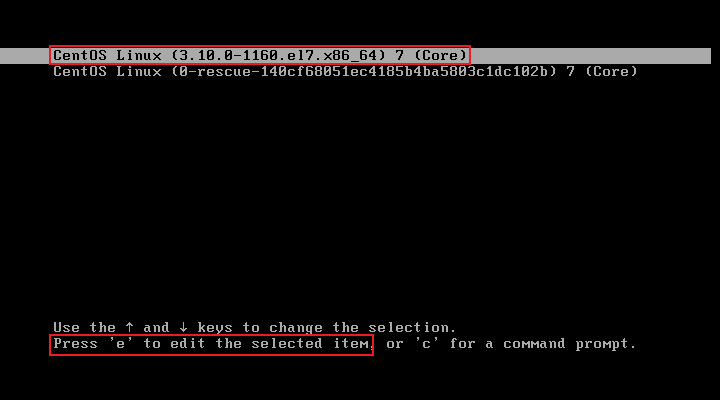
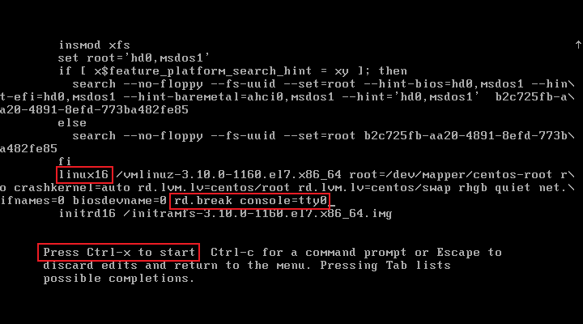
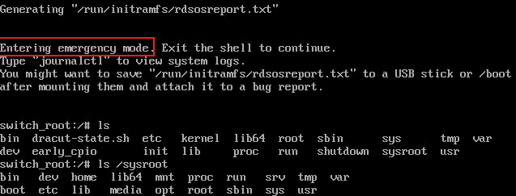

# SELinux安全机制

Security-Enhanced Linux是一套增强Linux系统安全的强制访问控制体系，集成在Linux内核（2.6及以上）中运行，RHEL 7基于SELinux体系针对用户、进程、目录、文件提供了预设的保护策略及管理工具

SELinux具备三种运行模式：enforcing（强制）、permissive（宽松）、disabled（彻底禁用），SELinux临时切换运行模式时，只能在enforcing与permissive之间切换，只有通过配置文件才能将运行模式修改为disabled。permissive模式下，SELinux对大部分的操作会放开限制，但仍会记录执行的操作，只有非常危险的操作才会被permissive模式阻止

```bash
# 临时切换运行模式
getenforce      # 获取SELinux当前的运行模式
setenforce 0    # 设置SELinux为permissive模式

# 永久修改运行模式
vim /etc/selinux/config
SELINUX=permissive
```

从任意运行模式切换到disabled模式，都需要经过系统重启生效。临时切换运行模式会立即生效，修改配置文件不会立即生效，会在系统下次启用时生效

# Firewalld防火墙

防火墙一般被用于数据隔离与策略管理，它可以严格过滤出、入站的所有流量，一般情况下主要是限制入站流量。防火墙又分为硬件防火墙和软件防火墙，两者在逻辑拓扑上应用的位置不相同，作用范围也不同，硬件防火墙一般用于整体网络的出口，或某个功能区域的出口，它被用于保护网络内的所有机器；软件防火墙一般用于某一台具体的主机上，它只会保护安装了软件的机器。CentOS 7发行版中默认的软件防火墙是firewalld

## 一、Firewalld服务基础

在CentOS 7发行版上，Firewalld服务的软件包默认就会被安装，且Firewalld服务的守护进程默认就是开机自启动，它用到的守护进程名称是firewalld，`firewall-cmd`、`firewall-config`都是Firewalld服务的管理工具，其中`firewall-config`是Firewalld的图形化管理工具，仅作了解即可

Firewalld防火墙策略管理是CentOS系统中保障网络安全的关键机制，通过区域（Zone）划分不同信任级别的网络环境，并动态管理流量规则，Firewalld预设了多种安全区域，管理员可根据网络场景应用策略

- public：默认仅允许SSH、DHCPv6等基础服务，严格限制入站流量。public是CentOS 7使用的默认区域，默认情况下系统中的所有网卡都处于此区域下
- trusted：允许所有流量（高危，仅限内网测试）
- home/work：放行Samba、mDNS等办公服务
- block/drop：拒绝/静默丢弃入站请求（生产环境常用drop节省资源）
- dmz/external：面向隔离区域或公网，仅放行指定服务

Fiewalld的规则生效模式分两种：Runtime（运行时）和Permanent（永久），运行时的规则立即生效，但也是临时生效，重新加载防火墙策略或重启系统后规则失效；永久规则需要添加`--permanent`选项，并且需要手动使其立即生效，否则只能等待系统重启后生效

### 1.1 防火墙判定规则

1. 查看客户端请求中的*源IP*，匹配自身firewalld所有zone中的规则，如果某个zone内存在匹配源IP的规则，则数据进入该zone
2. 所有zone都没有匹配源IP的规则时，进入默认zone（即public）

源IP规则必须由管理员手动写入，默认情况下所有zone都没有源IP规则，并且**防火墙的第一原则并不是优先匹配默认zone**，而是匹配源IP规则。一个源IP规则只能写入一个zone，同一个源IP的规则不能写入多个zone，Firewalld会报错

## 二、Firewalld命令解析

`--permanent`与`--reload`两个选项一般是绑定使用的，使用`--permanent`选项配置永久策略后，必须使用`--reload`选项使其立刻生效，否则只能等待系统重启策略才会生效

### 1.1 查看

```bash
# 区域
[root@pc80 ~]# firewall-cmd --get-default-zone    #查看默认区域

# 基本策略
[root@pc80 ~]# firewall-cmd --zone=public --list-all    # 查看public区域的详细信息
```

### 1.2 新增

```bash
# 基本策略
[root@pc80 ~]# firewall-cmd --zone=public --add-service=http    # 运行时策略，在public区域放行http协议的数据入站
[root@pc80 ~]# firewall-cmd --zone=public --add-service=ftp     # 在public区域放行ftp协议的数据入站
[root@pc80 ~]# firewall-cmd --zone=public --add-service=http --permanent    # 永久策略，需要重新加载防火墙策略生效

# 源IP策略
[root@pc80 ~]# firewall-cmd --zone=block --add-source=192.168.0.10    # 拒绝某个IP的所有请求
```

### 1.3 删除

```bash
# 基本策略
[root@pc80 ~]# firewall-cmd --zone=public --remove-service=ftp    # 运行时策略，在public区域拒绝ftp协议的数据入站
[root@pc80 ~]# firewall-cmd --zone=public --remove-service=http --permanent

# 源IP策略
[root@pc80 ~]# firewall-cmd --zone=block --remove-source 192.168.0.10    # 删除某个源IP策略
```

### 1.4 修改

```bash
# 区域
[root@pc80 ~]# firewall-cmd --set-default-zone=trusted    # 修改默认区域

# 基本策略
[root@pc80 ~]# firewall-cmd --reload    # 重新加载防火墙策略
```

# systemd服务管理

通常，管理员对Linux系统上的服务程序进行管理时，可以通过运行服务主程序的方式启动服务，或通过一些服务管理工具启用服务，两者区别在于，主程序启用服务的方式需要通过绝对路径实现，且不便于实现开机自启设置，服务管理工具的使用则更加简单。systemd作为CentOS 7的服务管理工具，也是作为CentOS 7开机启动的第一个进程，管理员的所有操作都仅与systemd交互即可实现。例如，通过systemd设置httpd服务开机自启，那么系统重启拉起systemd进程后，systemd进程会自动拉起httpd进程

## init程序

在Linux系统中init程序不是指具体的某一个程序代码，它指的是Linux内核引导后加载的第一个初始化进程（PID=1），这个初始化进程负责掌控整个Linux系统的运行、服务资源组合，在CentOS 7版本中，init程序指的就是systemd服务

传统的init程序特征：

- system v：顺序加载，RHEL 5系列采用
- upstart：事件触发，RHEL 6系列采用
- systemd：开机服务并行启动，各系统服务间精确依赖

systemd是一个高效的系统&服务管理器，并行启动服务的特征使系统开机速度更快，并行启动并非systemd独有的特征，只不过早期硬件性能限制无法使用并行启动

## systemd

systemd服务的配置目录是`/etc/systemd/system/`、服务目录是`/lib/systemd/system/`、管理命令是`systemctl`，需要重点关注的是服务目录，配置目录中的大部分文件都指向服务目录的软链接，服务目录下不仅保存了systemd自身的配置文件，在CentOS 7系统上安装的任意一个服务程序，都会在`/lib/systemd/system/`目录下产生一个相应的配置文件

例如，安装httpd服务后，在`/lib/systemd/system/`目录下会产生一个`httpd.service`配置文件，这个配置文件又被称之为服务启动配置文件，服务启动配置文件中会详细写明主程序的启动路径、停止服务的方式等信息。管理员通过systemd来管理服务进程时，本质上与直接运行服务的主程序没有太大差别，systemd同样需要知晓服务进程的主程序存放路径，它也需要通过服务的主程序才能启用服务，服务启动配置文件中就标注了这些信息

systemd服务管理与手动服务管理冲突，两种方式不兼容，如果已经先手动运行过服务主程序了，需要先手动停止服务主程序后，才能通过systemd管理服务

```bash
systemctl start httpd      # 启动httpd服务
systemctl restart httpd    # 重启httpd服务
systemctl stop httpd       # 停止httpd服务
systemctl status httpd     # 查看httpd服务状态
systemctl enable httpd     # 设置httpd服务开机自启
systemctl disable httpd    # 设置httpd服务不开机自启
systemctl is-enabled httpd # 查看httpd服务是否开机自启
```

**Centos6管理服务**

```bash
/etc/init.d/iptables stop    # 停止iptables服务
chkconfig iptables off       # 设置iptables服务开机自启
chkconfig iptables           # 查看iptables服务是否已停止开机自启
chkconfig --list             # 查看所有开机自启的服务
```

## 运行级别

**Centos 6的7种运行级别**

Centos 6可以通过修改`/etc/inittab`文件永久修改运行级别

```shell
0	关机（init 0）
1	单用户模式（重置用户密码信息root，修复系统）    救援模式也可以解决root密码问题
2	多用户模式（无网络服务）    NFS网络存储服务无法使用
3	多用户模式（命令行模式）    有网络服务
4	未使用
5	图形化界面模式
6	重启
```

**Centos 7的运行模式**

在CentOS 7版本已经没有运行级别的概念了，将运行级别改为target，称之为运行模式，但实际上就是对CentOS 6的运行级别进行了简化，CentOS 7版本的运行模式主要重心放在CentOS 6上两个最常用的级别上，即字符模式（multi-user.target）与图形模式（graphical.target），在CentOS 7版本中仍能够通过`init`命令可直接实现字符界面与图形界面之间的切换，但预计在RHEL 8.5版本将移除`init`命令

```bash
systemctl isolate multi-user.target    # 当前切换到字符模式，等同于init 3
systemctl isolate graphical.target     # 当前切换到图形模式，等同于init 5
systemctl get-default    # 获取每次开机默认的运行模式
systemctl set-default multi-user.target    # 设置永久策略，每次开机进入字符模式
```

`/usr/lib/systemd/system/`此目录下`runlevel*.target`所指向的源文件就是CentOS 7的7种运行级别名称

```shell
ls -l /usr/lib/systemd/system/runlevel*.target
lrwxrwxrwx 1 root root 15 Jan  8  2021 /usr/lib/systemd/system/runlevel0.target -> poweroff.target
lrwxrwxrwx 1 root root 13 Jan  8  2021 /usr/lib/systemd/system/runlevel1.target -> rescue.target
lrwxrwxrwx 1 root root 17 Jan  8  2021 /usr/lib/systemd/system/runlevel2.target -> multi-user.target
lrwxrwxrwx 1 root root 17 Jan  8  2021 /usr/lib/systemd/system/runlevel3.target -> multi-user.target
lrwxrwxrwx 1 root root 17 Jan  8  2021 /usr/lib/systemd/system/runlevel4.target -> multi-user.target
lrwxrwxrwx 1 root root 16 Jan  8  2021 /usr/lib/systemd/system/runlevel5.target -> graphical.target
lrwxrwxrwx 1 root root 13 Jan  8  2021 /usr/lib/systemd/system/runlevel6.target -> reboot.target
```

### 破解root密码

破解root密码是一种操作技巧，不需要对操作过程有什么理解，记忆即可。破解root密码的前提必须是服务器的管理员，它需要服务器直连显示器的情况下重启服务器

1. 重启系统，选择系统内核后按e键，进入救援模式

   

2. 按↓箭头拉到最底下，找到linux16开头的行，在此行末尾添加两个参数`rd.break console=tty0`，按`Ctrl+x`启动系统.`Home`、`End`键可以一行的行头和行尾快速切换

   

3. 救援模式

   

   救援模式本身是Linux内核加载到内存中的一个微型的操作系统，救援模式下本身会具备一些数据专门用于救援系统。在救援模式下，它会将磁盘中的所有数据存放在`/sysroot/`目录下，这其中也包括操作系统的数据，因此出于安全性考虑，`sysroot`目录在救援模式下默认使用只读挂载。当管理员进入救援模式时，大多数场景下就意味着操作系统本身已经出现异常，因此需要通过救援模式对系统数据，即修改`/sysroot/`目录下的数据。

4. 破解root密码

   ```bash
   # 以读写方式重新挂载/sysroot/目录
   mount -o remount,rw /sysroot/
   
   # 切换到硬盘操作系统的环境
   chroot /sysroot/
   
   # 修改root账户密码
   echo "Admin@huawei.com" | passwd --stdin root
   
   # 当操作系统的SELinux是enforcing模式时，需要重置SELinux策略。如果SELinux不是enforcing模式，则不需要此操作
   cat /etc/selinux/config    # 在救援模式下查看SELinux的运行状态必须查看配置文件，getenforce的输出结果不可靠
   touch /.autorelabel
   
   # 重启系统完成操作
   reboot -f
   ```

   
