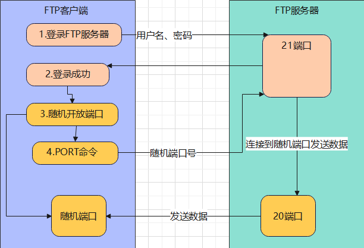
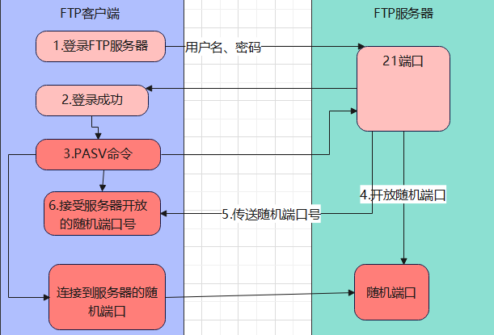
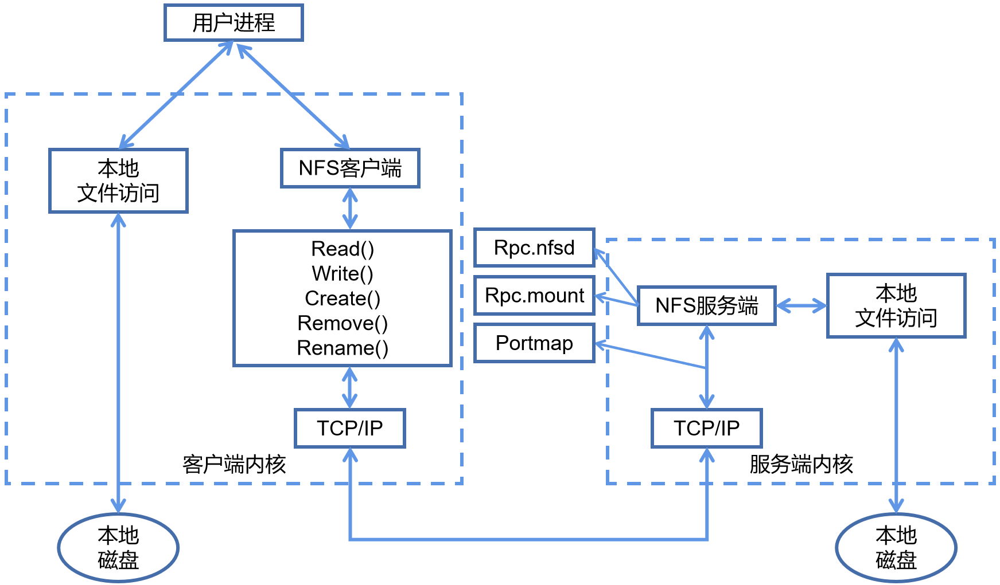

# Web服务

Web服务是一种基于互联网的标准化技术，允许不同平台、不同语言的应用程序通过网络协议相互通信和数据交换，是基于B/S架构的网页服务。生活中最常见的示例，使用浏览器访问百度的网站时，百度提供的就是一个Web服务。最常见的用于提供Web服务的软件包括httpd、Nginx、Tomcat等Web应用程序，HTTP（超文本传输协议）是Web服务最常用的底层传输协议

互联网上会描述Linux是专门提供服务的操作系统，但实际提供服务的并不是Linux系统本身，而是运行在Linux系统上的各种应用程序，Linux只是一个出于通用目的而设计的资源管理平台。需要注意的是，httpd是Web应用程序，而HTTP是网络传输协议，两者名称相似，但完全不是同一个概念

## 一、HTTP协议

### 1.1 http协议介绍

超文本传输协议（HTTP）是一个用于传输超媒体文档（例如 HTML）的应用层协议。HTTP遵循经典的C/S模型，客户端打开一个连接以发出请求，然后等待直到收到服务器端响应。HTTP是无状态协议，这意味着服务器不会在两个请求之间保留任何数据（状态）。尽管通常基于TCP/IP层，但它可以在任何可靠的传输层上使用，也就是说，该协议不会像UDP那样静默的丢失消息

1. 超文本

   包含有超链接（Link）和各种多媒体元素标记（Markup）的文本，这些超文本之间彼此链接，形成Web，因此又被称为网页（Web Page），这些链接用URL表示。HTML是最常见的超文本标记语言

2. URL

   HTTP 请求的内容通称为"资源"。"资源"这一概念非常宽泛，它可以是一份文档，一张图片，或所有其他你能够想到的格式。每个资源都由一个URI来进行标识。一般情况下，资源的名称和位置由同一个 URL（统一资源定位符，它是 URI 的一种）来标识，URL由协议、主机、端口（默认为80）和文件路径四部分组成

### 1.2 URL的语法（URL）

Uniform Resource Locator，统一资源定位符

- **方案或协议**

  `http://`<span>w</span>ww.example.com:80/path/index.html?key1=value1&key2=value2#Document

  `http://`告诉浏览器使用何种协议。对于大部分 Web 资源，通常使用 HTTP 协议或其安全版本，HTTPS 协议。另外，浏览器也知道如何处理其他协议。例如， mailto: 协议指示浏览器打开邮件客户端；ftp:协议指示浏览器处理文件传输

- **主机**

  http://`www.example.com`:80/path/index.html?key1=value1&key2=value2#Document

  `www.example.com`既是一个域名，也代表管理该域名的机构。它指示了需要向网络上的哪一台主机发起请求。当然，也可以直接向主机的 IP address 地址发起请求

- **端口**

  http://<span>w</span>ww.example.com`:80`/path/index.html?key1=value1&key2=value2#Document

  `:80`是端口。它表示用于访问 Web 服务器上资源的技术“门”。如果访问的该 Web 服务器使用 HTTP 协议的标准端口（HTTP 为 80，HTTPS 为 443），则通常省略端口号

- **路径**

  http://<span>w</span>ww.example.com:80`/path/index.html`?key1=value1&key2=value2#Document

  `path/index.html` 是 Web 服务器上资源的路径。如果没有指定访问路径，那将会直接访问WEB服务器的根，此时服务器反馈到客户端的文件就是管理员指定的默认网页文件

- **查询**

  http://<span>w</span>ww.example.com:80/path/index.html`?key1=value1&key2=value2`#Document

  `?key1=value1&key2=value2` 是提供给 Web 服务器的额外参数。这些参数是用 & 符号分隔的键/值对列表。Web 服务器可以在将资源返回给用户之前使用这些参数来执行额外的操作。每个 Web 服务器都有自己的参数规则，想知道特定 Web 服务器如何处理参数的唯一可靠方法是询问该 Web 服务器所有者

- **片段**

  http://<span>w</span>ww.example.com:80/path/index.html?key1=value1&key2=value2`#Document`

  `#Document` 是资源本身的某一部分的一个锚点。锚点代表资源内的一种“书签”，它给予浏览器显示位于该“加书签”点的内容的指示。例如，在 HTML 文档上，浏览器将滚动到定义锚点的那个点上；在视频或音频文档上，浏览器将转到锚点代表的那个时间。值得注意的是 # 号后面的部分，也称为片段标识符，永远不会与请求一起发送到服务器

### 1.3 http工作原理

1. 用户输入域名->浏览器跳转->浏览器缓存->Hosts文件->DNS解析（递归查询|迭代查询）

   ```bash
   客户端向服务端发起查询->递归查询
   服务端向服务端发起查询->迭代查询
   ```

   

2. 浏览器向服务端发起TCP连接（三次握手）

   ```bash
   客户端 --> 请求包连接 syn=1 seq=x --> 服务端
   客户端 <-- 响应客户端 syn=1 ack=x+1 seq=y <-- 服务端
   客户端 --> 建立连接 ack=y+1 seq=x+1 --> 服务端
   ```

3. 客户端发起http请求

   ```bash
   1. 请求的方法：GET获取
   2. 请求的Host主机：www.baidu.com
   3. 请求的资源：/index.html
   4. 请求的端口：默认http是80、https是443
   5. 请求携带的参数：属性（请求的类型、压缩、认证、浏览器信息等）
   6. 请求最后的空行
   ```

4. 服务端响应的内容

   ```bash
   1. 服务端使用的WEB服务软件版本
   2. 服务端响应请求文件的类型
   3. 服务端响应请求的文件是否进行压缩
   4. 服务端响应请求的主机是否进行长连接
   ```

5. 客户端向服务端发起TCP断开（四次挥手）

   ```bash
   客户端 -->断开请求 fin=1 seq=x          --> 服务端
   客户端 <--响应断开 fin=1 ack=x+1 seq=y  <-- 服务端
   客户端 <--断开连接 fin=1 ack=x+1 seq=z  <-- 服务端
   客户端 -->确认断开 fin=1 ack=z+1 seq=sj --> 服务端
   ```

### 1.4 访问网站分析

1. 浏览器分析超链接中的URL

2. DNS请求

   PC向DNS服务器发出DNS QUERY请求`www.qq.com`的A记录，DNS的A记录表示将域名绑定到IP

   

3. DNS回复

   DNS服务器回复DNS response，解析出`www.qq.com`域名对应的2条A记录

   

4. TCP三次握手

   PC获取到`www.qq.com`的IP地址后，向该IP发起TCP三次握手

   

5. HTTP GET请求

   在TCP三次握手的连接上，PC向`www.qq.com`服务器发起GET请求主页

   

6. 服务器响应

   `www.qq.com`服务器回应浏览器HTTP/1.1 200 OK，返回主页数据包

7. TCP四次挥手

   完成数据交互过程，TCP四次挥手断开连接

### 1.5 长连接与短连接

短连接：HTTP 1.0，一次TCP连接只能发起一次http请求

长连接：HTTP 1.1，在一次TCP连接中，可以发起多次http请求


打开百度的首页可以看到浏览器请求了58个资源，如果以短连接的方式发起58个requests，那需要发起58次TCP连接，而长连接仅需要在一次TCP连接里，发起58次http请求即可

HTTP 1.1 一次请求对应一次响应，HTTP 2.0 从串行请求变成了并行请求，批量执行请求与响应

### 1.6 http请求与响应

- **http请求**

  ```bash
  Request URL: https://www.baidu.com/		# 请求得URL地址
  Request Method: GET				# 请求方法
  Status Code: 200 OK				# 状态码
  Remote Address: 14.215.177.38:443		# 请求的主机地址和端口
  scheme: https					# 请求的协议
  accept: text/html				# 请求的资源类型
  accept-encoding: gzip, deflate, br		# 压缩
  accept-language: zh-CN,zh;q=0.9			# 语言
  cache-control: no-cache				# 缓存
  pragma: no-cache				# 无缓存
  user-agent: Chrome/108.0.0.0 Safari/537.36	# 客户端来源设备
  ```

- **http响应**

  ```bash
  Connection: keep-alive
  Content-Encoding: gzip
  Content-Type: text/html; charset=utf-8		# 返回内容的类型和字符集
  Date: Mon, 19 Dec 2022 14:31:47 GMT		# 返回服务器时间，GMT表示需要在此时间基础上+8小时
  Server: BWS/1.1					# 使用的web软件版本
  Location: https://www.baidu.com/		# http重定向
  Referer: https://www.baidu.com/			# 记录上一网页的地址
  cookie						# 会话共享
  ```

  HTTP Cookie（也叫 Web Cookie 或浏览器 Cookie）是服务器发送到用户浏览器并保存在本地的一小块数据。浏览器会存储 cookie 并在下次向同一服务器再发起请求时携带并发送到服务器上。通常，它用于告知服务端两个请求是否来自同一浏览器——如保持用户的登录状态。Cookie 使基于无状态的 HTTP 协议记录稳定的状态信息成为了可能

- **响应状态码**

  | 状态码                | 含义                 |
  | --------------------- | -------------------- |
  | 200                   | 访问成功             |
  | 301                   | 永久跳转             |
  | 302 Moved Temporarily | 临时跳转             |
  | 304 From memory cache | 本地缓存             |
  | 307                   | 内部跳转             |
  | 304 Not Modified      | 本地缓存             |
  | 400                   | 客户端错误           |
  | 401                   | 认证错误             |
  | 403                   | 找不到主页、权限不足 |
  | 404 Not Found         | 找不到该页面         |
  | 500                   | 服务端错误           |
  | 502                   | 找不到后端主机       |
  | 503                   | 服务器过载           |
  | 504                   | 请求超时             |

- **http相关术语**

  pv：页面浏览量；一次浏览产生了多少个http请求就代表产生了多少个pv

  uv：独立设备；uv指同一时间网站被多少个硬件设备访问

  ip：独立ip；ip指同一时间访问网站的公网ip数量

## 二、httpd服务

httpd服务是Apache HTTP Server（通常称为 Apache）的核心程序，作为开源 Web 服务器软件，用于处理 HTTP/HTTPS 请求并提供网页内容。在CentOS发行版上httpd服务的软件包名称就是httpd，在Ubuntu发行版上httpd服务的软件包名称也叫apache2

### 2.1 基本实现

1. 安装软件包

   ```bash
   [root@pc80 ~]# yum install -y httpd
   [root@pc80 ~]# rpm -q httpd
   ```

2. 启用服务

   ```bash
   [root@pc80 ~]# systemctl start httpd    # 以systemd管理httpd服务，或以主程序的方式启用服务/usr/sbin/httpd
   ```

3. 准备网页文件

   ```bash
   [root@pc80 ~]# echo "NSD Web Server" > /var/www/html/index.html
   ```

   网站首页的默认文件名称必须是`index.html`，文件名称写错时，仅输入IP或域名不会自动访问到此网页文件的内容

4. 添加防火墙临时规则

   ```bash
   [root@pc80 ~]# firewall-cmd --zone=public --add-service=http
   ```

5. 测试访问httpd服务

   ```bash
   [root@pc80 ~]# pgrep -l httpd    # 本地查看进程
   
   [root@pc81 ~]# curl http://192.168.0.80    # 远程主机测试访问
   ```

   没有准备`index.html`文件或`index.html`文件名写错时，httpd服务默认会向用户提供测试网页的内容

### 2.2 基本配置

#### 2.2.1 默认参数

| 参数           | 作用                | 默认值         |
| -------------- | ------------------- | -------------- |
| Listen         | 监听地址:端口       | 80             |
| ServerName     | 本站点注册的DNS名称 | 无             |
| DocumentRoot   | 网页根目录          | /var/www/html/ |
| DirectoryIndex | 起始页/首页文件名   | index.html     |

修改httpd服务的配置文件需要谨慎，配置文件中任意一行的错误都会导致整个服务不可用，且在配置文件中修改任意配置后都必须重启服务才能生效

此处需要对端口再多一些描述，每个对外提供服务的应用程序都应该对外监听一个端口，大部分总所周知的服务已经具备了其默认的端口，一个应用程序可以监听多个端口，但多个应用程序不可监听同一个端口。例如，Web服务默认监听80端口、FTP服务默认监听21端口，当主机上没有FTP程序时，Web服务可以通过修改默认配置来实现同时监听80、21端口，但当主机上已存在FTP程序时，Web服务再监听21端口就会产生冲突。需要注意的是，即便Web服务监听了21端口，客户端向服务端发起访问时也需要通过http协议访问21端口，服务端的Web服务才会有响应，21端口默认情况下被用于FTP服务，如果客户端用FTP协议访问服务端的21端口，服务端的Web服务仍会拒绝客户端访问

### 2.3访问控制

访问httpd服务跳转到测试页面的有且只会由三种原因导致：

1. 没有写任何的Web页面文件
2. 写了Web页面文件，但Web页面文件名称与DirectoryIndex指定的文件名称不一致
3. 访问控制被拒绝

虽然通过`DocumentRoot`参数可以修改httpd服务的网页根目录，但不是任意一个目录都可以直接被httpd服务作为网页根目录的。假设将`/`目录作为httpd服务的网页根目录，这个路径将存在巨大安全隐患，因此httpd服务会对网页根目录进行访问控制，也就是说需要手动为网页根目录配置访问控制列表，允许特定的客户端能够访问

httpd服务的访问控制存在一个继承机制，当网页根目录本身没有设置任何访问控制规则时，它默认会继承父目录的访问控制规则。在多层级目录下，当各个层级的父目录访问控制规则不一致时，网页根目录的继承机制取就近原则，优先继承自身上一级父目录的访问控制规则

#### 2.3.1 访问控制语法

httpd服务的配置文件中，默认情况下只写了两条规则：

1. 针对根目录拒绝所有人访问

   ```bash
   <Directory />    # 此处声明网页根目录
       AllowOverride none
       Require all denied    # 拒绝所有人访问
   </Directory>
   ```

2. 针对`/var/www/`目录允许所有人访问

   ```bash
   <Directory "/var/www">
       AllowOverride None
       # Allow open access:
       Require all granted    # 允许所有人访问
   </Directory>
   ```

根据访问控制的父目录权限继承机制，如果将`/`目录作为网页根目录，在不手动配置`/`目录的访问控制的前提下，`/`目录会拒绝所有人访问，即便将`/`目录换成`/var/`目录同样也是拒绝所有人访问，`/var/`目录会继承`/`目录的访问权限，即拒绝所有人

### 2.4 虚拟主机

一般情况下，仅通过httpd默认的配置文件只能在一台主机上提供一个Web站点，虚拟主机技术可以实现一台主机上提供多个不同的Web站点，这个技术不止在httpd程序上有应用，在大多数Web服务的应用程序上都有应用，它通过三种方式实现多个Web站点：

- 基于域名的虚拟主机
- 基于端口的虚拟主机
- 基于IP地址的虚拟主机

由于虚拟主机本身的配置较多，不建议将虚拟主机的配置直接写入httpd服务的主配置文件中，配置文件中任意一行的错误都会导致整个服务不可用。httpd服务除了主配置文件以外，还存在“调用配置文件”的机制，httpd程序在启动时会先读取主配置文件，再读取调用配置文件，因此虚拟主机的配置可以写入调用配置文件中。各个Web服务的应用程序也都具备调用配置文件的机制，调用配置文件的存放路径一般在程序主配置路径下的`./conf.d/`目录中，例如httpd服务的调用配置文件路径是`/etc/httpd/conf.d/*.conf`

虚拟主机基本配置语法如下

```bash
<VirtualHost IP地址:端口>
  ServerName 域名
  DocumentRoot 网页根目录
</VirtualHost>
```

### 2.5 示例

示例1    修改网页根目录以及监听端口

```bash
[root@pc80 ~]# rpm -qc httpd
[root@pc80 ~]# vim /etc/httpd/conf/httpd.conf
Listen 80
Listen 8000
DocumentRoot "/var/www/myweb"
[root@pc80 ~]# mkdir /var/www/myweb/    # 新建网页根目录
[root@pc80 ~]# echo "Wo Shi myweb" > /var/www/myweb/index.html    # 新建首页文件
[root@pc80 ~]# systemctl restart httpd    # 重启httpd服务
[root@pc80 ~]# curl http://192.168.0.80    # 测试httpd服务
[root@pc80 ~]# curl http://192.168.0.80:8000
```

示例2    修改网页根目录以及访问控制权限

```bash
[root@pc80 ~]# vim /etc/httpd/conf/httpd.conf
DocumentRoot "/myweb"
<Directory "/myweb">    # 新增访问控制配置
    Require all granted
</Directory>
[root@pc80 ~]# systemctl restart httpd
[root@pc80 ~]# echo "This is Webroot" > /myweb/index.html
[root@pc80 ~]# curl http://192.168.0.80
```

示例3    基于域名的虚拟主机

```bash
[root@pc80 ~]# vim /etc/httpd/conf.d/vhost.conf
<VirtualHost *:80>
  ServerName www.hebor.cc
  DocumentRoot /var/www/hebor/
</VirtualHost>

<VirtualHost *:80>
  ServerName www.nannan.cc
  DocumentRoot /var/www/nannan/
</VirtualHost>
[root@pc80 ~]# mkdir /var/www/hebor /var/www/nannan
[root@pc80 ~]# systemctl restart httpd
[root@pc80 ~]# echo "hebor" > /var/www/hebor/index.html
[root@pc80 ~]# echo "nannan" > /var/www/nannan/index.html

[root@pc81 ~]# vim /etc/hosts
www.hebor.cc    192.168.0.80
www.nannan.cc   192.168.0.80
[root@pc81 ~]# curl http://www.hebor.cc
[root@pc81 ~]# curl http://www.nannan.cc
```

基于域名的虚拟主机需要服务端有能够正常对外提供的域名，实验环境中或部分内网环境下是不具备这种条件的，因此可以通过修改主机的本地域名解析文件hosts来实现域名与IP的对应关系，只有先实现客户端的域名与IP的对应关系后，才能够正常访问域名虚拟主机

当客户端域名解析存在问题时，它也能够正常访问到服务端的Web站点，只不过此时服务端提供的Web站点会根据配置文件的上下顺序提供，先写的配置优先级会更高。例如，上例虚拟主机的配置文件中，hebor的站点写在先写，那么客户端永远都只能访问到hebor的站点

一旦Web应用程序中使用了虚拟主机的配置，那么该主机上所有的Web站点都需要通过虚拟主机的配置来实现，其他的Web站点的配置不再生效。例如，示例2已经在主配置文件中修改过`/myweb/`的网页根目录，正常来说httpd服务会先读取主配置文件再读取调用配置文件，实际上主配置文件中的Web站点并未生效，而是直接展示了hebor的虚拟主机的站点

示例4    基于端口的虚拟主机

```bash
[root@pc80 ~]# vim /etc/httpd/conf.d/vhost.conf
Listen 8080    # 主配置文件中已监听80端口，此处仅需要补充监听8080端口即可
<VirtualHost *:80>
  ServerName www.hebor.cc
  DocumentRoot /var/www/hebor/
</VirtualHost>

<VirtualHost *:8080>
  ServerName www.hebor.cc
  DocumentRoot /var/www/nannan/
</VirtualHost>
[root@pc80 ~]# curl http://192.168.0.80
[root@pc80 ~]# curl http://192.168.0.80:8080
```

# FTP服务

File Transfer Protocol，文件传输协议。FTP服务是一种基于C/S架构的网络协议，专为高效传输文件而设计，CentOS发行版上最常见的用于实现FTP服务功能的软件是vsftpd，默认的共享数据的主目录是`/var/ftp/`

## 一、FTP工作原理

FTP服务比较常见的会用到20、21端口，其中21端口用于控制连接传输控制信号，一般被用于传输FTP命令和执行信息等；20端口用于数据连接，一般用于上传、下载数据。FTP的数据传输模式分为**主动传输**和**被动传输**，主动传输方式由服务端主动发起连接，使用20、21端口；被动传输方式由客户端主动发起，使用21端口和一个由服务器产生的随机高端口。因此，根据FTP的两个端口的不同作用判断，21端口属于常驻端口，而20端口不一定会用上，也可以是任意一个随机端口提供数据传输功能

### 1.1 主动模式

Active模式，客户端通过FTP服务端的身份验证之后，自身会产生一个默认高于1024的随机端口，并通过PORT命令将自身产生的随机端口号通知给FTP服务端，FTP服务端再通过自身20端口与客户端的随机端口建立连接传输数据。在这个过程中需要注意的是，客户端自身只是产生了一个随机端口，并没有实际建立一个到FTP服务端20端口的连接，而FTP服务端收到客户端的随机端口后，才通过20端口向客户端发起连接，对于客户端的防火墙来说，这是从外部要建立到内部的连接，通常会被阻塞



### 1.2 被动模式

Passive模式，客户端通过FTP服务端的身份验证之后，会向FTP服务端发起PASV命令，FTP服务端收到客户端的PASV命令后会产生一个随机端口，并将产生的随机端口号转发给客户端，再由客户端向FTP服务端的随机端口发起连接，这个随机端口将会被用于数据传输。FTP服务端的随机端口的范围是可以手动设置的



## 二、部署

### 1.1 基本实现

1. 安装软件包

   ```bash
   [root@pc80 ~]# yum install -y vsftpd
   [root@pc80 ~]# rpm -qi vsftpd
   ```

2. 启用服务

   ```bash
   [root@pc80 ~]# /usr/sbin/vsftpd    # 以主程序的方式启用服务
   ```

3. 准备测试文件

   ```bash
   [root@pc80 ~]# echo "ftp test" > /var/ftp/test.txt
   ```

   FTP服务默认不需要准备测试文件，默认共享数据的主目录下已存在一个共享目录`/var/ftp/pub/`，准备测试文件更便于识别

4. 本地测试访问FTP服务

   ```bash
   [root@pc80 ~]# curl ftp://192.168.0.80/
   ```


# NFS服务

Network File System，网络文件系统，用于在集群中用于保存静态资源数据。NFS主要功能是通过*局域网络*在不同主机间共享文件，用于企业集群架构中，如果是大型网站，会用到更复杂的分布式文件系统FastDFS（4K~500M的小文件，音频、小说、视频），Glusterfs（大文件，iso镜像），HDFS

**NFS主要用于解决web静态资源的一致性和资源共享问题**，避免web服务器的磁盘空间浪费，但它不能解决网站访问的延时问题，甚至会扩展大这个问题

## 一、NFS写入原理



NFS服务端本地写入，当用户执行mkdir命令，该命令会调用shell解释器翻译给内核，内核解析完成后驱动对应的硬件设备

NFS远程写入实现过程

1. 用户进程访问NFS客户端，使用不同的函数封装不同的操作命令
2. NFS客户端通过TCP/IP协议传输数据到NFS服务端
3. NFS服务端接收请求后，会先调用portmap进程进行端口映射
4. nfsd进程用于判断NFS客户端是否拥有权限连接NFS服务端
5. Rpc.mount进程判断客户端是否有具备文件的操作权限
6. idmap进程实现用户的映射和压缩（与NFS配置文件参数有关）
7. 最后NFS服务端会将对应请求的函数解封装转换为本地能识别的命令，传递至内核，由内核驱动硬件

从NFS的远程写入过程中，无论客户端操作系统是什么操作系统平台并不重要，客户端的命令首先都需要交给函数进行封装，函数传输到服务端后再进行识别；nfs服务发起的远程过程调用基于RPC协议，所以使用nfs必须启动rpc服务

- Rpc.nfsd：基本的NFS守护进程，主要功能是管理客户端是否能够登录服务器
- Rpc.mount：主要功能是管理NFS的文件系统。当客户端顺利通过nfsd登录NFS服务器后，在使用NFS服务所提供的文件前，还必须通过文件使用权限的验证。它会读取NFS的配置文件/etc/exports来对比客户端权限
- Portmap：主要功能是进行端口映射工作，其本身默认监听111端口

## 二、部署

### 1.1 基本实现

1. 安装软件包

   ```bash
   [root@pc80 ~]# yum install -y nfs-utils    # rpc包会被作为nfs的依赖包一起安装
   [root@pc80 ~]# rpm -q nfs-utils
   ```

2. 修改配置文件

   ```bash
   [root@pc80 ~]# mkdir /public
   [root@pc80 ~]# vim /etc/exports
   /public *    # 允许任意客户端访问
   ```

3. 启用服务

   ```bash
   [root@pc80 ~]# systemctl start rpcbind
   [root@pc80 ~]# systemctl start nfs-server
   [root@pc80 ~]# firewall-cmd --zone=public --add-service=nfs
   [root@pc80 ~]# firewall-cmd --zone=public --add-service=rpc-bind
   [root@pc80 ~]# firewall-cmd --zone=public --add-service=mountd
   ```

   rpcbind服务与nfs-server服务的启动具备依赖关系，nfs-server依赖rpcbind服务，因此需要先启动rpcbind服务，才能启用nfs-server服务。NFS服务默认监听2049端口，默认情况下NFS服务端只提供只读权限

4. 客户端挂载

   NFS通过RPC协议进行交互，所以客户端也必须具备rpcbind服务，除此以外，nfs-utils包中仍包含一些客户端要使用到的命令，例如showmount等

   ```bash
   [root@pc81 ~]# yum install -y nfs-utils
   [root@pc81 ~]# showmount -e 192.168.0.80	# 检查是否存在共享内容
   [root@pc81 ~]# mkdir /mnt/nfs
   [root@pc81 ~]# mount -t nfs 192.168.0.80:/public /mnt/nfs
   [root@pc81 ~]# df -h    # 查看挂载
   ```

### 1.2 进阶配置

1. 修改NFS服务端配置文件

   NFS主配置文件`/etc/exports`，NFS配置文件语法格式：`共享目录 NFS客户端地址(客户端权限)`，通过`man exports`也可以查看NFS配置示例

   ```bash
   [root@pc80 ~]# mkdir /public
   [root@pc80 ~]# vim /etc/exports
   /public 192.168.0.0/24(rw,sync,all_squash)
   ```

   nfs服务端将`/data`目录共享给`172.16.1.0/24`网段的所有主机，并对客户端开放如下权限：

   1. rw：所有客户端主机都具备读写权限
   2. sync：将数据写入NFS服务器的硬盘中后才会结束操作，最大限度保证数据不丢失
   3. all_squash：将所有用户映射为本地的匿名用户（nfsnobody）

2. 重启NFS服务

   ```bash
   [root@pc80 ~]# systemctl restart nfs-server
   [root@pc80 ~]# firewall-cmd --zone=public --add-service=nfs --permanent
   [root@pc80 ~]# firewall-cmd --zone=public --add-service=rpc-bind --permanent
   [root@pc80 ~]# firewall-cmd --zone=public --add-service=mountd --permanent
   ```

3. 服务端校验

   NFS服务启动后，`/var/lib/nfs/etab`内会记录NFS的共享配置信息，如果此文件为空，则配置文件可能有误，查看此文件时能看到大量权限参数，除了手动配置的参数以外，其他的参数都是NFS默认添加的

   ```bash
   [root@pc80 ~]# cat /var/lib/nfs/etab
   [root@pc80 ~]# ss -lntp | column -t    # 查看端口
   ```
   
5. 客户端挂载

   ```bash
   [root@pc81 ~]# showmount -e 192.168.0.80	# 检查是否存在共享内容
   [root@pc81 ~]# mkdir /mnt/nfs
   [root@pc81 ~]# mount -t nfs 192.168.0.80:/public /mnt/nfs
   [root@pc81 ~]# df -h    # 查看挂载
   ```

NFS客户端连接挂载完毕后，往服务端共享目录里写入数据时会提示权限错误，客户端连接服务端的时候会经过两层验证，nfsd会检测客户端是否能够连接成功，mount会检测客户端对共享目录的权限。在上例中，mount的权限是rw，这两个检测都没有问题，因此，提示权限错误是由于主配置文件中，客户端的另一个权限参数all_squash导致

all_squash参数表示将所有客户端的用户压缩成一个匿名用户，这个匿名用户的uid和gid都是65534（nfsnobody)。所以，任何一个客户端的指令到达服务端后，都会被NFS服务交给这个匿名用户进行接封装再执行，但由于服务端的共享目录是由root创建，所以匿名用户没有权限操作共享目录，重新更改共享目录的授权即可。关于匿名用户的信息，在`/var/lib/nfs/etab`文件中也有记录

上例挂载属于临时操作，永久挂载需要写入`/etc/fstab`，但NFS的挂载可能导致设备重启时系统启动失败，这个问题可能会由两个原因导致：一是写入`/etc/fstab`文件的配置有误、二是客户端启动时NFS服务端异常。前者通过`mount -a`命令可以测试配置文件是否有误，后者需要在编写`/etc/fstab`文件时在挂载选项列添加`_netdev`参数，此参数用于声明NFS服务端是一个网络设备

## 三、NFS服务端参数

在一般工作场景下，通常NFS服务端共享只是普通的静态数据，不需要执行`suid、exec`等权限，挂载的这个文件系统只能作为存取数据用，无法执行程序，对于服务端或客户端而言也增加了安全性

```shell
# 通过mount -o选项指定挂载参数，增加安全性能
mount -t nfs -o nosuid,noexec,nodev 172.16.1.31:/data /opt

# 禁止更新目录及文件时间戳挂载，一定程度上提升性能
mount -t nfs -o noatime,nodiratime 172.16.1.31:/data /opt
```

这两个选项对于现在的服务器架构而言，基本不需要添加这两个配置，硬盘读写纪录时间戳一定程度上会影响磁盘I/O，CDN能够解决这个问题

### 1.1 NFS配置详解

| nfs共享参数    | 参数作用                                                     |
| -------------- | ------------------------------------------------------------ |
| rw             | 读写权限                                                     |
| ro             | 只读权限                                                     |
| root_squash    | 当NFS客户端以root账户访问时，映射为NFS服务端的匿名用户（不常用） |
| no_root_squash | 当NFS客户端以root账户访问时，映射为NFS服务端的root用户（不常用） |
| all_squash     | 当NFS客户端以任意账户访问时，映射为NFS服务端的匿名用户（不常用） |
| no_all_squash  | 当NFS客户端以任意账户访问时，都不进行压缩                    |
| sync           | 同时将数据写入内存和磁盘中，保证不丢失数据                   |
| async          | 优先将数据写入内存，再写入硬盘；效率更高，可能丢失数据       |
| anonuid        | 配合all_squash使用，指定NFS的用户UID，服务端必须存在该用户   |
| anongid        | 配合all_squash使用，指定NFS的用户GID，服务端必须存在该用户   |

示例：验证all_squash、anonuid、anongid权限

```shell
[root@nfs ~]# more /etc/exports
/data/   172.16.1.0/24(rw,sync,all_squash,anonuid=666,anongid=666)

[root@nfs ~]# groupadd -g 666 www
[root@nfs ~]# useradd -u 666 -g 666 www
[root@nfs ~]# chown -R www.www /data
[root@nfs ~]# systemctl restart nfs-server.service

[root@web01 ~]# touch file
[root@web01 ~]# echo "hello" > file
[root@web01 ~]# ll /opt
-rw-r--r--. 1 666 666         6 Nov 30 11:43 file
```

NFS的远程写入，请求到达服务端后会切换成UID为666的用户执行写入操作，所以服务端的www用户一定要有能够操作共享目录的权限，而客户端系统没有UID为666的用户，所以客户端在查看共享目录属性信息的时候，所属组和所属用户都是直接显示数字，而不是显示用户名

### 1.2 NFS优缺点

NFS存储优点

1. NFS文件系统简单易用、方便部署
2. NFS存放的数据都在文件系统之上，所有数据直观可见

NFS存储局限

1. 存在单点故障，如果构建高可用，维护又比较麻烦 web -> nfs(sersync) -> backup
2. NFS数据明文，不对数据做任何校验
3. 客户端挂载NFS没有密码验证，一般只在内网使用

### 1.3 NFS故障

1. 客户端使用showmount查看服务端共享目录，提示RPC故障

   ```bash
   错误信息：clnt_create: RPC: Unknown host
   
   解决办法：关闭nfs服务，重启rpcbind服务后再启动nfs服务
   ```

# 自动挂载

又叫做按需挂载，通过Linux系统的autofs（automount file system）程序实现，其核心功能是动态管理文件系统挂载点。当用户访问指定目录时自动挂载对应设备或远程共享，闲置超过时限（默认5分钟）后自动卸载，以节省系统资源。从某种角度而言，自动挂载的稳定性不如开机挂载，此服务仅作了解

## 一、部署

### 1.1 基本实现

1. 安装软件包

   ```bash
   yum install -y autofs
   ```

2. 启用服务

   ```bash
   systemctl start autofs
   ```

   启用autofs服务时，autofs服务默认会创建`/misc/`目录

3. 校验

   ```bash
   ls -A /misc
   ls /misc/cd
   ```

   默认情况下autofs服务创建的`/misc/`目录是空目录，当用户访问挂载点`/misc/cd`时，autofs会自动挂载镜像设备到此挂载点下。当主机上存在`/dev/cdrom`设备时，autofs服务默认情况下会将`/dev/cdrom`挂载到`/misc/cd`下

### 1.2 进阶配置

autofs服务的配置框架分为两个层级：

- 主配置文件：`/etc/auto.master`

   此为固定配置文件不可变更，主配置文件中主要定义了**监控目录、子配置文件路径、超时时间**，在Linux系统上不是所有的目录都可以实现自动挂载功能，只有在autofs服务的监控目录下才能够实现自动挂载功能

   ```bash
   /misc    /etc/auto.misc    --timeout=300
   ```

- 子配置文件：`/etc/auto.misc`

   子配置文件可自定义存放路径和文件名，只需要在主配置文件中写明子配置文件的信息即可，子配置文件被用于定义具体的挂载规则，编写格式为`挂载点 挂载选项 :挂载设备`

   ```bash
   cd    -fstype=iso9660,ro,nosuid,nodev    :/dev/cdrom
   ```

1. 修改主配置文件

   ```bash
   vim /etc/auto.master
   /myauto    /opt/hebor.auto
   ```

2. 新建子配置文件

   ```bash
   vim /opt/hebor.auto
   nsd    -fstype=iso9660    :/dev/cdrom
   mynfs    -fstype=nfs    192.168.0.80:/public
   ```

3. 重启autofs服务

   ```bash
   systemctl restart auto
   ```

   重启autofs服务会自动创建挂载点目录

   

# DNS

