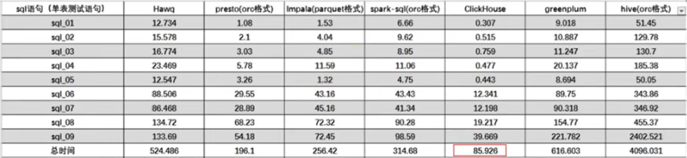
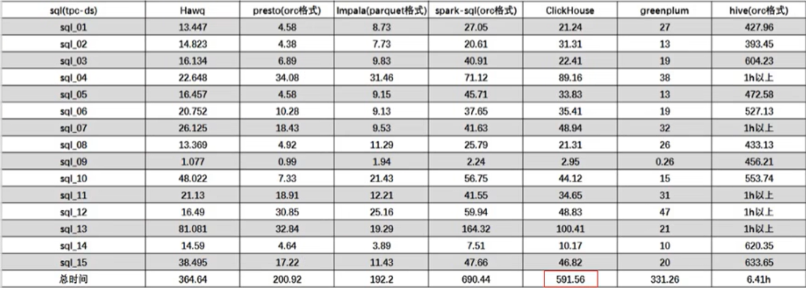

# 第一章、ClickHouse入门
ClickHouse是俄罗斯的Yandex于2016年开源的列式存储数据库（DBMS），使用C++语言编写，主要用于**在线分析处理查询（OLAP）**，能够使用SQL查询实时生成分析数据报告。

- OLAP（在线分析处理）：核心目标是支持复杂的业务分析和决策，擅长只读查询，适用于复杂聚合与分析，目标是**读的快、算得准**。典型应用场景包括趋势分析、数据挖掘等，典型技术代表如ClickHouse、Hive等
- OLTP（联机事务处理）：核心目标是支持日常业务流程、处理实时事务，擅长增删改查（CRUD）操作，适用于频繁的数据插入与更新，目标是**写的快、准、稳**。典型应用场景包括电商交易、订单录入等，典型技术代表如Oracle、MySQL等

## 一、ClickHouse的特点

### 1.1 列式存储

以下面的表为例：

| Id | Name | Age |
| :-: | :-: | :-: |
| 1 | 张三 | 18 |
| 2 | 李四 | 22 |
| 3 | 王五 | 34 |

1. 采用行式存储时，数据在磁盘上的组织结构为：

   

   好处是想查某个人所有的属性时，可以通过一次磁盘查找加顺序读取就可以。但是当想查所有人的年龄时，需要不停的查找，或者全表扫描才行，遍历的很多数据都是不需要的。

2. 采用列式存储时，数据在磁盘上的组织结构为：

   

   这时想查所有人的年龄只需把年龄那一列拿出来就可以了

**列式存储的优势：**

1. 对于列的聚合、计数、求和等统计操作原理优于行式存储。
2. 由于列内的所有数据类型都是相同的，针对数据存储更容易进行数据压缩（大数据量场景下考虑数据压缩），每一列数据可以通过选择更优的数据压缩算法提高数据的压缩比重。
3. 由于数据压缩比更好，一方面节省了磁盘空间，另一方面对于cache也有了更大的发挥空间。

### 1.2 DBMS的功能

几乎覆盖了标准SQL的大部分语法，包括DDL和DML，以及配套的各种函数，用户管理及权限管理，数据的备份与恢复。

### 1.3 多样化引擎

ClickHouse和MySQL类似，把表级的存储引擎插件化，根据表的不同需求可以设定不同的存储引擎。目前包括合并树、日志、接口、其他四大类等共20多种引擎。

### 1.4 高吞吐写入能力

ClickHouse采用类LSM Tree的结构，数据写入时会先写入缓存，然后周期性在后台对缓存数据执行Compaction，只有在执行Compaction时才会真正的去删除“过期”数据。“过期”数据可以通过时间戳、版本号或者其它自定义字段来进行标记，各个数据库机制不同，但理念相似，缓存中的数据可能同时保留有“新、旧”数据，但在执行Compaction时只会保留“新”数据。

通过类LSM tree的结构，ClickHouse在数据导入时全部是顺序append（追加）写，写入后数据段不可更改，数据更新通过时间戳或版本号标记等方式实现。顺序写的特性，充分利用了磁盘的吞吐能力，即便在HDD上也有着优异的写入性能。官方公开benchmark测试显示能够达到50MB-200MB/s的写入吞吐能力，按照每行100Byte 估算，大约相当于50W-200W条/s的写入速度。

在后台Compaction时也是多个段merge sort（归并排序）后顺序写回磁盘，但这也导致Compaction期间无法对外正常提供服务。

### 1.5 数据分区与线程级并行

数据分区的目的是为了避免全表扫描，ClickHouse将数据划分为多个partition，每个partition再进一步划分为多个index granularity（索引粒度），然后通过多个CPU核心分别处理其中的一部分来实现并行数据处理。在这种设计下，单条Query就能利用整机所有CPU。极致的并行处理能力，极大的降低了查询延时。

因此，ClickHouse即使对于大量数据的查询也能够化整为零平行处理。但同时ClickHouse特别占用CPU资源，并且对于单条查询使用多CPU，就不利于同时并发多条查询，所以对于高QPS（每秒查询次数）的查询业务，ClickHouse并不是强项。

由于ClickHouse的线程并行机制，未来在使用ClickHouse过程中比较容易出现问题的地方也是CPU，例如CPU资源瓶颈或高QPS查询都有可能导致ClickHouse异常。由此可见，ClickHouse本身不适合做初始的数据存储，它适用于已经处理过的、已合并了大量字段的宽表数据

### 1.6 性能对比

某网站精华帖，中对几款数据库做了性能对比。

1. 单表查询

   

2. 关联查询

   

ClickHouse像很多OLAP数据库一样，单表查询速度优于关联查询，而且ClickHouse的两者差距更为明显。从底层原理上ClickHouse就不适合做Join查询，所以在使用ClickHouse的场景中应该尽可能避免Join查询。

# 第二章、ClickHouse的安装
## 一、准备工作

1. 基本环境准备

   ```shell
   [root@centos ~]# \rm /etc/yum.repos.d/*
   [root@centos ~]# curl -o /etc/yum.repos.d/CentOS-Base.repo https://mirrors.aliyun.com/repo/Centos-7.repo
   [root@centos ~]# yum install -y vim bash-completion
   [root@centos ~]# systemctl disable --now firewalld
   [root@centos ~]# sed -i 's/SELINUX=enforcing/SELINUX=disabled/' /etc/selinux/config
   [root@centos ~]# setenforce 0
   ```

2. 取消打开文件数限制

   关于shell会话能使用的系统资源上限的调整，“最大打开的文件数“和”最大用户进程数“是最长用到的两个调试参数。clickhouse比较占用CPU资源，且数据存储在本地磁盘，当数据量较大、查询进程较多时，默认的`open files`和`max user processes`就不够用，所以需要将默认资源量扩大

   ```shell
   # 列出用户在当前shell会话下能够使用的各种系统资源的上限。分为软限制（soft limit）和硬限制（hard limit）
   [root@centos ~]# ulimit -a 
   core file size          (blocks, -c) 0
   data seg size           (kbytes, -d) unlimited
   scheduling priority             (-e) 0
   file size               (blocks, -f) unlimited
   pending signals                 (-i) 14988
   max locked memory       (kbytes, -l) 64
   max memory size         (kbytes, -m) unlimited
   open files                      (-n) 1024         #最大打开的文件数
   pipe size            (512 bytes, -p) 8
   POSIX message queues     (bytes, -q) 819200
   real-time priority              (-r) 0
   stack size              (kbytes, -s) 8192
   cpu time               (seconds, -t) unlimited
   max user processes              (-u) 14988        #最大用户进程数
   virtual memory          (kbytes, -v) unlimited
   file locks                      (-x) unlimited
   
   [root@centos ~]# vim /etc/security/limits.conf
   #<domain>        <type>  <item>  <value>
   * soft nofile 65535
   * hard nofile 65535
   * soft nproc 131072
   * hard nproc 131072
   
   [root@centos ~]# vim /etc/security/limits.d/20-nproc.conf
   *          soft    nproc     4096         #默认配置
   root       soft    nproc     unlimited    #默认配置
   * soft nofile 65535
   * hard nofile 65535
   * soft nproc 131072
   * hard nproc 131072
   
   # 配置文件修改完成后退出当前SSH连接，重新登陆即可使配置生效，通过ulimit -a检查配置是否生效
   ```

   `/etc/security/limits.conf`配置文件的语法格式解析如下：

   - *：此处用于填写限制的用户和用户组，`*`表示所有的用户和用户组，也可以明细化写成`user@group`的形式，用户名和组名之间用`@`符分隔
   - soft/hard/-：soft为软限制，表示当前资源用量；hard为硬限制，表示资源最大用量；`-`表示软限制和硬限制使用相同的值同时生效。soft值必须小于等于hard值
   - nofile/nproc：nofile表示文件描述符的数量；nproc表示用户进程数
   - 数值：资源限制的具体数值

   `/etc/security/limits.conf`文件的配置有可能会被`/etc/security/limits.d/20-nproc.conf`文件的配置覆盖掉，所以在修改系统资源限制时建议两个文件修改为同样的配置

   从`/etc/security/limits.d/20-nproc.conf`这个文件原有的配置来看，可以看到该文件应该是一个专门的`nproc`配置文件，我们也可以专门为`nofile`的配置新建一个文件，`/etc/security/limits.d/`目录下的所有配置文件都会生效

3. 安装clickhouse所需的相关依赖

   ```shell
   [root@centos ~]# yum install -y libtool *unixODBC*
   ```

## 二、单机安装

官网：https://clickhouse.com/

官方文档：https://clickhouse.com/docs

安装指导：https://clickhouse.com/docs/install/redhat

官方在线playground demo：https://sql.clickhouse.com/

官方示例数据集：https://clickhouse.com/docs/zh/getting-started/example-datasets

clickhouse离线RPM包：https://packages.clickhouse.com/rpm/stable/

1. 添加官方的RPM仓库

   ```shell
   [root@centos ~]# sudo yum install -y yum-utils
   [root@centos ~]# sudo yum-config-manager --add-repo https://packages.clickhouse.com/rpm/clickhouse.repo
   ```

2. 安装clickhouse

   ```shell
   [root@centos ~]# sudo yum install -y clickhouse-server clickhouse-client
   ```

   

2.2.1  在 hadoop102 的/opt/software 下创建 clickhouse  目录


2.2.2  将/2. 资料/ClickHouse  下 4  个文件 上传 到 hadoop102   的software/clickhouse 目录下

2.2.3  将安装文件同步到 hadoop103 、hadoop104

2.2.4  分别在三台机子上安装这 4 个 rpm 文件


sudo rpm -qa|grep clickhouse 查看安装情况
2.2.5  修改配置文件
	[atguigu@hadoop102 clickhouse]$ sudo vim /etc/clickhouse-server/config.xml    
（1）把 <listen_host>::</listen_host>  的注释打开，这样的话才能让 ClickHouse 被除本机以外的服务器访问

（2）分发配置文件

在这个文件中，有 ClickHouse 的一些默认路径配置，比较重要的
数据文件路径：<path>/var/lib/clickhouse/</path>
	日志文件路径：<log>/var/log/clickhouse-server/clickhouse-server.log</log>
2.2.6  启动 Server
	[atguigu@hadoop102 clickhouse]$ sudo systemctl start clickhouse-server        

2.2.7  三台机器上关闭开机自启
	[atguigu@hadoop102 clickhouse]$sudo systemctl disable clickhouse-server       

2.2.8  使用 client 连接 server


-m:可以在命令窗口输入多行命令
第 3 章 数据类型
3.1  整型
固定长度的整型，包括有符号整型或无符号整型。
整型范围（-2n-1~2n-1-1）：
Int8 - [-128 : 127]
Int16 - [-32768 : 32767]
Int32 - [-2147483648 : 2147483647]
Int64 - [-9223372036854775808 : 9223372036854775807]
无符号整型范围（0~2n-1）：
UInt8 - [0 : 255]
UInt16 - [0 : 65535]
UInt32 - [0 : 4294967295]
UInt64 - [0 : 18446744073709551615]
使用场景： 个数、数量、也可以存储型 id。
3.2  浮点型
Float32 - float
Float64 – double
建议尽可能以整数形式存储数据。例如，将固定精度的数字转换为整数值，如时间用毫

秒为单位表示，因为浮点型进行计算时可能引起四舍五入的误差。

使用场景：一般数据值比较小，不涉及大量的统计计算，精度要求不高的时候。比如保存商品的重量。
3.3  布尔型
没有单独的类型来存储布尔值。可以使用 UInt8  类型，取值限制为 0  或 1。
3.4 Decimal  型
有符号的浮点数，可在加、减和乘法运算过程中保持精度。对于除法，最低有效数字会被丢弃（不舍入）。
有三种声明：
     Decimal32(s)，相当于 Decimal(9-s,s)，有效位数为 1~9
     Decimal64(s)，相当于 Decimal(18-s,s)，有效位数为 1~18
     Decimal128(s)，相当于 Decimal(38-s,s)，有效位数为 1~38
s 标识小数位
使用场景： 一般金额字段、汇率、利率等字段为了保证小数点精度，都使用 Decimal进行存储。
3.5  字符串
1）String
字符串可以任意长度的。它可以包含任意的字节集，包含空字节。
2）FixedString(N)
固定长度 N   的字符串，N  必须是严格的正自然数。当服务端读取长度小于 N   的字符串时候，通过在字符串末尾添加空字节来达到 N  字节长度。 当服务端读取长度大于 N   的字符串时候，将返回错误消息。
与 String 相比，极少会使用 FixedString ，因为使用起来不是很方便。

使用场景：名称、文字描述、字符型编码。 固定长度的可以保存一些定长的内容，比如一些编码，性别等但是考虑到一定的变化风险，带来收益不够明显，所以定长字符串使用意义有限。
3.6  枚举类型
包括 Enum8  和 Enum16  类型。Enum  保存 'string'= integer   的对应关系。
Enum8  用 'String'= Int8  对描述。
Enum16  用 'String'= Int16  对描述。
1）用法演示
创建一个带有一个枚举 Enum8('hello' = 1, 'world' = 2)  类型的列

2）这个 x 列只能存储类型定义中列出的值：'hello'或'world'
hadoop102 :) INSERT INTO t_enum VALUES ('hello'), ('world'), ('hello');       

3）如果尝试保存任何其他值，ClickHouse  抛出异常


4）如果需要看到对应行的数值，则必须将 Enum 值转换为整数类型


使用场景：对一些状态、类型的字段算是一种空间优化，也算是一种数据约束。但是实际使用中往往因为一些数据内容的变化增加一定的维护成本，甚至是数据丢失问题。所以谨慎使用。
3.7  时间类型
目前 ClickHouse  有三种时间类型
     Date 接受年-月-日的字符串比如 ‘2019-12-16 ’
     Datetime 接受年-月-日 时:分:秒的字符串比如 ‘2019-12-16 20:50:10 ’
     Datetime64 接受年-月-日 时:分:秒.亚秒的字符串比如‘2019-12-16 20:50:10.66 ’日期类型，用两个字节存储，表示从 1970-01-01 (无符号)  到当前的日期值。
还有很多数据结构，可以参考官方文档：https://clickhouse.yandex/docs/zh/data_types/
3.8  数组
Array(T) ：由 T  类型元素组成的数组。
T  可以是任意类型，包含数组类型。 但不推荐使用多维数组，ClickHouse  对多维数组的支持有限。例如，不能在 MergeTree 表中存储多维数组。
（1）创建数组方式 1 ，使用 array 函数


（2）创建数组方式 2 ：使用方括号


第 4 章 表引擎
4.1  表引擎的使用
表引擎是 ClickHouse 的一大特色。可以说， 表引擎决定了如何存储表的数据。包括：
  数据的存储方式和位置，写到哪里以及从哪里读取数据。
  支持哪些查询以及如何支持。
  并发数据访问。
  索引的使用（如果存在）。
  是否可以执行多线程请求。
  数据复制参数。
表引擎的使用方式就是必须显式在创建表时定义该表使用的引擎，以及引擎使用的相关参数。
特别注意：引擎的名称大小写敏感

4.2 TinyLog
以列文件的形式保存在磁盘上，不支持索引，没有并发控制。一般保存少量数据的小表，生产环境上作用有限。可以用于平时练习测试用。
如：

4.3 Memory
内存引擎，数据以未压缩的原始形式直接保存在内存当中，服务器重启数据就会消失。读写操作不会相互阻塞，不支持索引。简单查询下有非常非常高的性能表现（超过 10G/s）。
一般用到它的地方不多，除了用来测试，就是在需要非常高的性能，同时数据量又不太大（上限大概 1  亿行）的场景。
4.4 MergeTree
ClickHouse  中最强大的表引擎当属 MergeTree（合并树）引擎及该系列（*MergeTree）中的其他引擎，支持索引和分区，地位可以相当于 innodb 之于 Mysql 。而且基于 MergeTree，还衍生除了很多小弟，也是非常有特色的引擎。
1）建表语句

2）插入数据

MergeTree  其实还有很多参数(绝大多数用默认值即可)，但是三个参数是更加重要的，也涉及了关于 MergeTree 的很多概念。
4.4.1 partition by  分区(可选)
1）作用

学过 hive 的应该都不陌生，分区的目的主要是降低扫描的范围，优化查询速度
2）如果不填
只会使用一个分区。
3）分区目录
MergeTree  是以列文件+索引文件+表定义文件组成的，但是如果设定了分区那么这些文件就会保存到不同的分区目录中。
4）并行
分区后，面对涉及跨分区的查询统计，ClickHouse 会以分区为单位并行处理。
5）数据写入与分区合并
任何一个批次的数据写入都会产生一个临时分区，不会纳入任何一个已有的分区。写入后的某个时刻（大概 10-15 分钟后），ClickHouse 会自动执行合并操作（等不及也可以手动通过 optimize 执行），把临时分区的数据，合并到已有分区中。

6）例如
再次执行上面的插入操作

查看数据并没有纳入任何分区


手动 optimize 之后


再次查询

4.4.2 primary key 主键(可选)
ClickHouse 中的主键，和其他数据库不太一样，它只提供了数据的一级索引，但是却不是唯一约束。这就意味着是可以存在相同 primary key 的数据的。
主键的设定主要依据是查询语句中的 where  条件。
根据条件通过对主键进行某种形式的二分查找，能够定位到对应的 index  granularity,避免了全表扫描。
index  granularity： 直接翻译的话就是索引粒度，指在稀疏索引中两个相邻索引对应数据的间隔。ClickHouse 中的 MergeTree 默认是 8192。官方不建议修改这个值，除非该列存在大量重复值，比如在一个分区中几万行才有一个不同数据。
稀疏索引：


稀疏索引的好处就是可以用很少的索引数据，定位更多的数据，代价就是只能定位到索引粒度的第一行，然后再进行进行一点扫描。
4.4.3 order by（必选）
order by  设定了分区内的数据按照哪些字段顺序进行有序保存。
order  by 是 MergeTree  中唯一一个必填项，甚至比 primary  key  还重要，因为当用户不设置主键的情况，很多处理会依照 order by 的字段进行处理（比如后面会讲的去重和汇总）。
要求：主键必须是 order by 字段的前缀字段。
比如 order by  字段是 (id,sku_id)     那么主键必须是 id  或者(id,sku_id)
4.4.4  二级索引
目前在 ClickHouse  的官网上二级索引的功能在 v20.1.2.4 之前是被标注为实验性的，在这个版本之后默认是开启的。
1）老版本使用二级索引前需要增加设置
是否允许使用实验性的二级索引（v20.1.2.4 开始，这个参数已被删除，默认开启）

2）创建测试表


其中 GRANULARITY N  是设定二级索引对于一级索引粒度的粒度。
3）插入数据

4）对比效果
那么在使用下面语句进行测试，可以看出二级索引能够为非主键字段的查询发挥作用。
[atguigu@hadoop102 lib]$ clickhouse-client --send_logs_level=trace <<< 'select * from t_order_mt2  where total_amount > toDecimal32(900., 2)';

4.4.5  数据 TTL
TTL 即 Time To Live ，MergeTree 提供了可以管理数据表或者列的生命周期的功能。
1）列级别 TTL
（1）创建测试表

（2）插入数据（注意：根据实际时间改变）

（3）手动合并，查看效果  到期后，指定的字段数据归 0


2）表级 TTL
下面的这条语句是数据会在 create_time  之后 10 秒丢失

涉及判断的字段必须是 Date 或者 Datetime 类型，推荐使用分区的日期字段。
能够使用的时间周期：
- SECOND
- MINUTE
- HOUR
- DAY
- WEEK
- MONTH
- QUARTER
- YEAR

4.5 ReplacingMergeTree
ReplacingMergeTree 是 MergeTree  的一个变种，它存储特性完全继承 MergeTree，只是多了一个去重的功能。 尽管 MergeTree 可以设置主键，但是 primary key 其实没有唯一约束的功能。如果你想处理掉重复的数据，可以借助这个 ReplacingMergeTree。
1）去重时机
数据的去重只会在合并的过程中出现。合并会在未知的时间在后台进行，所以你无法预先作出计划。有一些数据可能仍未被处理。

2）去重范围
如果表经过了分区，去重只会在分区内部进行去重，不能执行跨分区的去重。
所以 ReplacingMergeTree  能力有限， ReplacingMergeTree  适用于在后台清除重复的数据以节省空间，但是它不保证没有重复的数据出现。
3）案例演示
（1）创建表

ReplacingMergeTree()  填入的参数为版本字段，重复数据保留版本字段值最大的。如果不填版本字段，默认按照插入顺序保留最后一条。
（2）向表中插入数据

（3）执行第一次查询


（4）手动合并

（5）再执行一次查询


4）通过测试得到结论
  实际上是使用 order by  字段作为唯一键
  去重不能跨分区
  只有同一批插入（新版本）或合并分区时才会进行去重
  认定重复的数据保留，版本字段值最大的
  如果版本字段相同则按插入顺序保留最后一笔
4.6 SummingMergeTree
对于不查询明细，只关心以维度进行汇总聚合结果的场景。如果只使用普通的 MergeTree的话，无论是存储空间的开销，还是查询时临时聚合的开销都比较大。
ClickHouse  为了这种场景，提供了一种能够“预聚合”的引擎 SummingMergeTree
1）案例演示
（1）创建表

（2）插入数据

（3）执行第一次查询


（4）手动合并

（5）再执行一次查询


2）通过结果可以得到以下结论
  以 SummingMergeTree（）中指定的列作为汇总数据列
  可以填写多列必须数字列，如果不填，以所有非维度列且为数字列的字段为汇总数据列
  以 order by  的列为准，作为维度列
  其他的列按插入顺序保留第一行
  不在一个分区的数据不会被聚合
  只有在同一批次插入(新版本)或分片合并时才会进行聚合
3）开发建议
设计聚合表的话，唯一键值、流水号可以去掉，所有字段全部是维度、度量或者时间戳。
4）问题
能不能直接执行以下 SQL 得到汇总值

select total_amount from  XXX where province_name=’’ and create_date=’xxx’    不行，可能会包含一些还没来得及聚合的临时明细
如果要是获取汇总值，还是需要使用 sum 进行聚合，这样效率会有一定的提高，但本身 ClickHouse 是列式存储的，效率提升有限，不会特别明显。

第 5 章 SQL 操作
基本上来说传统关系型数据库（以 MySQL 为例）的SQL 语句，ClickHouse 基本都支持，这里不会从头讲解 SQL 语法只介绍 ClickHouse 与标准 SQL（MySQL）不一致的地方。
5.1 Insert
基本与标准 SQL（MySQL）基本一致
（1）标准
insert into [table_name] values( … ),( ….)
（2）从表到表的插入
insert into [table_name] select a,b,c from [table_name_2]
5.2 Update  和 Delete
ClickHouse 提供了 Delete 和 Update 的能力，这类操作被称为 Mutation 查询，它可以看做 Alter  的一种。
虽然可以实现修改和删除，但是和一般的 OLTP 数据库不一样，Mutation 语句是一种很“重”的操作，而且不支持事务。
“重”的原因主要是每次修改或者删除都会导致放弃目标数据的原有分区，重建新分区。所以尽量做批量的变更，不要进行频繁小数据的操作。
（1）删除操作

（2）修改操作
alter table t_order_smt update total_amount=toDecimal32(2000.00,2) where id =102;
由于操作比较“重”，所以 Mutation语句分两步执行，同步执行的部分其实只是进行新增数据新增分区和并把旧分区打上逻辑上的失效标记。直到触发分区合并的时候，才会删除旧数据释放磁盘空间，一般不会开放这样的功能给用户，由管理员完成。

5.3  查询操作
ClickHouse 基本上与标准 SQL  差别不大
  支持子查询
  支持 CTE(Common Table Expression  公用表表达式 with  子句)
  支持各种 JOIN ，但是 JOIN 操作无法使用缓存，所以即使是两次相同的 JOIN 语句， ClickHouse 也会视为两条新 SQL
  窗口函数(官方正在测试中...)
  不支持自定义函数
     GROUP BY  操作增加了 with rollup\with cube\with total  用来计算小计和总计。
（1）插入数据

（2）with rollup：从右至左去掉维度进行小计
hadoop102 :) select id , sku_id,sum(total_amount) from  t_order_mt group by id,sku_id with rollup;

（3）with cube:  从右至左去掉维度进行小计，再从左至右去掉维度进行小计
hadoop102 :) select id , sku_id,sum(total_amount) from  t_order_mt group by id,sku_id with cube;


（4）with totals:  只计算合计
hadoop102 :) select id , sku_id,sum(total_amount) from  t_order_mt group by id,sku_id with totals;

5.4 alter 操作
同 MySQL 的修改字段基本一致
1）新增字段

2）修改字段类型

3）删除字段

5.5  导出数据

更多支持格式参照：

https://clickhouse.tech/docs/en/interfaces/formats/
第 6 章 副本
副本的目的主要是保障数据的高可用性，即使一台 ClickHouse 节点宕机，那么也可以从其他服务器获得相同的数据。
https://clickhouse.tech/docs/en/engines/table-engines/mergetree-family/replication/
6.1  副本写入流程

6.2  配置步骤
（1）启动 zookeeper 集群
（2）在 hadoop102   的/etc/clickhouse-server/config.d   目录下创建一个名为 metrika.xml
的配置文件, 内容如下：
注：也可以不创建外部文件，直接在 config.xml 中指定<zookeeper>

（3）同步到 hadoop103 和 hadoop104 上
sudo /home/atguigu/bin/xsync /etc/clickhouse-server/config.d/metrika.xml      

（4）在 hadoop102 的/etc/clickhouse-server/config.xml  中增加


（5）同步到 hadoop103 和 hadoop104 上

分别在 hadoop102 和 hadoop103 上启动 ClickHouse 服务
注意：因为修改了配置文件，如果以前启动了服务需要重启

注意：我们演示副本操作只需要在 hadoop102 和 hadoop103 两台服务器即可，上面的操作，我们 hadoop104  可以你不用同步，我们这里为了保证集群中资源的一致性，做了同步。
（6）在 hadoop102 和 hadoop103 上分别建表
副本只能同步数据，不能同步表结构，所以我们需要在每台机器上自己手动建表
①hadoop102

②hadoop103
create table t_order_rep2 ( id UInt32,
sku_id String,
total_amount Decimal(16,2),
create_time Datetime
) engine =ReplicatedMergeTree('/clickhouse/table/01/t_order_rep','rep_103') partition by toYYYYMMDD(create_time)
primary key (id)
order by (id,sku_id);
③参数解释
ReplicatedMergeTree  中，
第一个参数是分片的 zk_path 一般按照：/clickhouse/table/{shard}/{table_name}  的格式

写，如果只有一个分片就写 01 即可。
第二个参数是副本名称，相同的分片副本名称不能相同。
（7）在 hadoop102 上执行 insert 语句


（8）在 hadoop103 上执行 select，可以查询出结果，说明副本配置正确

第 7 章 分片集群
副本虽然能够提高数据的可用性，降低丢失风险，但是每台服务器实际上必须容纳全量数据，对数据的横向扩容没有解决。
要解决数据水平切分的问题，需要引入分片的概念。通过分片把一份完整的数据进行切分，不同的分片分布到不同的节点上，再通过 Distributed 表引擎把数据拼接起来一同使用。
Distributed 表引擎本身不存储数据，有点类似于 MyCat 之于 MySql，成为一种中间件，通过分布式逻辑表来写入、分发、路由来操作多台节点不同分片的分布式数据。

注意：ClickHouse 的集群是表级别的，实际企业中，大部分做了高可用，但是没有用分片，避免降低查询性能以及操作集群的复杂性。
7.1  集群写入流程（3 分片 2 副本共 6 个节点）


7.2  集群读取流程（3 分片 2 副本共 6 个节点）


7.3 3 分片 2 副本共 6 个节点集群配置（供参考）
配置的位置还是在之前的/etc/clickhouse-server/config.d/metrika.xml ，内容如下


7.4  配置三节点版本集群及副本
7.4.1  集群及副本规划（2 个分片，只有第一个分片有副本）


hadoop102	hadoop103	hadoop104
<macros>
<shard>01</shard>
<replica>rep_1_1 </replica> </macros>	<macros>
<shard>01</shard>
<replica>rep_1_2</replica> </macros>	<macros>
<shard>02</shard>
<replica>rep_2_1 </replica> </macros>
7.4.2  配置步骤
1）在 hadoop102 的/etc/clickhouse-server/config.d  目录下创建 metrika-shard.xml 文件
注：也可以不创建外部文件，直接在 config.xml 的<remote_servers>中指定


2）将 hadoop102 的 metrika-shard.xml 同步到 103 和 104
sudo /home/atguigu/bin/xsync /etc/clickhouse-server/config.d/metrika-shard.xml

3）修改 103 和 104 中 metrika-shard.xml 宏的配置
（1）103


（2）104


4）在 hadoop102 上修改/etc/clickhouse-server/config.xml

5）同步/etc/clickhouse-server/config.xml 到 103 和 104


6）重启三台服务器上的 ClickHouse 服务


7）在 hadoop102 上执行建表语句
  会自动同步到 hadoop103 和 hadoop104 上
  集群名字要和配置文件中的一致
  分片和副本名称从配置文件的宏定义中获取


可以到 hadoop103 和 hadoop104 上查看表是否创建成功

8）在 hadoop102 上创建 Distribute  分布式表


参数含义：
Distributed（集群名称 ，库名 ，本地表名 ，分片键）
分片键必须是整型数字 ，所以用 hiveHash 函数转换 ，也可以 rand()

9）在 hadoop102 上插入测试数据

10）通过查询分布式表和本地表观察输出结果
（1）分布式表

（2）本地表

（3）观察数据的分布

st_order_mt_all	


hadoop102:

st_order_mt	
hadoop103:

st_order_mt	
hadoop104:

st_order_mt	
7.5  项目为了节省资源，就使用单节点，不用集群
不需要求改文件引用，因为已经使用集群建表了，如果改为引用 metrika-shard.xml 的话，启动会报错。我们以后用的时候只启动 102 即可。