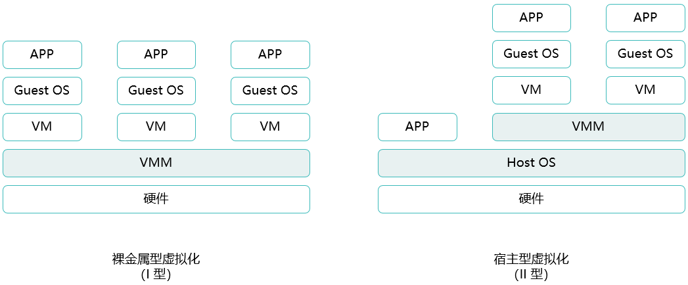
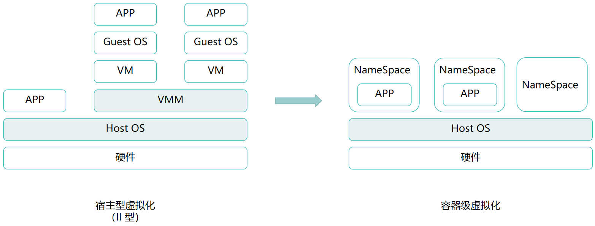

# Docker基础入门

在虚拟化技术学习中曾提到过虚拟化与容器之间的关系，虚拟机不等于容器，Docker也不等于容器，Docker只是使用容器的一种工具

## 虚拟化

目前主流的虚拟化的实现形式分两种：*主机级虚拟化* 和 *容器级虚拟化*。主机级虚拟化需要提供完整的虚拟硬件平台

### 一、主机级虚拟化

主机级虚拟化的分类



- **Ⅰ型虚拟化**

  Ⅰ型虚拟化又称为裸金属型虚拟化，它将传统的操作系统与硬件分离解耦，转而直接在硬件之上安装了一个虚拟化OS，也被称为hypervisor层、VMM层等，在这个虚拟化OS上再安装多个虚拟机以达到最大限度的发挥硬件的性能。esxi就是Ⅰ型虚拟化

- **Ⅱ型虚拟化**

  Ⅱ型虚拟化则是在宿主机上安装虚拟化的hypervisor软件，通过hypervisor软件实现安装虚拟机。比较常见的有 virtualbox 和 vmware workstation

以上两种类型的主机级虚拟化，其底层的实现机制都是类似的，无论底层硬件上是否具备宿主机操作系统，hypervisor所提供的都是一套完整的虚拟化的硬件平台，那么用户需要通过该虚拟机执行任何操作或部署服务之前，都需要先在虚拟机上执行一套完整的系统安装流程

安装虚拟机操作系统的过程，等同于安装系统内核的过程，由安装好的内核提供用户空间，应用程序则运行在用户空间内。但实际上，运行内核并不是主要目的，内核的核心作用在于资源分配和管理，真正能够产生价值的是在用户空间中运行的应用程序，而不是出于通用目的而设计的资源管理平台。然而，系统内核仍需要作为业务中不可或缺的一部分，原因在于现在的应用程序基本上都需要依赖系统内核提供的运行环境才能正常运行

虽然主机级虚拟化技术的确实现了更大程度的物理资源利用率，但其带来的性能损耗也是不容忽视的，当需要部署的服务很少，甚至只有1个或2个服务时，虚拟机就显得无比臃肿

### 二、容器级虚拟化

既然只启用少量服务时虚拟机显得臃肿，那么减少中间层就是显著的提升效率的方式，例如，将虚拟机中的GuestOS层剥离。但如此一来又会产生一个问题，使用虚拟机的最终目的是为了实现资源隔离，每个虚拟机或虚拟机上的应用程序的异常都不会影响到其他虚拟机，那么将GuestOS层剥离后仍需考虑原本运行在各个虚拟机上的各个应用程序之间的隔离问题。也就是说，现在既需要将将GuestOS层剥离，同时在使用同一系统内核的情况下，又要使原本运行在各个虚拟机上的各个应用进程之间互相隔离



那么现在所需要的系统环境就产生了变化，首先需要一组硬件平台，其次在硬件平台上需要一组“虚拟的隔离环境管理器”，最后创建多个“隔离环境”，将各个应用进程运行在“隔离环境”内。众所周知，应用程序需要运行在用户空间中，因此这个所谓的“隔离环境”实际上就是隔离的用户空间。一般情况下，一个系统内核上对应只有一个用户空间，但在现在的应用场景下，我们希望可以拥有多组用户空间，多组用户空间之间互不干扰，一组用户空间中只运行一个或部分应用进程。但，正如XEN架构一般，无论用户空间之间怎么隔离，一般都会有一个用户空间，甚至是第一个用户空间，一定是有特权的，这个特权用户空间一般用于管理其他用户空间

在拥有多组用户空间之后，随后启动应用进程时，使应用进程运行在各个隔离的用户空间中，众多用户空间能够共享底层同一个系统内核，并被同一个系统内核管理，但每个用户空间内的应用进程在运行时所能感知到的边界是其所属的用户空间的边界，以此实现应用程序之间的隔离。每个用户空间都为应用进程提供了运行环境，并且保护其内部的应用进程不受其他应用进程的干扰，所以每个用户空间都是一个容器

一个单独的用户空间的主要目标是为了实现资源隔离，任何应用程序运行在该用户空间当中，它就认为自己是唯一运行在当前内核之上用户空间中的进程，且自己能看到的其他进程也都是这个系统内核之上的所有进程，因此一个用户空间中至少应该能够具备以下6种资源：

* UTS：独立的主机名域名

* Mount：独立的挂载树（文件系统树）；每个用户空间都需要具备独立的根文件系统

* IPC：进程间通信的专用通道，信息量、消息队列和共享存储；

  一般情况下，用户空间中的不同应用进程都是在同一个物理内存中运行，系统内核是希望不同进程间通过IPC实现进程间通信的，但在容器级虚拟化场景下，如果不同用户空间内的应用进程可以通过IPC实现进程间通信，那么隔离将毫无意义，因此需要确保每个用户空间的IPC资源都是独立的。同一容器下的不同应用进程之间可以通过IPC实现通信，不同容器间的应用进程不可通过IPC实现通信

* PID：独立的进程树；

  正常情况下，一个操作系统的运行无非就是“两棵树”，文件系统树和进程树，用户空间中的每一个进程都应该从属于某个父进程，如果一个进程没有父进程，它就应该是用户空间中的init进程。在Linux系统上的进程管理，子进程由父进程创建，也由父进程终止并回收，如果init进程终止了，那么在init终止之前会将所有子进程终止，也就是关机，这是Linux系统的基本逻辑

  在容器级虚拟化场景下，既然每个用户空间都认为自己就是系统内核上唯一的用户空间，那么每个用户空间就需要具备自己独立的init进程，否则这个用户空间中的应用进程将无法被管理，但对于init进程而言，事实上每个文件系统上只能有一个init进程，因此对于每个用户空间的处理方式分为两种

  如果用户空间内存在多个应用进程，那么该用户空间必须产生一个假的init进程，通过init进程对多个应用进程进行管理；如果一个用户空间内只运行一个应用进程，该应用进程就可以直接就被视作init进程，只要该应用进程结束，用户空间就被回收

  在系统内核上进程号为1的init进程只能有1个，在容器级虚拟化场景下，又不得不为每一个用户空间伪造init进程，因此需要将每个用户空间的进程树进行隔离

* User：独立的用户和用户组；

  每一个系统内核上都只能有一个root ID，如果每一个用户空间都具备root ID，那么是否存在某个用户空间的root账户能够跨边界管理其他用户空间的进程，这又失去了隔离的意义。因此，应该是为每个用户空间伪装出一个root账户，这个伪装的root账户在真正的系统内核上只是一个普通账户，但对于用户空间而言，该账户具备最高权限

* Net：独立的网络设备、TCP/IP栈、套接字接口Socket

> **jail、vserver**

容器并不是一个新概念，最早出现在FreeBSD系统上，早期被称为jail（监狱），最初的目的是为了运行一个应用进程不受其他干扰。最初出于程序的安全运行考虑，为应用程序提供一个沙箱环境，即便应用程序产生异常行为，也不至于影响到沙箱以外的其他应用进程。后来有人将jail这种技术复刻到Linux系统上，其产品称为vserver，早期vserver主要使用chroot工具来实现类似jail的功能

#### Namespace

对于系统内核而言，这些资源都是独立的、唯一的一组资源，因为系统内核在最初设计时就只是为了支撑单个用户空间运行，但随着技术发展产生了更多的运行容器的需求，为了支撑容器机制的实现，Linux系统在内核级已经通过一个名为namesapce的机制，逐渐原生支持以上6种资源的切分、隔离。事实上，这其中每一种资源只要能够在内核级可以切分为互相隔离的环境，这种隔离的环境就被称之为名称空间 Namespace

例如，正常情况下，UTS本身是属于系统内核级的资源，一个系统内核就应该只有一个UTS，在Linux内核原生支持namespace之后，每个namespace可以当作是Linux内核上唯一的、跟其他namespace不相互干扰的用户空间一样，UTS能够以namespace为单位进行隔离的，在一个Linux内核之上可以创建多个namespace，每个namespace都可以拥有独立的UTS，并且由Linux内核原生支持namespace的隔离。每个namespace可以各自使用自己独立的UTS资源，而不影响真正的Linux内核的UTS

Linux的namespace功能支持直接通过系统调用向外输出，例如，通过系统调用函数创建一个namespace，将进程放入某个namespace中、将进程从某个namespace中取出等操作都可以通过系统调用函数实现。从这个角度来看，要想使用容器，需要依靠用于支撑用户空间的Linux内核级的内核资源的namespace隔离机制来实现，因此迄今为止，整个Linux领域的容器化技术就是靠内核级的6个namespace和chroot来实现的

相比较虚拟机，容器则属于轻量级的虚拟化技术，使用容器时不再需先安装操作系统，因为容器共享了底层的系统内核，只需要系统内核划分出一个namespace，应用进程将运行在namespace中，但同时，容器的隔离性明显不如虚拟机，因为整个虚拟机从头到尾都是虚拟的，而容器却共享底层的操作系统。相比较虚拟机的安装和启动，一个容器的启动是秒级响应，更快的启动速度和轻量化

虽然6种资源都已经通过Linux内核的namespace技术原生支持，但最晚支持的User资源的隔离在Linux内核版本3.8之后才被支持，所以如果想要更好的使用容器技术，内核版本应该保持在3.8以上，CentOS 6天然就被排除在外，没有User的namespace机制的情况下，CentOS 6也能够使用容器技术，只不过在某些地方有功能缺失。

#### CGroups

在主机级虚拟化场景下

只有namespaces还不够 

为了防止namespaces中进程出现因为内存泄露而不断吃掉宿主机的内存，导致宿主机崩溃，Linux内核还需要一个功能来限制每一个namespaces可调用的资源总量，那就是cGroups


## LXC

到如今，学习Docker必谈容器，但Docker并不等于容器，因此在学习Docker之前先了解一些容器的相关知识


容器的学习从LXC开始，LXC全称Linux Container，


谈Docker谈容器，虚拟机不等于容器，Docker也不等于容器，Docker只是使用容器的一种工具


### Docker
早期使用容器时需要手写代码调用内核创建内核，门槛非常高，而为了使容器技术更加易用，产生了一组解决方案LXC，通过LXC工具可以快速创建一个namespaces，而后通过一个脚本模板文件，此模板文件会自动实现安装过程。此安装过程就是，对应namespaces中的Linux发行版，指向其发行版所对应的软件仓库下载镜像所对应的软件包进行安装 <br />
LXC虽然简化了容器的使用，但其复杂程度依旧非常高，并且对于数据迁移和批量创建上依然没有很好的解决，早期的Docker作为LXC的增强版，后来使用自建引擎runC，Docker的安装过程不再是依靠模板文件，而是提前将所需要的软件包打包成了一个镜像，将镜像放在一个共有仓库上以供下载 <br />
Docker与LXC的理念上也有所不同，LXC创建一个namespaces，基本等同于vmware创建了一个虚拟机，在这个namespaces中运行程序。而Docker的理念是每一个容器中仅运行一个进程

Docker的基本用法
===============
Docker是C/S架构，Client和Server可以共存在同一台主机上，Docker守护程序监听三个Socket，分别是IPv4、IPv6和unix socket，默认只监听unix socket

#### 仓库
仓库也被称为registry，本地存储是不便于存放过多的镜像的，为了提供一个集中的存储、分发镜像的服务，Docker registry就是这样的服务，registry允许用户免费上传、下载公开的镜像，最常用的registry公开服务是官方的DockerHub。

#### 镜像
启动一个容器时首先会从本地搜索镜像，如果本地没有镜像，就回去registry下载后再启动容器，下载镜像时可使用两种协议，https和http，默认仅使用https协议，只有手动指定http时才会使用http协议下载镜像

#### 容器
容器的启动必须依赖**本地镜像**，容器的实质就是进程，运行在属于自己的独立的namespaces中，可以拥有自己的根文件系统、网络配置、进程空间，就像在使用虚拟机一样

#### 标签
除了registry，还有一个仓库repository，一个registry中可以存放多个repository，repository更多的表示软件的名字，比如nginx就是一个repository，但nginx也有不同的版本，这些不同的版本则用标签声明，比如nginx:1.15表示nginx仓库中的1.15版，下载镜像时如果不指定标签，默认下载最新版，也就是latest

---------

#### 分层构建，联合挂载
Docker的镜像并不是传统的iso镜像，Docker的每一个镜像都分成了许多层，每一层都是只读层，使用镜像时就是将这些层挂载到了一起，从外面看起来就像是一个镜像，每个低一层都是高一层镜像的父镜像。镜像的所有层都是只读层，但容器必定会产生数据，所以在创建容器时，只读层全部挂载完毕后还会在最顶层额外挂载一个读写层，这个读写层随着容器的消亡而消亡 <br />
从dockerhub下载到本地的镜像占用的存储可能会比dockerhub上显示的要小一些，因为dockerhub上显示的存储大小是经过压缩过的，这样从dockerhub下载到本地时产生的流量会小一些。因为docker的镜像以分层的形式存在，那不同的镜像使用到相同的层时，再从dockerhub下载镜像，docker就不会再下载这些本地已有的层

### 安装docker
示例：此示例采用docker官方推荐的yum安装方式
```shell
1. 卸载旧版本docker
$ sudo yum remove docker \
                  docker-client \
                  docker-client-latest \
                  docker-common \
                  docker-latest \
                  docker-latest-logrotate \
                  docker-logrotate \
                  docker-engine

2. 安装yum工具，添加docker的yum源(阿里云)
$ sudo yum install -y yum-utils
$ sudo yum-config-manager \
    --add-repo \
    http://mirrors.aliyun.com/docker-ce/linux/centos/docker-ce.repo

3. 安装docker
$ sudo yum install docker-ce docker-ce-cli containerd.io

4. 查看docker是否安装成功
$ sudo docker --version

5. 配置docker加速器
由于docker官方在国内的加速器不咋地，阿里云需要注册账号创建私人加速器，所以此步骤免了
```
[docker官网的安装手册入口](https://docs.docker.com/get-docker/)
[CentOS安装手册](https://docs.docker.com/engine/install/centos/)

#### docker镜像管理
docker镜像文件格式是：{registry name}:{port}/{namespaces}/{repository name}:{tag name}
默认不指定registry的情况下会使用dockerhub，也就是docker.io，{namespaces}一般指账户名，默认使用docker官方的library账户 <br />
示例：docker镜像管理命令
```shell
# docker search nginx    #查找nginx镜像
# docker pull busybox    #下载busybox镜像
# docker image ls    #查看已下载的镜像
```

#### dockers容器管理
容器的选项非常多，这里列出docker官网的命令手册：[docker命令手册](https://docs.docker.com/engine/reference/run/)
示例：常见的容器命令
```shell
# docker container ls    #查看当前正在运行的容器，-a选项查看所有容器
# docker container run --name box -it --rm busybox:latest    #使用busybox镜像运行一个容器，设置别名为box，-it进入交互模式，--rm退出容器时立马删除此容器

#在容器中启动httpd服务
/ # mkdir /var/www/html
/ # echo "This is a test" > /var/www/html/index.html
/ # httpd -f -h /var/www/html/

# docker inspect box    #查看容器的详细信息
# docker container start -a -i box    #启动容器，并进入容器
# docker container kill box    #强制终止容器
# docker container rm box    #删除容器，只有容器停止运行后才能删除
# docker container exec -it web /bin/sh    #绕过容器的边界进入已启动的容器内运行命令，exec命令会再创建一个进程覆盖掉容器内的主进程
# docker attach centos    #进入容器，与exec的区别是，exec是进入容器后开启一个新的终端，attach则是进入容器正在执行的终端
# docker logs web    #查看容器日志
# docker cp centos:/index.html ./    #从容器中拷贝文件到宿主机
# docker stats elasticsearch    #查看容器占用资源状态
```

#### docker容器网络
容器总共有三个网络：网桥、主机、null，默认使用网桥模式
```shell
# docker network ls    #查看docker网络
```