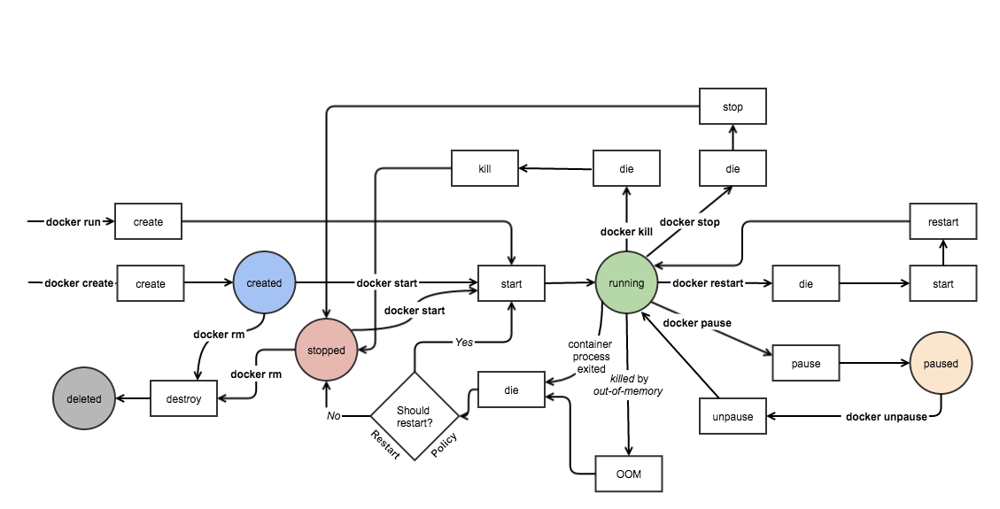

Docker的基本用法
===============

## 一、OCI

Open Container Initiative（开放容器计划），由Linux基金会主导于2015年成立，旨在围绕容器格式和运行时指定一个开放的工业化标准，确保容器跨平台的兼容性。OCI标准由两部分组成：

- Image Specification（镜像标准）：定义容器的分层结构、配置和分发格式
- Runtime Specification（运行时标准）：定义容器的创建、启动、隔离和生命周期管理

runC基于libcontainer构建，是一个根据OCI标准启动和运行容器的CLI工具，容器作为runC的子进程启动，可以嵌入到各种其他系统中，而无需运行守护进程。现如今，runC就是较新版本的Docker中使用的容器引擎

对于Docker而言，它专门提供了一个存放容器镜像的站点，称之为dockerhub。在dockerhub上可以找到大多数的容器镜像。从dockerhub下载到本地的镜像占用的存储可能会比dockerhub上显示的要小一些，因为dockerhub上显示的存储大小是经过压缩过的，这样从dockerhub下载到本地时产生的流量会小一些。因为docker的镜像以分层的形式存在，那不同的完整镜像使用到相同的细分镜像层时，再从dockerhub下载镜像，docker就不会再下载这些本地已有的细分镜像层

> **dockerhub访问异常**

截至2025年6月27日为止，dockerhub站点因不可抗力因素无法直接从国内访问，大部分的第三方的镜像加速服务也已经失效

## 二、Docker架构


整个Docker架构由三部分组成：Client、Server、Registry，Docker的Server端又称为DOCKER_HOST，所以整个Docker可以理解为是一个C/S架构的应用程序。实际上无论是Client端或Server端，都是由Docker这一个程序提供，Docker这个程序有很多子程序，其中一个子程序就是Docker daemon守护进程，当一台主机上运行Docker daemon时，这台主机就成为了一台守护进程服务器，他可以监听在Socket套接字上，套接字出于安全性考虑，默认只提供本机的unix socket文件的套接字

Docker作为C/S架构的应用程序，它支持三种套接字：IPv4套接字、IPv6套接字、unix socket套接字，也就是说默认情况下Docker daemon只允许本地Client访问。DOCKER_HOST的特征在于Containers与images，此前提到过，Docker基于镜像运行容器，这里的镜像指的就是DOCKER_HOST本地的images，然而DOCKER_HOST本身默认是没有image的，因此在第一次运行某一个容器时，Docker daemon需要从Registry下载相应的image，这个Registry默认是指的Docker Hub。从Registry下载镜像到DOCKER_HOST本地后，Docker daemon通过镜像的联合挂载机制，在所有镜像的最顶层挂载一个可写层，这就是一个容器，即Containers

**Registry**

Registry用于集中存放Docker的image，因此Registry也被简称为“仓库”。由于image本身就会占用更多的磁盘空间，并且Docker Host上未来会通过哪些image启动容器也是未知的，因此Docker Host本地不便于存放过多的image，但同时为了便于Docker Host的镜像管理，需要一个角色来提供集中的镜像存储、镜像分发的服务，这就是Registry。一般公共的Registry允许用户免费上传、下载公开的镜像，Docker配置文件中默认使用的Registry就是Docker官方提供的Docker Hub，现在也可以使用第三方提供的镜像仓库服务或自建私有Registry，例如阿里云容器镜像服务

Docker基于镜像启动一个容器时，首先会从Docker Host本地搜索镜像，如果本地没有镜像，就会从Registry拉取对应版本的镜像到本地后再启动容器。从Docker Host向Registry下载镜像时可使用两种协议：https或http，默认都是仅使用https协议，只有手动指定http时才会使用http协议下载镜像。同样的Client与Docker Host之间的通信也可以使用https或http，只不过在使用本地unix socket时无需考虑复杂场景

镜像是静态的，它就像是存放在磁盘上的程序文件；容器是动态的、具备生命周期的，它就像是通过程序启动成为进程，因此容器的启动必须依赖Docker Host本地镜像。容器运行在属于自己的独立的namespace中，可以拥有自己的根文件系统、网络配置、进程空间，就像在使用虚拟机一样

**tag**

总所周知，一个处于长期维护状态下的软件，本身就在不断的迭代更新，这意味着软件本身也是存在版本差异的。公共的Registry允许用户上传自制的镜像，那么Docker在使用Registry提供的集中的镜像存储服务时，Registry自身应该如何区分不同的应用程序、应用程序自身的不同版本、以及不同用户的自制镜像？

此处就需要引出一个新的“仓库”的概念，即repository。一个Registry下存放的是众多的repository，在不考虑用户自制镜像的情况下，一个repository下一般只存放一个应用程序的镜像，在repository下通过tag来区分应用程序自身的不同版本的镜像。repository本身又分为两种，一种是repository的名称直接与应用程序的名称相同，这种repository又被称为顶级repository，一般是由Docker Hub官方发布的镜像仓库；另一种则是由用户自建的repository，用户自建的repository与顶级repository在名称上会产生较大差异

在常规场景下提起nignx，一般指的是nginx应用程序，在Docker应用场景下提起nginx，一般指的是nginx的顶级repository。通过`docker search nginx`搜索nginx镜像时会检索到顶级repository和用户repository，例如`nginx`与`hebor/nginx`，前者repository名与应用程序名相同，一般是顶级仓库，后者则是由`用户名/镜像名`组成，一般是用户自制镜像repository。在使用`docker search`检索镜像时只会显示repository，如果要查看镜像的tag，需要通过浏览器访问Resigtry检索repository进行查看

无论是顶级repository或用户repository，镜像的不同版本在repository下都需要通过tag进行标记。以一个完整的nginx镜像名`nginx:1.15`为例，nginx表示镜像的repository、`1.15`则表示镜像的tag，因此通过`repository:tag`的组合才能唯一标识一个镜像，如果在拉取镜像时仅提供了repository名称而没有提供tag，则拉取该repository的默认镜像，repository的默认镜像一般都是latest最新版本的镜像，一个镜像可以同时具备多个tag

一个Registry至少需要具备两种功能：镜像存储的仓库、用户身份的认证，一般情况下，它还会通过其他插件提供Registry上所有可用镜像的索引

## 三、Docker部署

### 3.1 YUM安装

1. 卸载旧版本docker

   在安装Docker Engine之前需要卸载任何冲突的软件包

   ```bash
   [root@docker ~]# yum remove docker \
   docker-client \
   docker-client-latest \
   docker-common \
   docker-latest \
   docker-latest-logrotate \
   docker-logrotate \
   docker-engine
   ```

2. 配置YUM源

   CentOS 7于2024年结束生命周期，Docker官网已经不再提供CentOS 7的官方安装指南，因此需要使用第三方YUM源安装Docker

   ```bash
   [root@docker ~]# \rm /etc/yum.repos.d/*    # 删除系统自带的YUM配置
   [root@docker ~]# curl -o /etc/yum.repos.d/CentOS-Base.repo https://mirrors.aliyun.com/repo/Centos-7.repo
   [root@docker ~]# yum install -y yum-utils    # 安装YUM工具
   [root@docker ~]# yum-config-manager --add-repo https://mirrors.aliyun.com/docker-ce/linux/centos/docker-ce.repo    # 添加Docker的软件YUM仓库
   ```

3. 安装软件包

   ```bash
   [root@docker ~]# yum install docker-ce docker-ce-cli containerd.io docker-buildx-plugin docker-compose-plugin
   ```

4. 启用服务

   ```bash
   [root@docker ~]# systemctl enable --now docker
   ```

5. 配置镜像加速服务

   实际上大部分的第三方的镜像加速服务已经失效，此步骤可省略

   ```bash
   [root@docker ~]# vim /etc/docker/daemon.json    # 路径不存在时手动创建
   {
     "registry-mirrors": ["https://xxxxxxxx.mirror.aliyuncs.com"]
   }
   [root@docker ~]# systemctl daemon-reload 
   [root@docker ~]# systemctl restart docker
   ```

[docker官网的安装手册入口](https://docs.docker.com/get-docker/)
[CentOS安装手册](https://docs.docker.com/engine/install/centos/)

## 四、Docker管理

### 4.1 基本信息

1. 查看Client端与Server端的版本信息

   ```bash
   [root@docker ~]# docker version
   ```

2. 查看docker详细信息

   ```bash
   [root@docker ~]# docker info
   ...
   Server:
    Containers: 0    # 当前容器数量
     Running: 0      # 处于运行状态的容器数量
     Paused: 0       # 处于暂停状态的容器数量
     Stopped: 0      # 处于停止状态的容器数量
    Images: 0        # 镜像数量
    ...
    Storage Driver: overlay2    # 存储驱动后端，Docker镜像的分层构建、联合挂载功能必须使用特殊的文件系统才能实现
    ...
    Registry Mirrors:           # 仓库镜像
     https://v8znzt9x.mirror.aliyuncs.com/    # 此处可确认镜像加速器是否配置成功
   ```

### 4.2 常用操作

#### 4.2.1 镜像管理

```bash
[root@docker ~]# docker search nginx               # 搜索镜像
[root@docker ~]# docker image pull nginx:alpine    # 拉取最新版nginx镜像到本地
[root@docker ~]# docker image rm busybox:latest    # 删除本地镜像
[root@docker ~]# docker image ls --no-trunc        # 查看本地镜像
    --no-trunc：输出完整的镜像ID
```

常见的，nginx可以基于CentOS、Ubuntu等Linux发行版进行安装，同样的也可以基于一些小体量的Linux发行版进行安装，alpine就是基于微型Linux发行版构建出的nginx镜像，alpine版的磁盘空间占用、带宽压力都会小很多，测试环境下可以使用alpine版

无论是基于CentOS或微型Linux发行版的nginx镜像，即便是官方提供的镜像也不过是基于最小化的安装，实际上镜像里都缺少调试工具，在生产环境中更推荐自制镜像，根据实际需求可以将所需要的调试工具封装到镜像中

docker镜像文件格式是：`{registry name}:{port}/{namespaces}/{repository name}:{tag name}`，默认不指定registry的情况下会使用dockerhub，也就是docker.io，`{namespaces}`一般指账户名，默认使用docker官方的library账户

#### 4.2.2 容器管理

1. 运行容器

   容器的运行选项非常多，可以通过man手册或[Docker官网的命令手册](https://docs.docker.com/engine/reference/run/)查看运行选项解析

   ```bash
   [root@docker ~]# docker container run --name box -i -t --rm busybox:latest    #使用busybox镜像运行一个容器
       --name：为容器设置别名
       -i：保持STDIN打开
       -t：分配一个伪TTY
       --rm：退出容器时立马删除此容器
       -d,--detach：使容器运行在后台
   
   / # ps    # 查看容器中的进程
   PID   USER     TIME  COMMAND
       1 root      0:00 sh    # PID为1代表此进程是整个用户空间的总管进程，它的终止意味着整个用户空间的终止，用户空间的终止意味着整个容器的终止
       9 root      0:00 ps
   / # exit    # 由于--rm参数，推出容器时意味着这个容器将被删除
   
   [root@docker ~]# docker container run --name box -id busybox:latest    # 后台启用一个容器
   [root@docker ~]# docker container stop box    # 停止容器运行
   [root@docker ~]# docker container start -a -i box    # 启动并进入容器
   [root@docker ~]# docker container kill box    # 强制终止容器
   [root@docker ~]# docker container exec -it box /bin/sh    # 绕过容器的边界进入已启动的容器内运行命令，exec命令会再创建一个进程覆盖掉容器内的主进程
   [root@docker ~]# docker container attach box    # 进入容器，与exec的区别是，exec是进入容器后开启一个新的终端，attach则是进入容器正在执行的终端
   [root@docker ~]# docker container cp box:/index.html ./    # 从容器中拷贝文件到宿主机
   [root@docker ~]# docker container stats box    # 查看容器占用资源状态
   ```

   Docker的理念是在一个容器内只运行一个进程，基于一个镜像启动一个容器时，管理员可以手动指定容器要运行的程序，当管理员没有指定要运行的程序时，每个镜像自身都有它自定义的默认要运行的程序，容器会运行镜像自定义的默认程序

   在容器中运行的程序，包括守护进程或镜像自定义的默认程序，都不能运行在后台，如果容器中的主进程运行在后台，会被Docker判断为主程序已经终止，从而终止整个容器。以默认的nginx镜像为例，启用nginx镜像时可以看到nginx镜像的默认程序是将nginx的守护进程运行在前台

   当运行`Docker run`启用一个容器时，如果Docker Host本地没有镜像，它会自动从Registry下载镜像到本地后，再通过镜像启动容器，这个过程由Docker自动实现

2. 查看容器

   ```bash
   [root@docker ~]# docker container ls    # 查看当前正在运行的容器
       -a：查看所有容器，包括不活跃状态的容器
   [root@docker ~]# docker inspect box     # 查看容器的详细信息
   [root@docker ~]# docker logs web        # 查看容器日志
   ```

3. 删除容器

   ```bash
   [root@docker ~]# docker container rm box    # 删除容器，正常删除容器需要先停止运行容器
   ```

#### 4.2.3  网络管理

```bash
[root@docker ~]# docker network ls
NETWORK ID     NAME      DRIVER    SCOPE
c083dc41a4de   bridge    bridge    local    # 创建容器默认会使用bridge网络
a989ecf04600   host      host      local
a2b56ed2fa77   none      null      local
```

### 4.3 Docker状态变更流程


