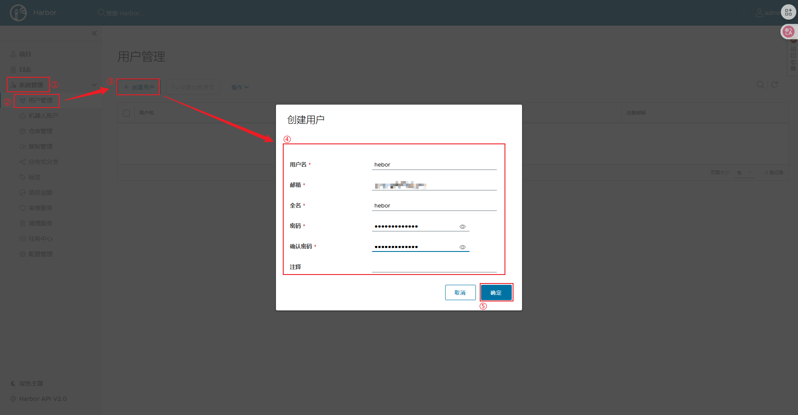
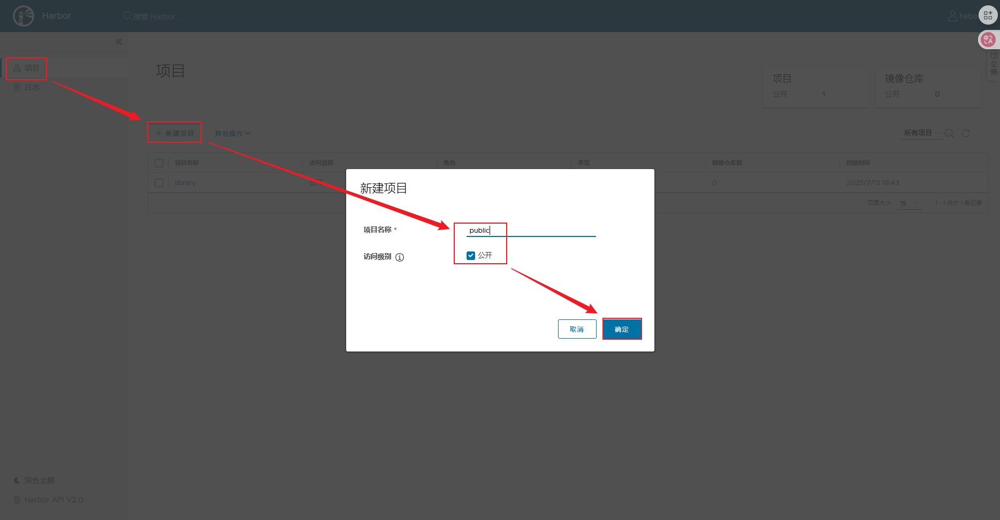

# Private Registry

Docker容器应用的开发和运行离不开可靠的镜像管理，虽然Docker官方以及第三方厂商都提供了公共的镜像仓库，但是从安全和效率等方面考虑，部署企业私有环境内的Registry是必要的

## 一、harbor

Harbor是由VMware公司开源的企业级的Docker Registry管理项目，它包括权限管理（RBAC）、LDAP、日志审核、管理界面、自我注册、镜像复制和中文支持等功能

### 1.1 harbor部署

1. 签发证书

   Docker Host访问Registry时默认使用HTTPS协议，HTTPS提供更加安全的外网访问，但同样HTTPS也需要证书文件，实验环境中使用自签发证书方式进行HTTPS环境部署，实现最终测试环境访问

   ```bash
   # 1.创建保存证书的目录
   [root@docker ~]# mkdir -p /data/ssl/ && cd /data/ssl/
   
   # 2.生成CA私钥文件
   [root@docker ssl]# openssl genrsa -out ca.key 3072
       genrsa：openssl的子命令，专用于生成RSA私钥。不生成公钥，公钥需从私钥提取
       -out：指定输出文件路径
       3072：RSA密钥长度，单位为bit。默认为2048，3072长度更高，安全性更强
   
   # 3.生成CA数字证书
   [root@docker ssl]# openssl req -new -x509 -days 3650 -key ca.key -out ca.pem
   Country Name (2 letter code) [XX]:CN
   State or Province Name (full name) []:BJ
   Locality Name (eg, city) [Default City]:BJ
   Organization Name (eg, company) [Default Company Ltd]:
   Organizational Unit Name (eg, section) []:
   Common Name (eg, your name or your server's hostname) []:
   Email Address []:
       req：证书请求操作，用于处理证书请求（CSR）或直接生成自签名证书
       -new：创建新的证书请求结构
       -x509：生成的证书格式标准，直接输出X.509格式的自签证书
       -days：证书有效时间
       -key：指定私钥文件
       -out：输出证书文件，包含公钥和签名信息
   
   # 4.生成私钥文件
   [root@docker ssl]# openssl genrsa -out harbor.key 3072
   
   # 5.生成证书请求文件（CSR)
   [root@docker ssl]# openssl req -new -key harbor.key -out harbor.csr
   Country Name (2 letter code) [XX]:CN
   State or Province Name (full name) []:BJ
   Locality Name (eg, city) [Default City]:BJ
   Organization Name (eg, company) [Default Company Ltd]:
   Organizational Unit Name (eg, section) []:
   Common Name (eg, your name or your server's hostname) []:harbor
   Email Address []:
   
   Please enter the following 'extra' attributes
   to be sent with your certificate request
   A challenge password []:
   An optional company name []:
   
   # 使用CA证书签署证书签名请求（CSR），生成最终可用的X.509格式服务器证书（harbor.pem）
   [root@docker ssl]# openssl x509 -req -in harbor.csr -CA ca.pem -CAkey ca.key -CAcreateserial -out harbor.pem -days 3650
       openssl x509：这是一个组合命令，用于证书生成、查看、转换等操作
       -req：指定输入的文件类型是CSR文件，声明输入文件是证书请求，而非已生成的证书
       -in：指定CSR文件
       -CA：指定CA证书文件
       -CAkey：指定CA私钥文件
       -CAcreateserial：自动创建序列号文件，生成唯一的.srl序列号文件，避免重复
   ```

    不同密钥长度的安全性与性能对比

   | 密钥长度 | 安全性 | 性能影响 | 典型应用场景              |
   | -------- | ------ | -------- | ------------------------- |
   | 2048 位  | ★★★☆☆  | 低       | 普通 Web 服务器、内部系统 |
   | 3072 位  | ★★★★☆  | 中       | CA 根证书、金融系统       |
   | 4096 位  | ★★★★★  | 高       | 军事、政府等高安全场景    |

2. 安装软件包

   ```bash
   [root@docker ssl]# cd
   [root@docker ~]# wget https://github.com/goharbor/harbor/releases/download/v2.13.1/harbor-offline-installer-v2.13.1.tgz
   [root@docker ~]# tar -xzf harbor-offline-installer-v2.13.1.tgz
   ```

3. 修改harbor配置文件

   ```bash
   [root@docker ~]# cp /root/harbor/harbor.yml.tmpl /root/harbor/harbor.yml
   [root@docker ~]# vim /root/harbor/harbor.yml
   hostname: docker.hebor.cc
   https:
     certificate: /data/ssl/harbor.pem
     private_key: /data/ssl/harbor.key
   ```

4. 安装docker-compose

   docker-compose项目是Docker官方的开源项目，负责实现对Docker容器集群的快速编排，其工程配置文件默认为`docker-compose.yml`，运行目录下必须存在一个`docker-compose.yml`文件。harbor官方文档中有声明，安装harbor的先决条件必须要先安装docker-compose，harbor 2.13版本要求docker-compose版本不低于2.3

   ```bash
   [root@docker ~]# wget https://github.com/docker/compose/releases/download/v2.38.2/docker-compose-linux-x86_64
   [root@docker ~]# mv docker-compose-linux-x86_64 /usr/local/bin/docker-compose
   [root@docker ~]# chmo +x /usr/local/bin/docker-compose
   [root@docker ~]# docker-compose --version
   ```

5. 安装harbor

   ```bash
   [root@docker ~]# cd harbor/
   [root@docker harbor]# docker load -i harbor.v2.13.1.tar.gz    # 导入镜像
   [root@docker harbor]# ./install.sh    # 执行安装脚本
   ```

   执行harbor的安装脚本后，harbor会在其根目录下生成一个`docker-compose.yml`配置文件，因此harbor可以通过docker-compose进行启停

6. 访问harbor

   浏览器输入harbor主机的IP，缺省账户密码是admin/Harbor12345

### 1.2 harbor管理

1. [系统管理] -> [用户管理] -> [创建用户]；新建用户，并切换为新用户等路harbor

   

2. [项目] -> [新建项目]；通过普通用户新建一个公开项目public、一个私有项目private

   

3. 切换另一台Docker机器，修改Docker Host配置连接Harbor

   ```bash
   [root@node1 ~]# vim /etc/docker/daemon.json
   {
     "registry-mirrors": ["https://v8znzt9x.mirror.aliyuncs.com"],
     "insecure-registries": ["192.168.0.13","docker.hebor.cc"]    # 指定使用http协议的Registry
   }
   [root@node1 ~]# systemctl daemon-reload 
   [root@node1 ~]# systemctl restart docker
   ```

4. 远端Docker Host登录Harbor

   远端Docker Host的登录操作与Harbor本身的项目权限有关，虽然在Harbor上创建的公开的public项目，但public在Harbor中默认是公开拉取而非公开推送，因此用户如果要向public推送镜像时，则需要同时具备项目访问权和推送权限

   ```bash
   [root@node1 ~]# echo "192.168.0.13    docker.hebor.cc" >> /etc/hosts
   [root@node1 ~]# docker login docker.hebor.cc
   Username: hebor
   Password: *****
   ```

5. 远端Docker Host向Harbor推送镜像

   推送镜像的命名格式也很关键，必须包含完整的项目名路径

   ```bash
   # 为镜像设置标签
   [root@node1 ~]# docker tag centos:latest docker.hebor.cc/public/centos:v1
   [root@node1 ~]# docker tag web:latest docker.hebor.cc/private/web:v1
   
   [root@node1 ~]# docker push docker.hebor.cc/public/centos:v1    # 向public项目推送镜像
   [root@node1 ~]# docker push docker.hebor.cc/private/web    # 向private项目推送镜像
   ```

6. 从Harbor拉取镜像

   ```bash
   [root@node1 ~]# docker image rm centos    # 删除本地镜像
   [root@node1 ~]# docker pull docker.hebor.cc/public/centos:v1
   
   # 拉取镜像的另一种方式，从Harbor上获取镜像的pull链接，这种方式拉取的镜像tag是none
   [root@node1 ~]# docker pull docker.hebor.cc/public/centos@sha256:a1801b843b1bfaf77c501e7a6d3f709401a1e0c83863037fa3aab063a7fdb9dc
   ```

   

private registry
----------------

docker默认拒绝使用http访问registry，为了快速创建私有registry，docker专门提供的一个程序包：docker-distribution，且在dockerhub上也有registry的容器仓库，运行registry容器必须为其定义一个存储卷，且此存储卷应该时共享存储。
```shell
# yum install  docker-registry -y	#实际安装过程安装的还是docker-distribution包
# rpm -ql docker-distribution		#查看配置文件路径、镜像存储路径、服务名称
# vim /etc/docker-distribution/registry/config.yml	#修改镜像存储路径
# systemctl start docker-distribution.service	#启动服务，默认使用5000端口
```
直接使用本地地址是可以上传镜像的，但如果非本地地址，又不是https协议，则需要修改/etc/docker/daemon.json文件
```shell
"insecure-registries": ["10.250.1.11:5000"]	#添加此行，IP地址可以更改为域名
```
重启docker服务后，修改镜像仓库名称，上传镜像即可

harbor
------

harbor的项目代码托管在github上，在安装harbor之前需要确认主机上已经安装了docker和docker-compose，确切的版本要求github上面也明确[要求](https://github.com/goharbor/harbor)了
[harbor配置文件信息](https://goharbor.io/docs/2.0.0/install-config/configure-yml-file/)<br />
配置文件中分为必要配置和可选配置，必要配置至少要修改主机名，可以选择性修改harbor的管理员密码和数据库密码，如果没有为https配置证书，那https的内容需要注释，否则会报错<br />
[harbor脚本安装](https://goharbor.io/docs/2.0.0/install-config/run-installer-script/)<br />
直接运行安装脚本即可，安装完成后查看端口是否开放

```diff
- harbor.yml文件中开放的端口号必须要与/etc/docker/daemon.json文件中的端口号相同，否则即便安装完成也无法登录web
```