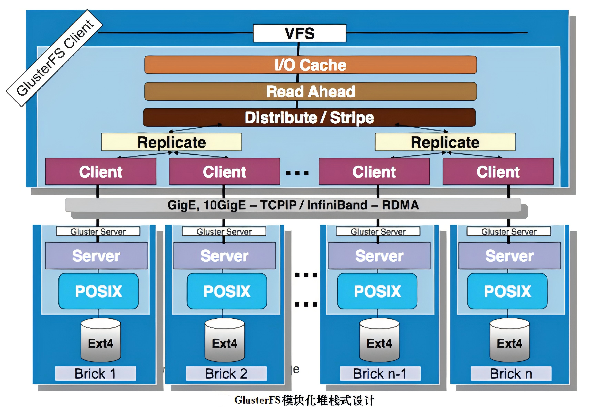
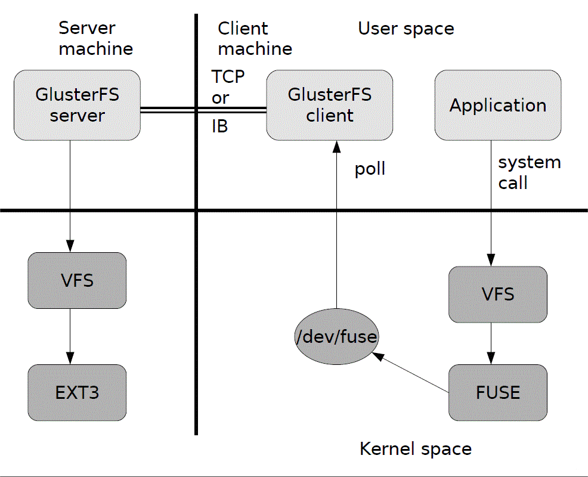
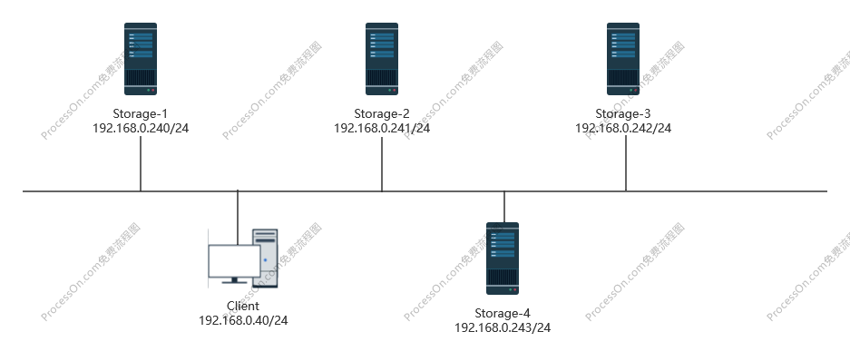

# GFS分布式文件系统

分布式存储是将一些零散的服务器，利用软件技术组合到一起的大容量的存储空间。相比较阵列集群而言，分布式存储可以通过添加服务器来实现存储池的扩容，因此分布式存储的扩容相比较阵列集群而言也相对容易。

分布式存储是**去中心化**的，能够提供高性能的**并行I/O访问**，例如，某一个计算节点的数据在写入存储之前，会对该数据进行切片，数据会被打散均衡的写入不同的后端存储服务器。每个计算节点都有自己的CPU、内存、网卡等硬件设备，每台服务器都能独立的对外提供I/O读写。分布式存储横向扩展容易，服务器的成本也比阵列低，但服务器不是专业的阵列，分布式存储的所有解决方案都是通过软件实现的，因此相比较阵列，分布式存储还需要解决数据的可靠性、可用性的问题，为了避免出现数据丢失的情况，需要**副本**机制保证数据完整性，但副本越多，可用空间越小

## GlusterFS概述

GlusterFS是一个高性能的、开源的分布式文件系统，一般情况下它由存储服务器、客户端以及NFS/Samba存储网关三部分组成。

- 存储服务器：数据的实际存放位置，通过横向扩展存储服务器数量可以实现扩大存储池容量
- 客户端：客户端不是指客户PC机，比较常见的系统架构中，直接面向用户的一般是调度服务器，在调度服务器下面是Web服务器集群，其次多个Web服务器共享后端的同一个存储，存储即GFS，因此GFS的客户端一般情况下是指的Web集群下的Web服务器
- NFS/Samba存储网关：存储网关在GFS系统架构中并不是必须要存在的，一般情况下NFS/Samba存储网关的作用是为了兼容其他的一些操作系统，例如Windows操作系统，一般情况下Windows系统可能无法直接接入GFS集群，此时即可通过代理、过渡的方式将GFS存储数据共享到Windows系统上，即NFS/Samba存储网关。如果业务环境中没有需要兼容的需求，NFS/Samba存储网关就无需部署

GlusterFS的一个重要特点是在整个集群当中都没有元数据服务器，在存储的概念里，数据最终会落在硬盘上。在没有元数据的情况下，如果要在硬盘中读取某一个数据，需要全盘扫描硬盘来找到这个数据；元数据的作用就类似于书的目录，它用于记载数据存放在硬盘的物理位置，因此在有元数据的情况下，通过先读取元数据来获取数据存放的物理位置，可以加快数据的读取速度

GlusterFS之所以在没有元数据的情况下还能作为高性能分布式存储，是因为它直接通过Hash算法计算数据的读写位置。元数据原本的作用是为了加快数据的读写，但元数据本身仍存在一些问题，例如在海量小文件场景下，所有数据访问都需要先于元数据服务器交互，频繁的元数据读写请求会导致服务器负载过高、性能下降；元数据更新需要与数据更新同步完成（例如文件访问时间修改），导致高并发场景延迟显著增加；元数据服务器的故障会导致整个集群的存储数据不可用，等问题。GlusterFS使用算法定位数据的方式，解决了文件系统依赖元数据做数据读写的问题，每个文件的路径名通过Hash计算映射到特定存储点，避免元数据查询的开销，实现完全并行化数据访问

### GlusterFS的特点

- **扩展性和高性能**：基于弹性Hash算法存储数据，理论上可以通过扩展存储服务器数量来实现无限容量的存储空间
- **高可用性**：GlusterFS本身提供了一些高可用特性，例如GFS具备多种卷类型，其中有一种复制卷类型可以实现数据的备份
- **全局统一命名空间**：GlusterFS集群配置完成后，每个卷都有一个唯一的卷名，客户端需要使用GlusterFS存储时仅需要挂载卷名即可，而无需关心底层由多少硬盘组成
- **弹性卷管理**：在使用过程中，可按业务需求缩容、扩容卷的存储空间大小
- **基于标准协议**：客户端与服务端可以基于TCP/IP和InfiniBand RDMA两种网络协议实现互联

### GlusterFS术语

- **Brick**：存储块。对于存储节点而言，一个存储块既可以是一块物理硬盘、也可以是一个物理硬盘上的某一个分区。Brick有单独的表示方式`存储节点IP:/挂载点`
- **Volume**：逻辑卷，一组存储块的集合。可以由物理上可以毫无关联的硬盘或存储块组成，例如由不同存储节点的硬盘逻辑上组合到一起形成一个整体
- **FUSE**：是Linux系统内核中的一个模块，该模块允许用户创建自己的文件系统。单纯的逻辑卷无法直接存储数据，还需要先进行格式化创建文件系统才可以存储数据，FUSE模块允许用户创建自己的文件系统，例如XFS、EXT等文件系统
- **VFS**：虚拟文件系统，是Linux内核中的一个关键抽象层，**向上提供统一接口，向下兼容不同文件系统**。与开发相关，仅作了解
- **Glusterd**：GlusterFS服务的守护进程，在存储集群的每个节点上都应该运行此收回就能成

### GlusterFS架构



GlusterFS采用模块化、堆栈式的架构，通过对模块的组合实现复杂的功能

模块化指的是GlusterFS中存在多种类型的卷，不同类型的卷可以用于实现不同的功能，例如，此前高可用性特点中提到的复制卷可以实现数据备份功能，还有分布式卷可以实现底层数据写入到多个存储节点，使存储容量易扩展。这就是GlusterFS的模块化，指通过不同的类型的卷实现不同的功能

堆栈式即指通过对模块的组合实现复杂的功能。例如，将复制卷与分布式卷结合使用，即可同时实现数据备份和容量扩展功能，既保障数据的安全性，又保障存储的可扩展性

## GlusterFS工作原理



示意图中以左右两侧来看，左侧是`Server machine`、右侧是`Client machine`，服务端与客户端之间可以通过TCP/IP或IB（InfiniBand RDMA）网络协议实现互联。示意图中以上下两侧来看，上面是`User space`、下面是`Kernel space`，整个Client与Server通信的过程中，只有用户空间是管理员可观察、可管理到的，内核空间的操作由Linux Kernel自动完成，管理员无法手动干预。假设现在Client有一些数据要写入Server端，数据的写入流程如下

1. 客户端应用程序要通过GlusterFS的挂载点访问数据时，首先会向客户端操作系统的VFS API发起系统调用
2. 客户端Linux系统内核通过VFS API收到请求并处理
3. VFS将数据递交给FUSE内核文件系统
4. FUSE文件系统通过/dev/fuse设备文件将数据递交给GlusterFS client端程序；只有ClusterFS client才能关联到ClusterFS Server
5. ClusterFS client程序收到数据后，client程序根据配置文件的配置对数据进行处理；Cluster client程序的配置文件中能够定位到Cluster Server的地址
6. ClusterFS client程序通过网络将数据传递至远端的GlusterFS Server，并将数据写入到Server的存储设备上

### 弹性HASH算法

- 通过HASH算法得到一个32位的整数

- 划分为N个连续的子空间，每个空间对应一个Brick

  GlusterFS会基于Volume下面Brick的数量，将2^32的总地址范围空间均匀的划分给每个Brick，以4个Brick节点的GlusterFS卷为例，2^32的总地址范围区间数值会均分为4份，每个Brick节点占用一份范围空间。当用户要访问存储中的某一个文件时，首先会计算该文件的HASH值得到一个32位的整数，根据文件的HASH值再去对比每个Brick的地址范围，找到文件HASH值所属的地址范围空间与其对应的Brick

  比如，4个Brick分别对应的地址空间是`1~1000`、`1001~2000`、`2001~3000`、`3001~4000`，现在某一个文件的HASH值计算为1024，那么用户读写就应该找到第二个Birck。实际的数值不会这么小，范围应该是2^32

- 弹性HASH算法的优点
  - 保证数据平均分布在每一个Brick中
  - 解决了对元数据服务器的依赖，进而解决了单点故障以及访问瓶颈

## GlusterFS的卷类型

GlusterFS支持多种卷类型，然而在GlusterFS的实际应用过程，某些卷类型并不能广泛的适用于实际需求，因此随着GlusterFS的不断更新，部分卷类型已经被淘汰，不同版本的GlusterFS支持的卷类型不一样，旧版本的GlusterFS支持的卷类型更多，从GlusterFS 6.1版本开始有关于条带卷的相关卷类型全部被停用，命令帮助能看到相关命令，但已无法使用

- 分布式卷
- 条带卷（已停用）
- 复制卷
- 分布式条带卷（已停用）
- 分布式复制卷
- 条带复制卷（已停用）
- 分布式条带复制卷（已停用）

### 分布式卷

- 没有对文件进行分块处理
- 通过扩展文件属性保存HASH值
- 支持的底层文件系统有Ext3、Ext4、ZFS、XFS等

分布式卷没有分块处理，一个文件只能作为一个整体存放在某一个Server中，不提升读写效率

**分布式卷的特点**

- 文件分布在不同服务器，不具备冗余性；某个Server故障后，存放在该Server上的文件全部丢失
- 更容易和廉价的扩展卷的大小；理论上通过横向扩展服务器数量，可以实现无限大的存储空间
- 单点故障会造成数据丢失
- 依赖底层的数据保护；例如通过服务器上的RAID卡实现数据冗余

**创建分布式卷语法**

- 创建一个名为dis-volume的分布式卷，文件将根据HASH分布在Server1:/dir1、Server2:/dir2、Server3:/dir3中

  ```bash
  gluster volume create dis-volume server1:/dir1 server2:/dir2 server3:/dir3
  ```

  GlusterFS卷名有统一的命名空间，每个卷都有一个唯一的卷名，客户端需要使用这个GlusterFS存储时仅需要挂载卷名dis-volume即可

### 条带卷

- 根据偏移量两文件分为N块（N个条带节点），轮询的存储在每个Brick Server节点
- 存储大文件时，性能尤为突出
- 不具备冗余性，类似RAID 0

条带卷实现多个Server并大读写数据，提升读写效率

**条带卷特点**

- 数据被分割为更小块分布到块服务器集群中的不同条带区
- 分布存储减少了服务器负载，且更小的文件加速了读取速度
- 没有数据冗余

**创建条带卷**（仅做了解）

- 创建一个名为Stripe-volume的条带卷，文件将被分块轮询的存储在Server1:/dir1、Server2:/dir2两个Brick中

  ```bash
  gluster volume create stripe-volume stripe 2 transport tcp server1:/dir1 server2:/dir2
  ```


### 复制卷

- 同一文件保存一份或多份副本
- 因为要保存副本，所以磁盘利用率比较低
- 多多个节点上的存储空间不一致，将按照木桶效应取最低容量的节点作为该卷的总容量

**复制卷的特点**

- 卷中所有的服务器均保存一个完整的副本
- 卷的副本数量可由管理员创建卷的时候指定
- 至少由两个块服务器或更多服务器组成
- 具备冗余性

**创建复制卷**

- 创建名为rep-volume的复制卷，文件将同时存储两个副本，分别在Server1:/dir1和Server2:/dir2两个Brick中

  ```bash
  gluster volume create rep-volume replica 2 transport tcp server1:/dir1 server22:/dir2
  ```

### 分布式复制卷

- 兼顾分布式卷和复制卷的功能
- 用于需要冗余的场景

**创建分布式复制卷**

- 创建名为dis-rep的分布式复制卷，配置分布式复制卷时，卷中Brick所包含的存储服务器数必须是副本数的倍数（>=2倍）；命令上与复制卷的区别仅限于服务器的数量变化，分布式复制卷的服务器数量必须是副本数的倍数，复制卷的副本数与服务器数量等同

  ```bash
  gluster volume create dis-rep replica 2 transport tcp server1:/dir1 server2:/dir2 server3:/dir3 server4:/dir4
  ```

## 部署集群环境

### 集群结构

**集群环境**



**卷类型**

| 卷名称     | 卷类型       | 卷空间大小 | Brick                                                        |
| ---------- | ------------ | ---------- | ------------------------------------------------------------ |
| dis-volume | 分布式卷     | 12G        | Storage-1（/sdb）、Storage-2（/sdb）                         |
| rep-volume | 复制卷       | 5G         | Storage-3（/sdb）、Storage-4（/sdb）                         |
| dis-rep    | 分布式复制卷 | 8G         | Storage-1（/sdc）、Storage-2（/sdc）、Storage-3（/sdc）、Storage-4（/sdc） |

**设备列表**

| 操作系统 | 系统IP        | 主机名    | 挂载磁盘                         | 挂载目录       |
| -------- | ------------- | --------- | -------------------------------- | -------------- |
| CentOS7  | 192.168.0.240 | Storage-1 | /dev/sdb (6G)<br />/dev/sdc (4G) | /sdb<br />/sdc |
| CentOS7  | 192.168.0.241 | Storage-2 | /dev/sdb (6G)<br />/dev/sdc (4G) | /sdb<br />/sdc |
| CentOS7  | 192.168.0.242 | Storage-3 | /dev/sdb (5G)<br />/dev/sdc (4G) | /sdb<br />/sdc |
| CentOS7  | 192.168.0.243 | Storage-4 | /dev/sdb (5G)<br />/dev/sdc (4G) | /sdb<br />/sdc |

### 集群部署

#### 一 、初始环境同步

此步骤所有主机都需要同步配置

1. 关闭SELinuux

   ```bash
   setenforce 0    # 临时关闭SELinux，使其即刻生效
   vim /etc/sysconfig/selinux    # 永久关闭SELinux
   ```

2. 关闭防火墙

   ```bash
   systemctl stop firewalld 
   systemctl disable firewalld
   ```

3. 安装常用工具

   ```bash
   yum install -y vim lrzsz
   ```

4. 修改主机名

   ```bash
   hostnamectl set-hostname storage-N    # 按照集群结构修改各GlusterFS服务器的主机名
   ```

5. 修改本地域名解析文件

   ```bash
   vim /etc/hosts
   192.168.0.240	storage-1
   192.168.0.241	storage-2
   192.168.0.242	storage-3
   192.168.0.243	storage-4
   ```

#### 二、安装GlusterFS

所有GlusterFS服务端都需要安装GlusterFS软件

1. 配置YUM源

   ```bash
   yum install -y centos-release-gluster
   ```

2. 安装GlusterFS软件组

   ```bash
   yum install -y glusterfs glusterfs-server glusterfs-fuse glusterfs-rdma
   	glusterfs：客户端软件；在GlusterFS的服务端中也需要安装GlusterFS的客户端软件
   	glusterfs-server：服务端软件
   	glusterfs-fuse：内核文件系统
   	glusterfs-rdma：GlusterFS的专有网络类型；实验环境中不会使用到专有网络环境
   ```

   


## GlusterFS的维护与测试