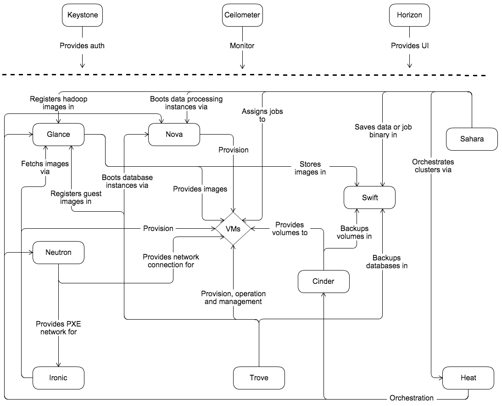
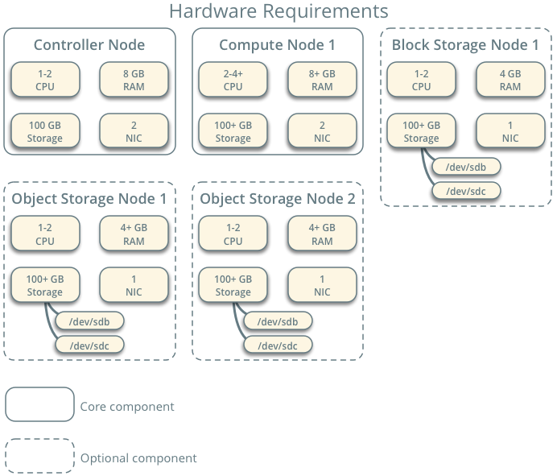

# OpenStack

OpenStack，一个开源的云计算管理平台，又称为云操作系统。属于IaaS（基础设施即服务）层，旨在为公有云或私有云提供可扩展的、弹性伸缩的计算、存储、网络资源，其中，计算资源通过虚拟机的方式提供，在OpenStack平台中，虚拟机又被称为实例

## 一、OpenStack架构

架构可以帮助我们站在高处看清事物的整体结果，避免过早的进入细节而迷失方向



从OpenStack架构图中基本上就能看到OpenStack中的所有重要模块（OpenStack官方称其为服务，下文统一使用服务这个术语）。OpenStack最终要对用户提供计算资源，而计算资源又是以虚拟机实例的形式提供，因此在架构图中可以看到所有的服务最终都是围绕VMs的。

1. Keystone：身份认证服务，提供用户权限管理和API访问控制；

   任何一个用户（包含租户用户或服务用户）要访问OpenStack时，都需要先通过Keystone的身份认证和授权，认证通过才能登录、授权通过才能使用资源。

2. Glance：镜像服务，提供虚拟机镜像文件的管理功能；

   虚拟机镜像文件（image）又称为虚拟机模板，管理功能则是指的image的上传、下载、搜索等功能，image实际上就是一个包含了操作系统的磁盘文件，被称为模板。

   Glance服务本身并不提供镜像文件的存储，因此Glance服务需要对接存储资源，例如Ceph、GlusterFS、本地目录等，从架构图中可以看到Glance服务有一个箭头指向Swift服务，Swift服务用于提供分部署对象存储。

3. Nova：计算服务，管理实例的生命周期；

   管理实例的生命周期则意味着虚拟机的创建、调度、迁移等操作都是由Nova服务完成的，从架构图中可以看到Nova有一个箭头直接指向了VMs。

   显而易见的，如果Nova服务需要完成对实例的生命周期的管理，那么它就必须对接虚拟化技术。Nova服务提供如CPU、内存资源等计算资源，因此它也被称为计算节点，而实际上这些计算资源都是由Nova所对接的虚拟化技术提供的。OpenStack是一个异构的平台，它可以通过不同的插件（或称为驱动）可以接入不同的虚拟化技术，例如KVM、VMware、FusionCompute等虚拟化技术。

   虚拟化技术的接入都由Nova服务实现，Nova可以通过不同虚拟化技术厂家提供的插件来接入不同的虚拟化技术，Nova本身可以接入的虚拟化技术有很多种，KVM是Nova接入的最多的虚拟化技术。当然，各个云厂商也有自己的云OS，例如华为自己的云OS架构下的Nova就有一个专门的驱动用于接入自己的FusionCompute虚拟化技术

   至此，Nova服务的功能分2大块，**对下需要通过不同的插件接入各种虚拟化技术、对上需要提供实例的生命周期管理**。

4. Cinder：块存储服务，为虚拟机提供持久化存储卷（volume），对于实例而言，volume就类似虚拟硬盘；

   与Glance服务类似，Cinder服务实现的是对持久化块存储资源的管理，也就是说Cinder服务本身并不提供存储资源，他需要与实际的存储设备或服务对接，然后将后端存储空间调度给实例，提供持久化块存储。

   与Nova服务类似，Cinder服务也需要通过不同的插件或驱动对接不同类型的后端存储，例如，通过Cinder对接Ceph、LVM、FC SAN、FusionStorage。相对而言对接FusionStrorage比较困难，需要拿到FusionStrorage的驱动

5. Neutron：网络服务，负责虚拟网络的构建与管理，支持子网划分、负载均衡和防火墙策略；

6. Horizon：Web 控制台，提供可视化界面管理云资源；

7. Ironic：裸金属服务器全生命周期管理服务，提供裸机即服务（BMaaS）；

   通过自动化技术和标准API实现物理机的电源控制、操作系统部署、硬件配置等操作，将物理机资源纳入云平台统一管理，使其成为云资源池的一部分

   Ironic服务依赖几个核心技术：IPMI/BMC、PXE、DHCP/TFTP。通过IPMI/BMC实现服务器远程电源控制和KVM访问、通过PXE实现网络引导部署系统、通过DHCP/TFTP分配临时IP并传输引导文件。通过Ironic服务可以实现直接向裸金属服务器安装系统，并将物理服务器视作OpenStack的一个实例进行管理

   OpenStack的自动化安装工具TripleO在实现上云部署的过程中，就利用到了Ironci的裸金属的功能，当然，TripleO不仅仅使用到了Ironic提供的裸金属功能，还用到了Heat的提供的编排功能

8. Heat：基础设施编排服务，通过模板化方式实现云资源的自动化部署、配置和管理；

9. Swift：分布式对象存储服务；

   分布式对象存储服务适用于大规模非结构化数据的存储场景，例如虚拟机镜像、图片、视频、日志等。与Cinder服务不同的是，Swift本身就是存储服务，从架构图中可以看到Glance、Cinder服务都有箭头直接指向Swift服务，Glance服务可以通过Swift服务存储镜像、Cinder服务可以通过Swift服务提供持久化存储

在整个OpenStack架构中，真正必不可少的核心服务只有前5个，Horizon服务提供友好的Web控制台页面，但通过命令行同样可以实现OpenStack的管理

## 二、OpenStack逻辑结构

现在，OpenStack的核心服务明确了，接下来将视角放低，看看核心服务的内部组成结构。实际上OpenStack有一个更加复杂的逻辑结构，当你需要去了解和设计OpenStack系统架构时，就必须清楚OpenStack的逻辑结构。


在逻辑结构中可以看到每个服务又由若干组件组成，以Glance服务为例，Glance服务中就包含`glance-api`、`galnce-registry`、`glance-database`三个组件。作为初学者而言，在OpenStack的逻辑结构中只需要关注两点

1. 消息队列

   OpenStack由多个服务组合而成，而每个服务内部又包含了多个组件，几乎所有的服务内的各个组件之间都需要通过消息队列进行通信。例如Nova服务，在OpenStack逻辑结构中，Nova服务内部包含`nova-scheduler`、`nova-console`、`nova-cert`等组件，但这些组件之间大多并不直接通信，而是通过消息队列`Queue`实现通信

   消息队列的优势在于解耦和分布式，例如将一个服务的多个组件部署在不同的节点上，通常情况下各个服务的API组件会部署在Controller节点上

2. API

   除了Neutron服务以外，OpenStack的每个服务都有自己的API组件，Neutron服务同样需要一个API组件，只不过Neuturn的API组件被集成到了`neutron-server`组件中。服务内部的多个组件之间需要通过消息队列通信，而不同的服务之间则需要通过各个服务的API组件进行通信

   服务的API组件会对外监听，API接口收到请求后会对请求的资源做解析，请求解析参数正常后API组件会将请求消息写入`Queue`，这个服务内的其他组件如果和请求的资源相关联，那么该组件自然会从`Queue`中订阅、消费消息，从而做下一步处理，最终的处理结果仍由API接口返回

OpenStack本身就是一个分布式系统，不但各个服务可以分布部署，服务中的组件也可以分布部署。这种分布式特性让OpenStack具备极大的灵活性、伸缩性和高可用性。当然从另一个角度讲，这也使得OpenStack比一般系统复杂，学习难度也更大。

## 三、OpenStack部署

一个OpenStack平台的部署，首要的事情就是集群规划

### Ⅰ、规划

首次手动部署OpenStack平台，以OpenStack官网指南手册为准，等学习到TripleO部署工具时再着重了解平台规划细节。根据OpenStack官网指南手册的示例架构，至少需要准备三个节点：控制节点、计算节点、存储节点，块存储节点和对象存储节点都属于可选项，控制节点与计算节点是必选项。此示例架构是最小配置，并非用于生产系统安装，它被设计为提供最低概念验证，用于学习OpenStack有关为特定创建架构的信息用例



#### 主机规划

| 节点类型      | vCPU | vMEM | vNic | vDisk     | 操作系统 | 运行服务                                                     |
| ------------- | ---- | ---- | ---- | --------- | -------- | ------------------------------------------------------------ |
| Controller    | 4    | 16G  | 3    | 100G      | CentOS 7 | Keystone、Glance、RabbitMQ、MySQL、MemCache、Redis、其他所有服务的API组件（nova-api、cinder-api、neutron-server等） |
| Compute       | 4    | 16G  | 3    | 100G      | CentOS7  | nova-compute；计算节点必须支持虚拟化技术，例如KVM            |
| Block Storage | 2    | 4G   | 3    | 100G+100G | CentOS7  | Cinder-Volume服务；通过驱动对接存储。需注意，Cinder的API服务运行在Controller节点上 |

实验环境中的openstack平台包含三个网络平面，互联网平面（Service）、管理网络平面（Manage）、租户网络平面（Tenant），其中租户网络在安装系统时无需配置IP，后续会用于隧道VXLAN

| 节点类型      | Service          | Manage          | Storage |
| ------------- | ---------------- | --------------- | ------- |
| Controller    | 192.168.31.40/24 | 192.168.0.40/24 |         |
| Compute       | 192.168.31.41/24 | 192.168.0.41/24 |         |
| Block Storage | 192.168.31.42/24 | 192.168.0.42/24 |         |

#### 节点职责

**Controller**

控制器节点运行 Identity service（身份服务）、Image service（镜像服务）、Placement service（放置服务）、Compute的管理服务、Neutron的管理服务、Horizon组件服务。它还包括其他支撑服务，如SQL数据库、消息队列和NTP。Compute的管理服务、Neutron的管理服务，基本上都是API组件，OpenStack每个组件内部的服务通信需要用到消息队列

**Compute**

计算节点运行操作实例的计算的虚拟机管理程序部分。默认情况下，Compute使用KVM虚拟机管理程序。计算节点还运行网络服务代理，该代理将实例连接到虚拟网络，并通过安全组为实例提供防火墙服务。

**Block Storage**

可选的块存储节点包含块存储和共享文件系统服务为实例调配的磁盘。为简单起见，计算节点和该节点之间的服务流量使用管理网络。生产环境应该实施单独的存储网络，以提高性能和安全性。可以部署多个数据块存储节点。

#### 网络类型

1. Provider networks

   Provider networks，以最简单的方式部署OpenStack网络服务，主要采用第2层（桥接/交换）服务和VLAN网络分段。本质上，它将虚拟网络连接到物理网络，并依赖物理网络基础设施提供第3层（路由）服务。此外，DHCP服务向实例提供IP地址信息。OpenStack用户需要更多关于底层网络基础设施的信息，以创建与基础设施完全匹配的虚拟网络。

2. Self-service networks

   Self-service networks，通过第3层（路由）服务增强了提供商网络选项，支持使用覆盖分段方法（如VXLAN）的自助服务网络。本质上，它使用NAT将虚拟网络路由到物理网络。此外，该选项为LBaaS和FWaaS等高级服务提供了基础。OpenStack用户可以在不了解数据网络底层基础设施的情况下创建虚拟网络。如果相应地配置了第2层插件，这也可以包括VLAN网络。

### Ⅱ、基础环境准备

#### 1、节点初始化

在系统安装结束后，首先需要确保三个节点的多个网络平面是正常的

1. Controller节点初始化

   SELinux无需关闭，OpenStack软件包中有一个包专门用于解决OpenStack的SELinux问题

   ```bash
   [root@localhost ~]# hostnamectl set-hostname controller.example.com    # 配置主机名
   [root@controller ~]# ip address show    # 查看IP配置是否正常
   [root@controller ~]# nmcli connection show    # 检查网络逻辑连接是否正常
   [root@controller ~]# nmcli connection modify ens33 autoconnect yes ipv4.method manual ipv4.addresses 192.168.31.40/24 ipv4.gateway 192.168.31.1 ipv4.dns 192.168.31.1
   [root@controller ~]# nmcli connection down ens33 && nmcli connection up ens33
   [root@controller ~]# nmcli connection modify ens34 autoconnect yes ipv4.method manual ipv4.addresses 192.168.0.40/24    # 网卡逻辑连接自启动，并设置网卡的启动协议为手动
   [root@controller ~]# nmcli connection up ens34    # 立即启动网卡连接
   [root@controller ~]# vim /etc/hosts
   192.168.0.40	controller.example.com	controller
   192.168.0.41	compute.example.com	compute
   192.168.0.42	storage.example.com	storage
   [root@controller ~]# systemctl disable firewalld
   [root@controller ~]# systemctl stop firewalld
   ```

2. Compute节点初始化

   ```bash
   [root@localhost ~]# hostnamectl set-hostname compute.example.com
   [root@compute ~]# ip address show
   [root@compute ~]# nmcli connection show
   [root@compute ~]# nmcli connection modify ens33 autoconnect yes ipv4.method manual ipv4.addresses 192.168.31.41/24 ipv4.gateway 192.168.31.1 ipv4.dns 192.168.31.1
   [root@compute ~]# nmcli connection down ens33 && nmcli connection up ens33
   [root@compute ~]# nmcli connection modify ens34 autoconnect yes ipv4.method manual ipv4.addresses 192.168.0.41/24
   [root@compute ~]# nmcli connection down ens34 && nmcli connection up ens34
   [root@compute ~]# scp root@192.168.0.40:/etc/hosts /etc/
   [root@compute ~]# systemctl disable --now firewalld
   ```

3. Storage节点初始化

   ```bash
   [root@localhost ~]# hostnamectl set-hostname storage.example.com
   [root@storage ~]# ip address show
   [root@storage ~]# nmcli connection show
   [root@storage ~]# nmcli connection modify ens33 autoconnect yes ipv4.method manual ipv4.addresses 192.168.31.42/24 ipv4.gateway 192.168.31.1 ipv4.dns 192.168.31.1 
   [root@storage ~]# nmcli connection down ens33 && nmcli connection up ens33
   [root@storage ~]# nmcli connection modify ens34 autoconnect yes ipv4.method manual ipv4.addresses 192.168.0.42/24 
   [root@storage ~]# nmcli connection down ens34 && nmcli connection up ens34
   [root@storage ~]# scp root@192.168.0.40:/etc/hosts /etc/
   [root@storage ~]# systemctl disable --now firewalld
   [root@storage ~]# ping 192.168.31.40
   [root@storage ~]# ping 192.168.31.41
   [root@storage ~]# ping 192.168.0.40
   [root@storage ~]# ping 192.168.0.41
   ```

#### 2、部署NTP服务

为了在节点之间正确地同步服务，您可以安装Chrony，这是NTP的一个实现。我们建议您将控制器节点配置为引用更精确的（下层）服务器，并将其他节点配置为引用控制器节点。在此实验环境中以Controller为NTP服务端，Compute节点与Storage节点都与Controller节点同步时间

1. Controller节点配置

   ```bash
   [root@controller ~]# vim /etc/chrony.conf
   allow 192.168.0.0/24
   [root@controller ~]# systemctl restart chronyd
   [root@controller ~]# systemctl enable chronyd
   ```

2. Compute节点配置

   ```bash
   [root@compute ~]# vim /etc/chrony.conf
   server controller.example.com iburst
   [root@compute ~]# systemctl restart chronyd 
   [root@compute ~]# systemctl enable chronyd
   [root@compute ~]# chronyc sources    # 确认是否与时间服务器同步时间
   ```

3. Storage节点配置

   ```bash
   [root@storage ~]# scp root@compute:/etc/chrony.conf /etc/
   [root@storage ~]# systemctl restart chronyd
   [root@storage ~]# systemctl enable chronyd
   [root@storage ~]# chronyc sources
   ```

#### 3、部署OpenStack软件源

安装OpenStack软件源时，需注意官方手册提醒，不同操作系统版本对应的可用的软件源不同，从U版开始就不支持CentOS7系统了，因为CentOS8版本开始使用的python版本发生变更。

1. 按OpenStack官网手册，给所有节点安装不同版本的OpenStack软件源，此处以controller节点为示例

   ```bash
   [root@controller ~]# \rm /etc/yum.repos.d/*    # CentOS7提供的缺省YUM源可能基本都不再可用，全部删除
   [root@controller ~]# curl -o /etc/yum.repos.d/CentOS-Base.repo https://mirrors.aliyun.com/repo/Centos-7.repo    # 配置阿里云的YUM源，也可以替换为其他可用的YUM源
   [root@controller ~]# yum install -y centos-release-openstack-train    # 以T版为例
   [root@controller ~]# yum repolist    # 先检查YUM仓库是否可用
   [root@controller ~]# yum -y upgrade    # 更新系统软件包
   reboot    # 更新系统后重启
   ```

   在OpenStack官网手册中声明，如果使用RHEL7系统，则还需要再另外安装一个rdo-release的RPM包。CentOS7操作系统本身会自带很多YUM源，在更新系统之前需要先确认自带的YUM仓库是否可用

   CentOS7于2024年停止官方维护，原镜像站点（如`mirrorlist.centos.org`）域名解析失效或网络不可达，`centos-release-openstack-train`包默认使用官方镜像列表（`mirrorlist`），但相关域名已无法访问，因此检查YUM仓库是否可用时可能会出现故障。此问题可以通过3种方式解决：

   - **解决方案一：切换至归档镜像源**

     CentOS官方将历史版本的软件包归档至`vault.centos.org`，通过如下步骤直接指向该地址。此处仅以一个YUM配置文件做示例，其他YUM配置文件的修改是类似的，除了`CentOS-NFS-Ganesha-28.repo`配置文件需要单独做一下修改。

     ```bash
     [root@controller ~]# sed -i \
     > -e 's/mirrorlist/#mirrorlist/g' \
     > -e 's|#baseurl=http://mirror.centos.org|baseurl=http://vault.centos.org|g' \
     > /etc/yum.repos.d/CentOS-OpenStack-train.repo
     [root@controller ~]# yum clean all    # 清理YUM缓存数据
     [root@controller ~]# yum repolist
     [root@controller ~]# yum -y upgrade
     reboot
     ```

   - **解决方案二：使用第三方镜像源**

     将`centos-release-openstack-train`包的镜像列表替换为国内镜像源。国内主流云厂商仍维护CentOS7的镜像仓库，更新更及时且访问稳定，例如阿里云、腾讯云。两种解决方案的操作是类似的，更建议使用国内的第三方YUM源

     ```bash
     [root@controller ~]# sed -i \
     > -e 's/mirrorlist/#mirrorlist/g' \
     > -e 's|#baseurl=http://mirror.centos.org|baseurl=http://mirrors.aliyun.com|g' \
     > /etc/yum.repos.d/CentOS-OpenStack-train.repo
     [root@controller ~]# yum clean all    # 清理YUM缓存数据
     [root@controller ~]# yum repolist
     [root@controller ~]# yum -y upgrade
     [root@controller ~]# reboot
     ```

     阿里云的openstack源：http://mirrors.aliyun.com/centos/7/cloud/x86_64/

2. 在Controller节点上安装openstack客户端工具

   ```bash
   [root@controller ~]# yum install -y python-openstackclient    # openstack客户端工具仅需要在Controller节点上安装即可，openstack的其他节点也可以选择安装
   ```

3. 在所有节点上安装openstack-selinux包

   安装此软件包号称是可以解决所有涉及到openstack服务的上下文切换都无需管理员手动干预SELinux的问题，但是实验环境中安装此包出现报错，虽然安装成功，但似乎并未达到想要的效果，仍需手动管理SELinux

   ```bash
   [root@controller ~]# yum install -y openstack-selinux
   [root@controller ~]# setenforce 0
   [root@controller ~]# sed -i -e 's/^SELINUX=enforcing/SELINUX=disabled/g' /etc/selinux/config
   ```

#### 4、SQL Database

大多数OpenStack服务组件使用SQL数据库来存储信息，所有的云数据信息都需要保存在数据库当中，例如虚拟机实例的创建、Keystone节点上创建用户、项目等。数据库通常运行在控制器节点上。OpenStack官方指南中的过程根据发行版使用MariaDB或MySQL。OpenStack服务还支持包括PostgreSQL在内的其他SQL数据库。实验环境中数据库选择使用Mariadb。

1. 在Controler节点上安装MariaDB

   ```bash
   yum install -y mariadb mariadb-server python2-PyMySQL
   ```

   python2-PyMySQL这个软件包是必须安装的，整个openstack平台基于python开发，这个包的作用是提供了python连接数据库的模块。在CentOS7及更低版本的系统使用python2-PyMySQL，CentOS8及更高版本的系统使用python3-PyMySQL

2. 修改MariaDB的配置文件

   ```bash
   [root@controller ~]# vim /etc/my.cnf
   [mysqld]
   bind-address = 192.168.0.40
   default-storage-engine = innodb
   innodb_file_per_table = on
   max_connections = 4096
   collation-server = utf8_general_ci
   character-set-server = utf8
   [root@controller ~]# systemctl enable mariadb
   [root@controller ~]# systemctl restart mariadb
   [root@controller ~]# mysql_secure_installation    # 初始化数据库设置，允许root用户远程登陆并设置root用户密码为redhat
   ```

#### 5、Message queue

OpenStack使用消息队列来协调所有组件的内部服务之间的操作和状态信息，OpenStack所有组件的内部服务之间都需要通过消息队列进行通信。消息队列服务通常在控制器节点上运行。OpenStack支持几种消息队列服务，包括RabbitMQ和Qpid。然而，打包OpenStack的大多数发行版都支持特定的消息队列服务。OpenStack官方指南实现了RabbitMQ消息队列服务，因为大多数发行版都支持它。实验环境中消息队列软件选择RabbitMQ。

1. 在Controller节点上安装RabbitMQ

   ```bash
   [root@controller ~]# yum install -y rabbitmq-server
   ```

2. 启用RabbitMQ服务

   ```bash
   [root@controller ~]# systemctl enable --now rabbitmq-server
   ```
   
3. 为openstack创建RabbitMQ账户

   ```bash
   [root@controller ~]# rabbitmqctl add_user openstack hebor    # 创建openstack用户并设置密码
   [root@controller ~]# rabbitmqctl list_users    # 查看RabbitMQ的用户列表，默认创建的openstack账户没有权限
   [root@controller ~]# rabbitmqctl set_permissions openstack ".*" ".*" ".*"    # 为 RabbitMQ用户openstack赋予对所有虚拟主机（Virtual Host）和资源的完全操作权限
   [root@controller ~]# rabbitmqctl change_password openstack hebor    # 修改openstack用户的密码
   ```
   
   RabbitMQ与MariaDB类似都具有身份认证功能，因此需要为openstack在RabbitMQ上创建一个用户，并且还需要针对openstack用户授权，否无该账户无法执行任何操作，例如消息队列的创建

#### 6、Memcached

组件的身份服务认证机制使用Memcached来缓存token。memcached服务通常运行在控制器节点上。对于生产部署，我们建议启用防火墙、身份验证和加密的组合来保护它。

Memcached用于保存用户的token。当用户通过Keystone做身份验证时，Keystone会为每个通过身份验证的用户分配一个token，用户可以拿着这个token在openstack其他节点上执行权限内的任意操作，而无需在执行其他操作时反复验证身份信息。但token本身是有时效性的，例如账户密码变更、删除账户等操作，因此token不适合保存在数据库中，此时就可以将Keystone为用户分配的token缓存在Mencached上

1. Controller节点上安装Memcached

   ```bash
   [root@controller ~]# yum install -y memcached python-memcached
   ```

2. 配置Memcached监听的接口

   ```bash
   [root@controller ~]# vim /etc/sysconfig/memcached
   OPTIONS="-l 127.0.0.1,::1,controller"    # 此处添加的域名或IP需要测试确认可达性
   [root@controller ~]# systemctl enable --now memcached    # 启用Memcached服务
   ```
   
   实验环境中所有的基础服务都集中在Controller节点本身，因此Memcached的默认配置就可以直接监听Controller节点，但仍可以在监听的地址上加上Controller节点的地址。Memcached服务缺省情况下监听11211端口

#### 7、Etcd

OpenStack服务可以使用Etcd，这是一种分布式可靠的键值存储，用于分布式键锁定、存储配置、跟踪服务实时性和其他场景。在OpenStack架构中Etcd服务并不是必选项，场景中不会用到Etcd功能时可以选择不安装Etcd。

1. Controller节点上安装Etcd

   ```bash
   [root@controller ~]# yum install -y etcd
   ```

2. 修改Etcd配置文件

   ```bash
   [root@controller ~]# systemctl enable --now etcd[root@controller ~]# vim /etc/etcd/etcd.conf
   #[Member]
   ETCD_DATA_DIR="/var/lib/etcd/default.etcd"    # Etcd的数据保存路径
   ETCD_LISTEN_PEER_URLS="http://192.168.0.40:2380"    # 监听控制节点端口
   ETCD_LISTEN_CLIENT_URLS="http://192.168.0.40:2379"
   ETCD_NAME="controller"    # Etcd集群名称
   #[Clustering]
   ETCD_INITIAL_ADVERTISE_PEER_URLS="http://192.168.0.40:2380"
   ETCD_ADVERTISE_CLIENT_URLS="http://192.168.0.40:2379"
   ETCD_INITIAL_CLUSTER="controller=http://192.168.0.40:2380"
   ETCD_INITIAL_CLUSTER_TOKEN="etcd-cluster-01"
   ETCD_INITIAL_CLUSTER_STATE="new"
   [root@controller ~]# systemctl enable --now etcd
   ```

   
