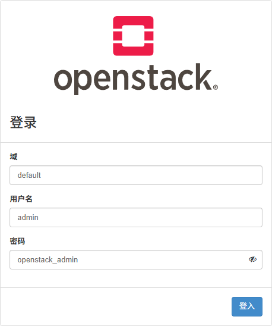

# Horizen

Horizon服务唯一需要的核心服务是Keystone服务，Horizon服务可以与OpenStack其他服务结合使用，例如Glance服务、Nova服务，还可以在具有独立服务（如Object Storage）的环境中使用Horizon服务。在部署Horizon服务之前，需要确保环境中已存在配置、运行了HTTP组件和Memcached组件的Keystone服务。

## Dashboard配置

### 一、Dashboard安装

1. 安装软件包

   ```bash
   [root@controller ~]# yum install -y openstack-dashboard
   ```

2. 修改Horizon配置文件

   ```bash
   [root@controller ~]# vim /etc/openstack-dashboard/local_settings
   OPENSTACK_HOST = "controller"
   OPENSTACK_KEYSTONE_URL = "http://%s:5000/v3" % OPENSTACK_HOST    # 在配置了OPENSTACK_HOST选项后，此选项使用默认参数即可
   ALLOWED_HOSTS = ['*']    # *号表示允许所有主机访问
   SESSION_ENGINE = 'django.contrib.sessions.backends.cache'
   
   CACHES = {
   	'default': {
   		'BACKEND': 'django.core.cache.backends.memcached.MemcachedCache',
   		'LOCATION': 'controller:11211',
   	}
   }
   OPENSTACK_KEYSTONE_MULTIDOMAIN_SUPPORT = True    # 此选项用于支持多Domain管理
   OPENSTACK_API_VERSIONS = {    # API接口版本
   	"identity": 3,
   	"image": 2,
   	"volume": 3,
   }
   OPENSTACK_KEYSTONE_DEFAULT_DOMAIN = "Default"    # 默认的Domain
   OPENSTACK_KEYSTONE_DEFAULT_ROLE = "user"
   TIME_ZONE = 'Asia/Shanghai'
   ```

   如果OpenStack架构规划中使用的网络类型是Provider networks类型，则还需要在Horizon配置文件中添加以下配置

   ```bash
   OPENSTACK_NEUTRON_NETWORK = {
   	'enable_router': False,
   	'enable_quotas': False,
   	'enable_distributed_router': False,
   	'enable_ha_router': False,
   	'enable_lb': False,
   	'enable_firewall': False,
   	'enable_vpn': False,
   	'enable_fip_topology_check': False,
   }
   ```

3. 修改httpd配置文件

   ```bash
   [root@controller ~]# vim /etc/httpd/conf.d/openstack-dashboard.conf
   ServerAdmin root@controller.example.com
   ServerName  controller.example.com
   
   WSGIApplicationGroup %{GLOBAL}
   ```

   在安装openstack-dashboard软件包后会自动在`/etc/httpd/conf.d`路径下生成Dashboard的httpd配置文件，OpenStack官方指南建议在这个原始的httpd配置文件中修改、添加配置，修改原始httpd配置文件完成后访问`http://controller/dashboard/`验证Dashboard服务。但这种方式可能会产生身份验证的问题，如果出现身份验证问题，建议采用下面这种方式重新生成Dashboard的配置文件并进行修改

   ```bash
   [root@controller ~]# python /usr/share/openstack-dashboard/manage.py make_web_conf --apache > /etc/httpd/conf.d/openstack-dashboard.conf    # 生成Dashboard的httpd服务的配置文件
   [root@controller ~]# vim /etc/httpd/conf.d/openstack-dashboard.conf
   ServerAdmin root@controller.example.com
   ServerName  controller.example.com
   
   WSGIApplicationGroup %{GLOBAL}    # 重新生成的Dashboard配置文件里已经自带有此参数，无需手动添加
   ```

4. 重启httpd服务

   ```bash
   [root@controller ~]# systemctl restart httpd memcached
   ```

### 二、验证

通过浏览器访问管理网络地址`http://controller/`



