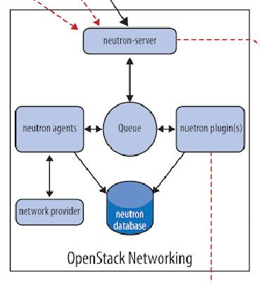

# Neutron

Neutron服务相对于前面的4项服务，难度更大、更复杂，对于Neutron服务的学习需要从多个不同的维度进行描述

## Neutron架构

Neutron服务内包含了如下组件：

- Neutron Server

  对比其他OpenStack服务，Neutron服务的组件中并没有API组件，Neutron API组件的功能集成在了Neutron Server组件中，Neutron Server组件对外提供Neutron API，接收客户端请求，并调用Plugin处理请求。例如，创建网络、创建子网、创建router等请求。

- Plugin

  Neutron的Plugin按照功能又分为两类：Core Plugin 和 Service Plugin，Core Plugin维护Neutron的network、subnet、port相关资源的信息，Service Plugin提供routing、firewall、load balance等服务。无论是哪一类Plugin，它最终都是用于处理Neutron Server的请求，维护OpenStack的逻辑网络状态，并调用Agent处理请求。

  Plugin维护的是OpenStack的逻辑网络状态，它只负责将创建资源的请求信息写入到数据库并维护数据库中的信息，例如，用户发起请求要创建一个网桥，Plugin从Queue中读取到Neutron Server的请求后，会将网桥的资源信息写入数据库，但Plugin并不会真正在物理节点上创建出这个网桥，而是将Neutron Server请求的资源信息写入数据库后，再通过Queue通知运行在各个物理节点上的Agent，通过对应的Agent创建网桥。

- Agent

  真正用于具体的实现所有的网络细节，处理Plugin的请求，负责在network provider上真正实现各种网络功能。Agent本身也有多种类型，例如，L3 Agent、DHCP Agent、Linux Birdge Agent等类型，当Agent需要在OpenStack网络中实现某一种功能时，需要通过对应类型的Agent实现，例如，在子网内需要实现DHCP功能时，需要通过DHCP Agent实现。

- network provider

  提供网络服务的虚拟或物理网络设备，例如，Linux Bridge、Open vSwitch或其他支持Neutron的物理交换机

- Queue

  Neutron Server、Plugin 和 Agent 之间通过 Messaging Queue 通信和调用。

- Database

  存放OpenStack的网络状态信息，包括Network、Subnet、Port、Router等。

## OpenStack网络类型

在OpenStack官方指南的概述章节中就有提到，OpenStack架构的网络类型分两种：Provider networks 和 Self-service networks

### Provider networks

直译为提供商网络，Provider networks以最简单的方式部署OpenStack Networking服务，主要提供了二层交换网络和VLAN隔离服务。从本质上讲，它将虚拟网络桥接到物理网络，并依靠物理基础设施提供三层路由网络。在Provider networks类型的网络下，用户需要知晓底层网络基础架构的更多信息，以创建于基础架构完全匹配的虚拟网络。

简单一点理解，Provider networks网络类型下，OpenStack只提供单节点下的多实例之间的二层交换网络服务，如果要实现多节点下的多实例之间的二层交换网络、三层路由网络服务，则需要通过网络基础架构来实现，即通过物理交换机、物理路由器设备来实现。因此，Provider networks类型导致OpenStack架构本身缺少对三层专用网络的支持，以及高级服务，例如LBaaS、FWaaS等。

### Self-service networks

Self-service networks需要了解三个概念

- Tenant的网络类型

  例如VXLAN、VLAN、FLAT（扁平网络模型，所有实例都属于同一VLAN）

- Router

  租户的实例如果需要连接外网或跨网段通信，则需要通过Router提供的三层网络实现

- Provider

  通过Provider将虚拟网络映射到某个物理网络上

