# 管理实例

## 一、创建实例

### 1、创建Flavor

flavor的类似于模板的概念，flavor定义了实例的资源用量，在OpenStack上新建实例之前必须要先创建flavor，在创建的flavor上指定虚拟硬件资源，例如vCPU、vMEM、vDisk等，再通过flavor创建实例，通过flavor创建的实例所具备的虚拟硬件资源量就等同于flavor的虚拟资源量

在OpenStack的概念里，flavor指的是虚拟机实例的类型，创建flavor时会需要指定一个“根磁盘容量”，这个根磁盘容量的大小不可小于image文件的Virtual size。且flavor的创建只能通过admin账号、或具备admin角色权限的账号进行创建。例如，通过admin账户创建要给flavor之前，需要先确认磁盘镜像的信息

```bash
[root@controller ~]# source admin-openrc
[root@controller ~]# qemu-img info cirros-0.4.0-x86_64-disk.img 
image: cirros-0.4.0-x86_64-disk.img
file format: qcow2
virtual size: 44M (46137344 bytes)    # 创建flavor时，flavor的跟磁盘容量不可小于此容量
disk size: 12M
cluster_size: 65536
Format specific information:
    compat: 1.1
    lazy refcounts: false
    refcount bits: 16
    corrupt: false
```

#### Horizen操作

[管理员] -> [计算] -> [实例类型] -> [创建实例类型]

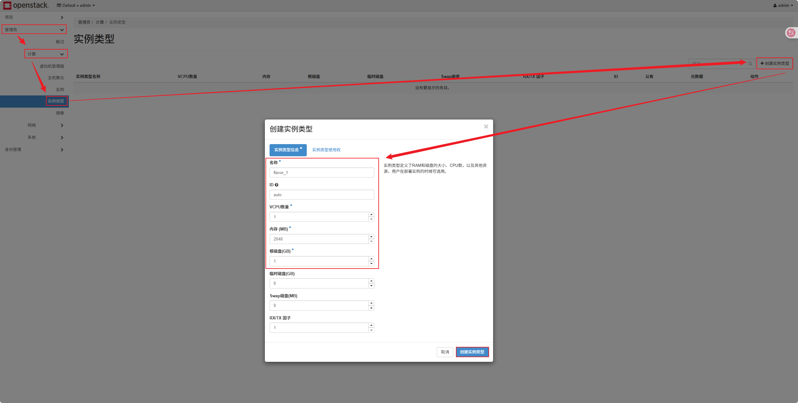

#### CLI操作


### 2、创建网络

网络的创建大致分为5个步骤：创建租户网络 -> 创建外部网络 -> 创建路由 -> 设置网关 -> 设置浮动IP。为了更直观的感受实例的创建流程，此处先只创建一个租户网络。创建实例时如果引用此租户网络，那么实例的内网IP会使用此租户网络的子网IP

#### Horizen操作

1.  [项目] -> [网络] -> [网络] -> [创建网络]；创建private私有网络

   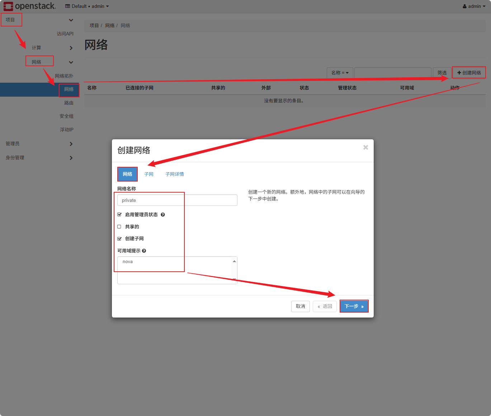

2. 配置private子网

   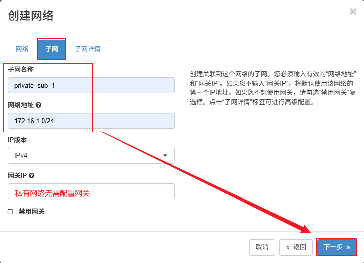

3. 配置private子网DHCP地址池

   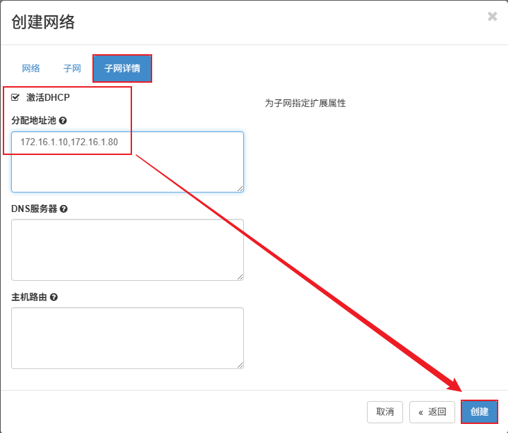

通过Horizen创建租户网络完成后，通过CLI查看网络状态会发现，Horizen的操作在系统上创建了一个网桥

```bash
[root@controller ~]# brctl show 
bridge name     bridge id               STP enabled     interfaces
brq70264f7d-9c          8000.8e7f5f4c3ffc       no              tap167fa0a5-68
                                                        vxlan-1    # vxlan-1的编号实际上就是创建网络时指定的段ID号
```

#### CLI操作

### 3、创建安全组

安全组简单一点理解就是一组规则的集合，这组规则定义了对实例进、出的流量的处理方式，例如，可以实现定义外部流量只能访问到实例的Web服务，而不可以访问到实例的ssh服务

#### Horizen操作

1. [项目] -> [网络] -> [安全组] -> [创建安全组]；创建一个新的安全组，

   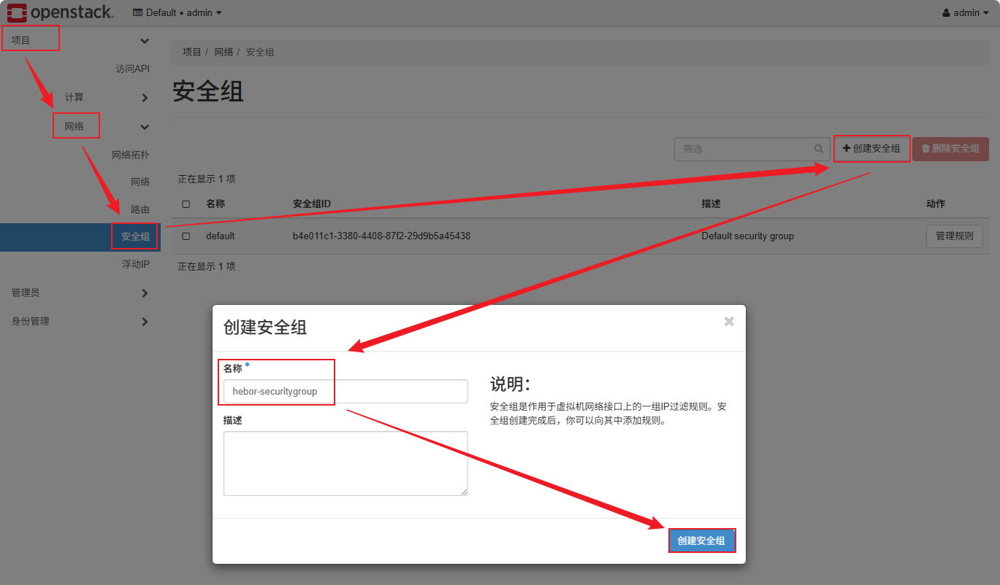

2. [安全组] -> [选择指定安全组] -> [管理规则] -> [添加规则]；为安全组添加规则

   新建的安全组下默认会存在两条规则，针对IPv4和IPv6的出站方向放行所有流量，也就是说，默认情况下实例可以任意向外部发起访问，但所有的外部请求都不可以直接访问到实例。所以，安全组的规则配置一般都是指针对入站方向的规则，例如，添加一条规则允许所有来源请求能够ping通实例

   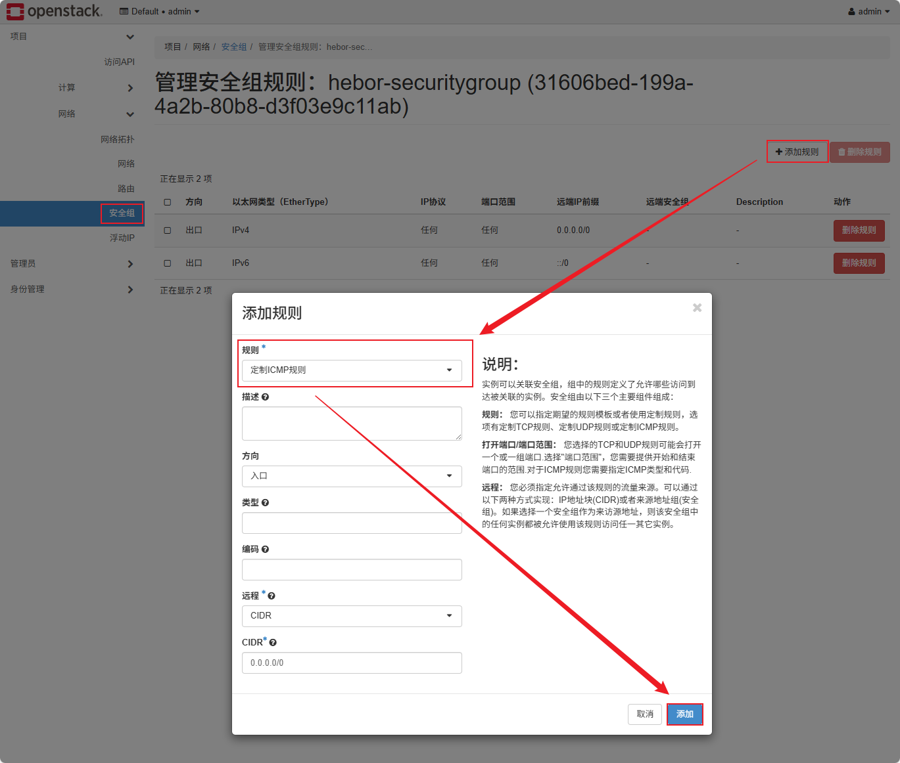

### 4、创建密钥对

实际上就是创建SSH的私钥和公钥，在创建密钥对时，OpenStack会将私钥下载到PC本地，连接实例时可以直接通过私钥ssh连接到实例

[项目] -> [计算] -> [密钥对] -> [创建密钥对]

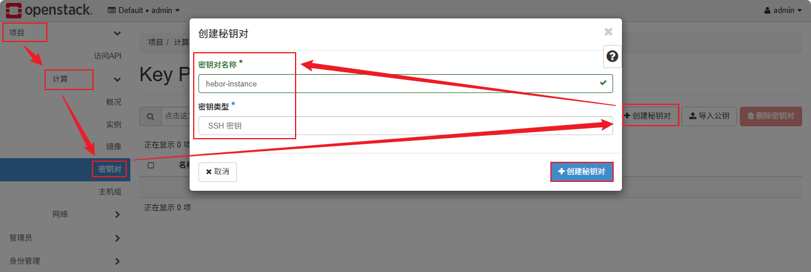

### 5、创建实例

#### Horizen操作

1. [项目] -> [计算] -> [实例] -> [创建实例]

   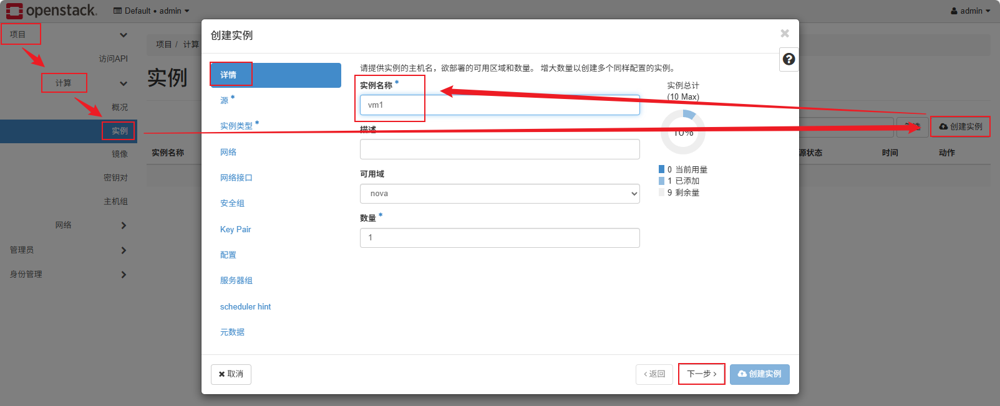

2. 配置镜像

   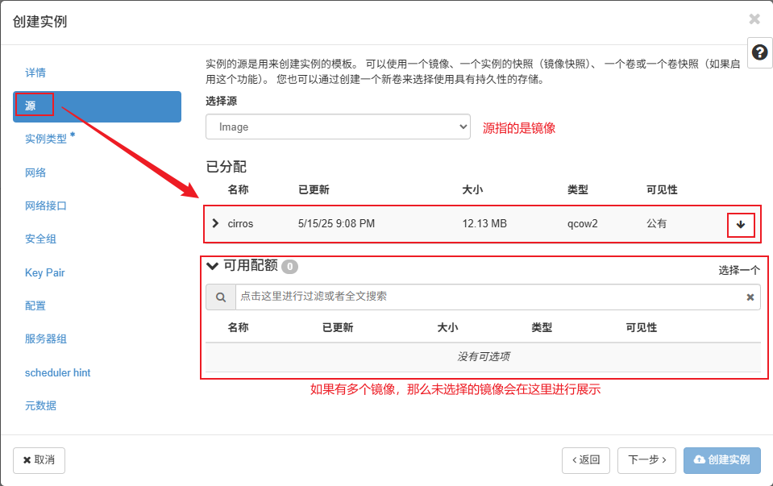

3. 选择flavor

   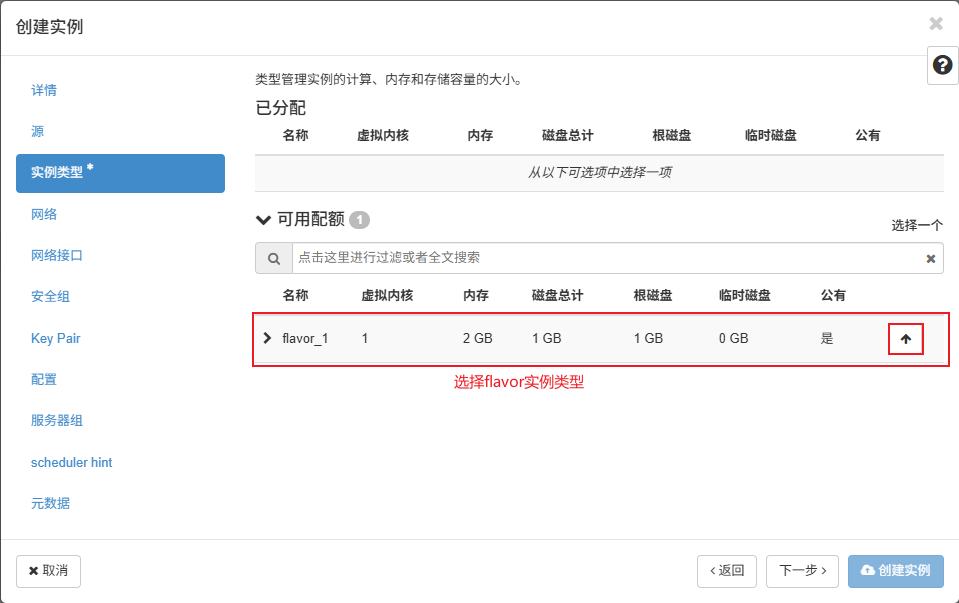

4. 选择网络

   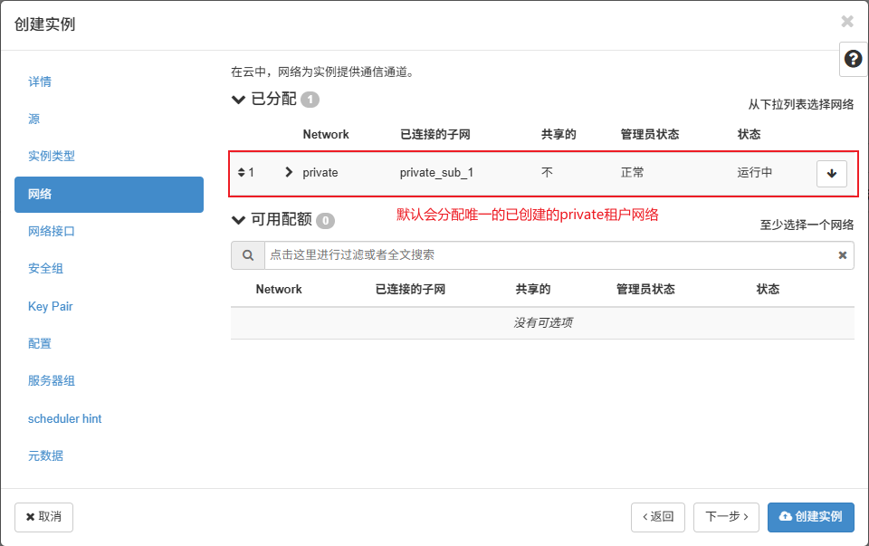

5. 添加安全组；安全组直接使用自定义的安全组即可，default安全组取消分配

   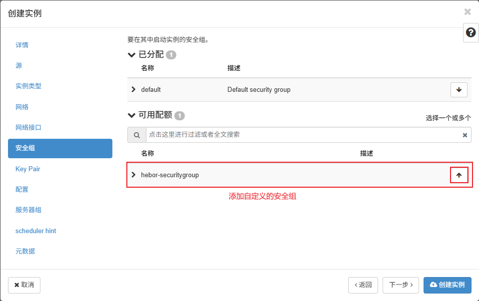

6. 配置密钥对；密钥对配置完成后直接创建实例即可

   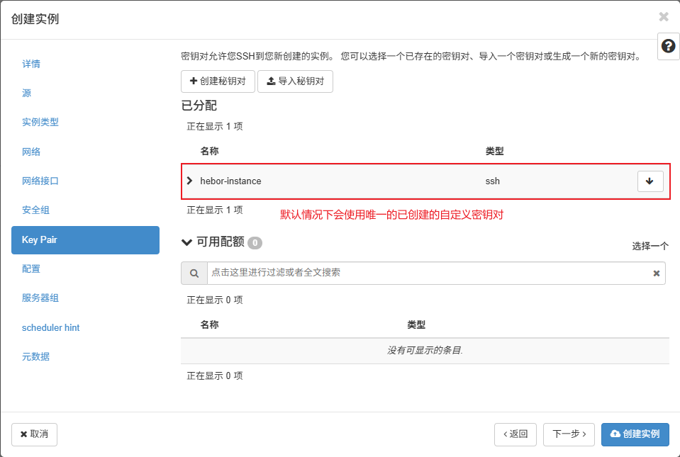

7. 等待实例孵化完成

   在孵化过程中就能够通过web控制台看到实例自动获取到的IP，这个IP属于实例所属网络的DHCP自动分配，即private网络的IP地址范围

   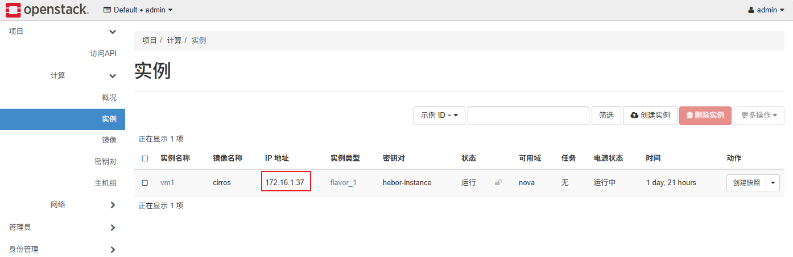

## 二、实例控制台

在web控制台中直接点击实例名称即可查看实例详细信息，查看实例的详细信息可以通过控制台（即VNC）的方式访问实例，但根据现有的配置文件，windows主机无法直接访问到实例的控制台页面，因为windows主机本地无法解析域名`controller:6080`。这个问题可以通过多种方式解决，例如，通过本地DNS服务器或windows本地Hosts解析，使windows主机具备`controller:6080`的域名解析，或者通过修改Compute节点的Nova服务的配置文件，将VNC的跳转地址配置为具体的IP而非域名

1. [项目] -> [计算] -> [实例] -> [点击实例名称] -> [控制台]

   

   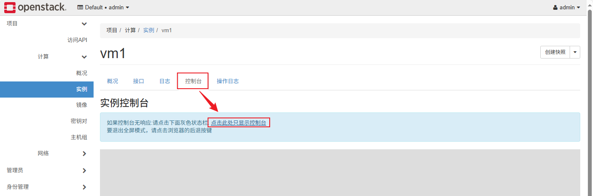
   

### 1、Windows主机无法访问VNC控制台问题

1. 修改Compute节点的Nova服务配置文件，将VNC代理URL的域名修改为固定IP，这样windows主机在进入实例的控制台时会访问固定IP而非域名，此方式无需配置windows主机的域名解析

   ```bash
   [root@compute ~]# vim /etc/nova/nova.conf
   [vnc]
   novncproxy_base_url = http://192.168.0.40:6080/vnc_auto.html    # 将此处URL的域名修改为IP
   
   [root@compute ~]# systemctl restart openstack-nova-compute
   ```

2. 修改Compute节点的Nova服务中有关于VNC的配置后，重启Nova服务，再刷新浏览器会发现控制台已经产生变化，但仍提示connection is closed

   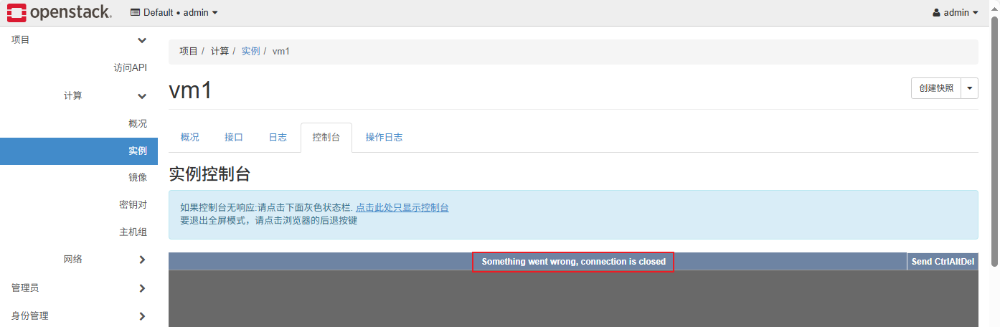

### 2、控制台连接失败问题

1. 在Controller节点查看novncproxy的日志

   通过novncproxy日志初步判断可能是由于`noVNC` 客户端与`nova-novncproxy`组件之间的WebSocket协议协商失败，导致浏览器无法建立VNC连接

   ```bash
   [root@controller ~]# tail -f /var/log/nova/nova-novncproxy.log
   2025-05-28 20:32:05.934 5164 INFO nova.console.websocketproxy [-] 192.168.0.1 - - [28/May/2025 20:32:05] code 400, message Client must support 'binary' or 'base64' protocol
   ```

2. 编辑`/usr/share/novnc/core/websock.js`文件，强制声明支持`binary`或`base64`协议

   ```bash
   [root@controller ~]# vim /usr/share/novnc/core/websock.js
   	open(uri, protocols) {    # 约在230行左右
   		this.attach(new WebSocket(uri, ['binary', 'base64']));    # 显式添加协议参数
   	}
   [root@controller ~]# systemctl restart openstack-nova-novncproxy
   ```

   禁用浏览器缓存数据并刷新浏览器，能够正常访问到VNC控制台

   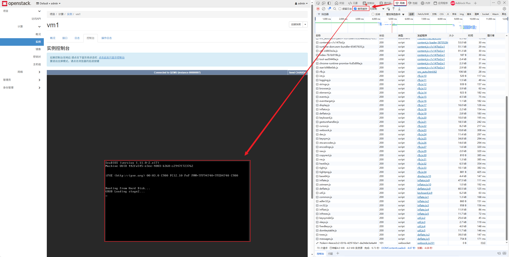

### 3、实例无法正常启动问题

虽然已经能够通过VNC控制台管理实例，但实例本身无法进入系统，这是由于实验环境中的嵌套虚拟化导致的，使用物理设备时不会有这种问题。这个问题可以通过多种方式解决，例如，手动修改image的虚拟化硬件属性，设置image不使用virtio驱动

```bash
[root@controller ~]# openstack image set --property hw_disk_bus=ide --property hw_vif_model=e1000 cirros
```

- hw_disk_bus=ide

  将虚拟机的磁盘控制器类型设置为IDE，这是一种传统磁盘接口标准，适用于兼容旧版操作系统，IDE总线性能较低，但兼容性更好

- hw_vif_model=e1000

  将虚拟机的网卡类型指定为Intel E1000型号，这是一种广泛支持的硬件模拟网卡，适用于需要兼容性或未安装virtio-net驱动的GuestOS，E1000基于全虚拟化，性能低于virtio-net，但通用性更强。如果GuestOS支持virtio-net，建议优先使用virtio-net提高吞吐量

修改image的虚拟化硬件属性后，需要重新创建实例，重新创建的实例则恢复正常

## 三、创建外部网络

通过VNC控制台登录实例后，查看实例的IP，实例通过private网络自动获取到了DHCP地址池中的IP，但此时VM1实例仍是一个信息孤岛，它无法与其他网络实现通信。网络的一个基本知识是，如果要实现跨网段通信，需要具备一个路由设备，因此还需要为VM1实例创建一个Router，但一个虚拟路由器仍无法真正意义上的实现跨网段通信，因此该Router还需要桥接到一个真正的物理网络上

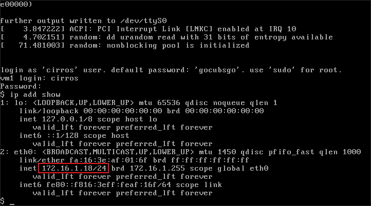

实际上，通过Web控制台创建private网络时，底层同步在Neutron节点和Compute节点上创建了一个网桥，并且vxlan-1绑定到了这个网桥上。此前在安装部署Neutron服务时，在linux bridge agent插件的配置文件中有声明vxlan隧道的源ip，那么在Compute节点上可以实现，VM1实例接入private网络，并通过vxlan隧道将数据转发到Neutron节点，但此时Neutron节点上还没有一个终端可以用于接收VM1实例的数据。因此还需要在Neutron节点上创建一个router，并且还需要将创建的Router绑定到private网络，用于对接vxlan-1隧道网络。

在Neutron节点上创建router后，理论上VM1实例的数据就已经能够正常访问到router，但此时VM1实例的数据仍无法访问到其他网络，因为router作为一个虚拟路由器，它需要桥接到一个物理网卡上以接入物理网络，实验环境中通过router实现VM1实例的互联网访问，因此将router桥接到ens33网卡上。在两个节点上使用`brclt show`即可观察到网桥信息。

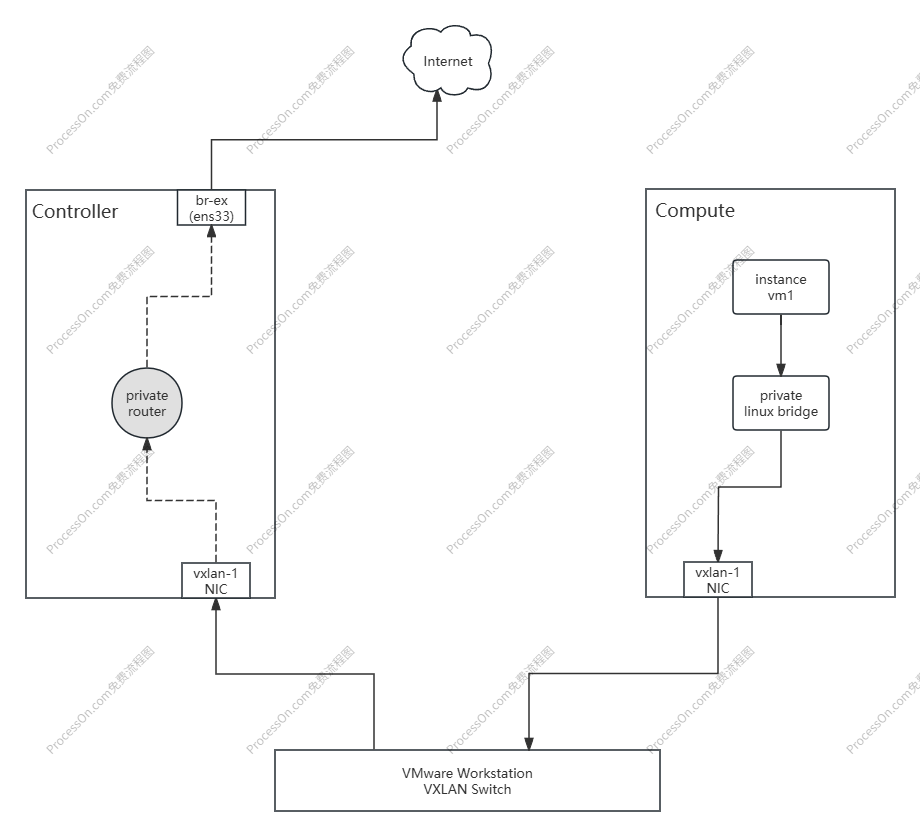


1. [项目] -> [网络] -> [路由] -> [新建路由]；租户新建router，新建Router的操作等同于将上例拓扑中的private router接线到vxlan-1 NIC

   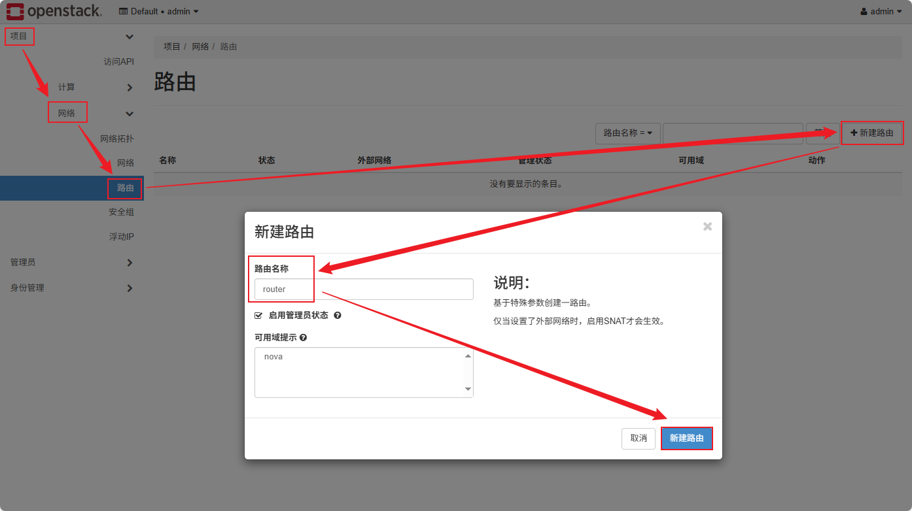

2. [点击路由名称] -> [接口] -> [增加接口] -> [网络]；将router与private网络绑定，绑定接口后可以观察到router的固定IP。新建路由router并绑定private网络的过程，等同于逻辑上将private router与private linux bridge用一条逻辑链路实现互联

   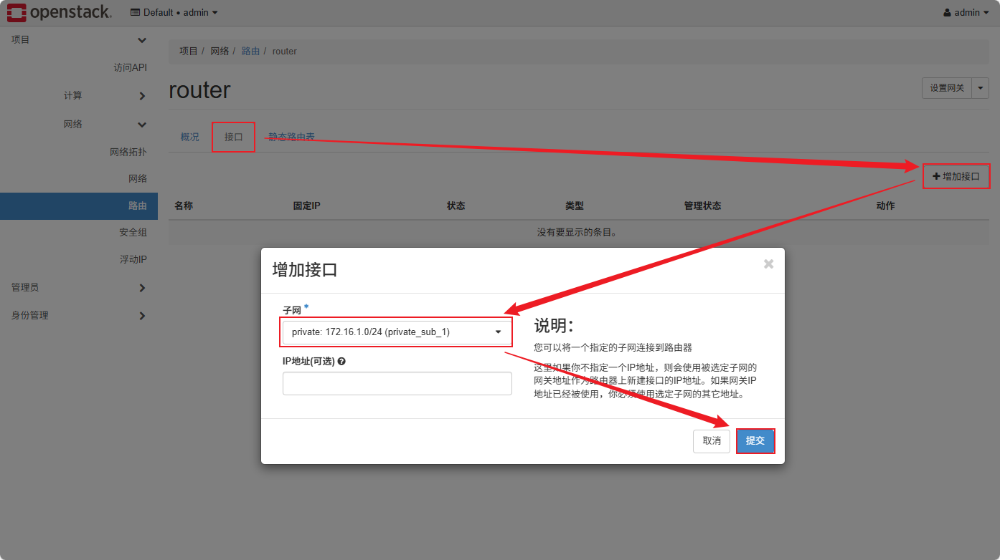

   在创建router子接口的同时，该子接口也关联了子网，在Controller节点上可以观察到此时已经新建了一个namespace

   ```bash
   [root@controller ~]# ip netns
   qdhcp-939b84a1-2245-45e3-886d-7e1ce90c7d8b (id: 1)    # 部署Neutron服务后生成的DHCP namespace
   qrouter-7ec138f2-b899-4408-929c-25f88890958e (id: 0)    # 创建router后生成的router namespace
   
   # 进入该名称空间并启动一个bash进程
   [root@controller ~]# ip netns exec qrouter-7ec138f2-b899-4408-929c-25f88890958e /bin/bash
   [root@controller ~]# ip add show         # 查看namespace的IP信息
   [root@controller ~]# ping 172.16.1.18    # 通过router namespace测试与VM1实例的连通性
   ```

3. 测试VM1实例与router的通信

   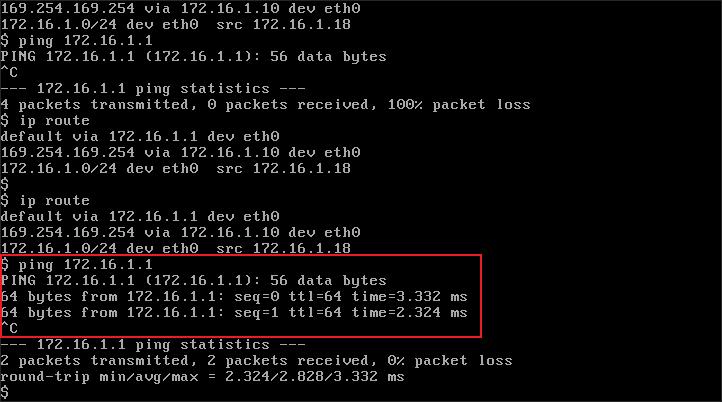

4. [管理员] -> [网络] -> [网络] -> [创建网络]；创建外部网络public

   此时VM1实例已实现与router的通信，但这也就是实例VM1的网络边界了，它无法再进一步的访问互联网，因此还需要通过管理员再创建一个外部网络

   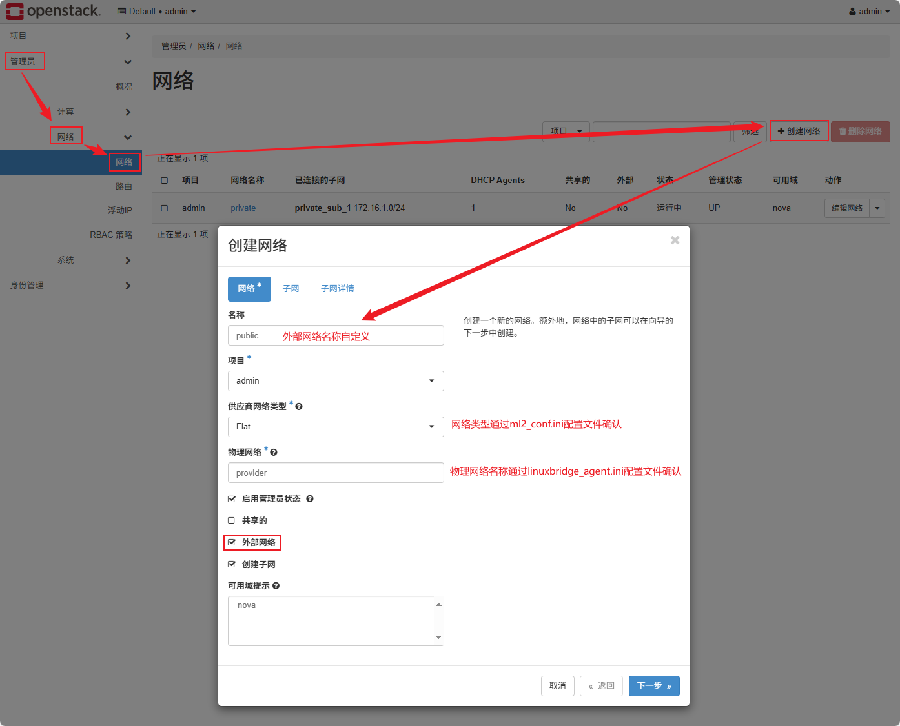

   通过Neutron服务的配置文件可以确认需要创建网络类型

   ```bash
   [root@controller ~]# cat /etc/neutron/plugins/ml2/linuxbridge_agent.ini
   [linux_bridge]
   physical_interface_mappings = provider:ens33    # 通过此配置可以确认网络名称为provider
   
   [root@controller ~]# cat /etc/neutron/plugins/ml2/ml2_conf.ini
   [ml2_type_flat]
   flat_networks = provider    # 通过此配置可以确认创建的网络类型应该是Flat
   ```

5. 配置public外部网络

   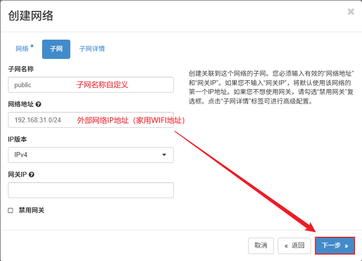

6. 配置public外部网络的地址池；外部网络无需DHCP自动分配，浮动IP皆为手动分配

   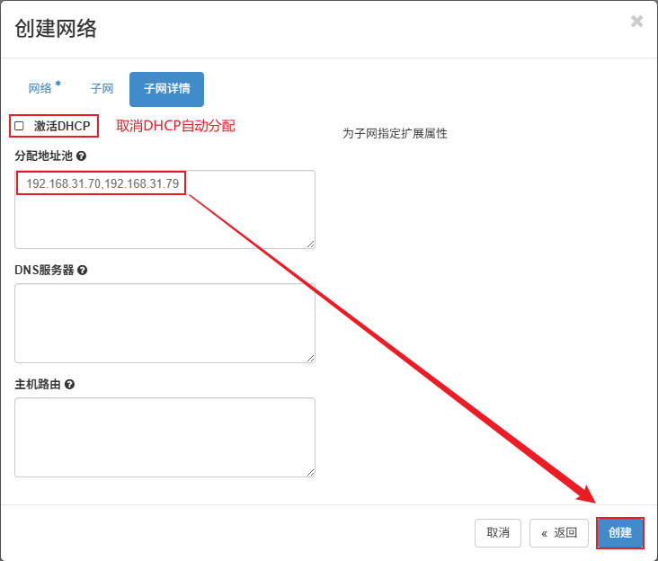

7. [项目] -> [网络] -> [路由] -> [设置网关] -> [选择外部网络] -> [启用SNAT] -> [提交]；调用外部网络

   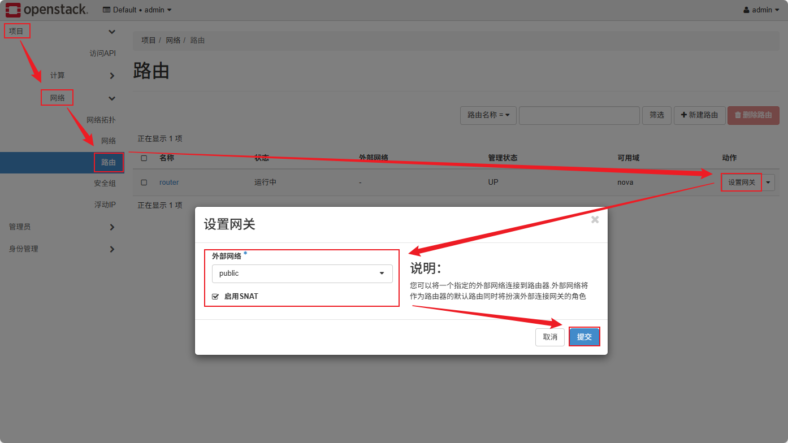

   设置网关的步骤在Neutron节点上新建了一个网桥，并且private router与Neutron节点的外部网络端口ens33都连接在这个网桥上，此时等同于打通了router到外部网络的链路

   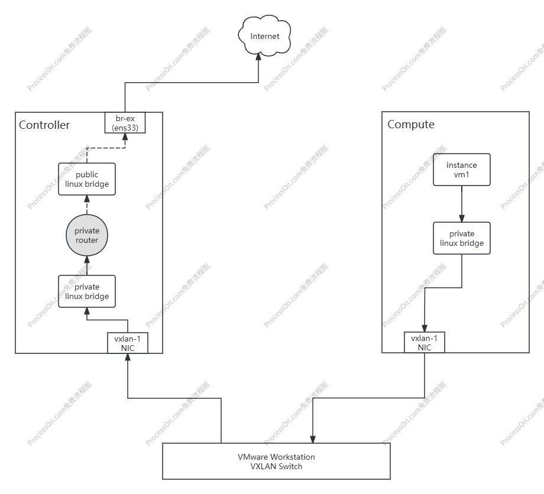

   为router设置网关后，router上会新增一个外部网络的接口，且该外部网络接口会从外部网络地址池中获取一个外网IP，通过router的namespace可以查看到详细信息

   ```bash
   [root@controller ~]# brctl show    # 外部网络的网桥上可以看到router的tap虚拟网卡和Neutron节点的外部网络的网卡ens33
   bridge name     bridge id               STP enabled     interfaces
   brq502d08da-b6          8000.000c293f4c96       no              ens33
                                                           tap7c5d91e1-b7
   brq939b84a1-22          8000.321cfa021ec0       no              tap2c97a10f-24
                                                           tapc001f9db-6a
                                                           vxlan-1
   virbr0          8000.525400c2bce1       yes             virbr0-nic
   
   [root@controller ~]# ip netns exec qrouter-7ec138f2-b899-4408-929c-25f88890958e /bin/bash
   [root@controller ~]# ip add show 
   1: lo: <LOOPBACK,UP,LOWER_UP> mtu 65536 qdisc noqueue state UNKNOWN group default qlen 1000
       link/loopback 00:00:00:00:00:00 brd 00:00:00:00:00:00
       inet 127.0.0.1/8 scope host lo
          valid_lft forever preferred_lft forever
       inet6 ::1/128 scope host 
          valid_lft forever preferred_lft forever
   2: qr-c001f9db-6a@if8: <BROADCAST,MULTICAST,UP,LOWER_UP> mtu 1450 qdisc noqueue state UP group default qlen 1000
       link/ether fa:16:3e:e6:f5:02 brd ff:ff:ff:ff:ff:ff link-netnsid 0
       inet 172.16.1.1/24 brd 172.16.1.255 scope global qr-c001f9db-6a
          valid_lft forever preferred_lft forever
       inet6 fe80::f816:3eff:fee6:f502/64 scope link 
          valid_lft forever preferred_lft forever
   3: qg-7c5d91e1-b7@if15: <BROADCAST,MULTICAST,UP,LOWER_UP> mtu 1500 qdisc noqueue state UP group default qlen 1000    # 新增的外部网络的IP信息，此外部网络地址用于实例的出站SNAT
       link/ether fa:16:3e:c7:c7:c5 brd ff:ff:ff:ff:ff:ff link-netnsid 0
       inet 192.168.31.75/24 brd 192.168.31.255 scope global qg-7c5d91e1-b7
          valid_lft forever preferred_lft forever
       inet6 fe80::f816:3eff:fec7:c7c5/64 scope link 
          valid_lft forever preferred_lft forever
   ```

8. [项目] -> [网络] -> [浮动IP] -> [分配IP给项目]；此时VM1实例已经可以实现访问外部网络，但外部网络仍无法直接访问到该VM1实例，实例还需要一个浮动IP对外提供服务。浮动IP就是从外部网络IP中申请一个地址与实例做关联

   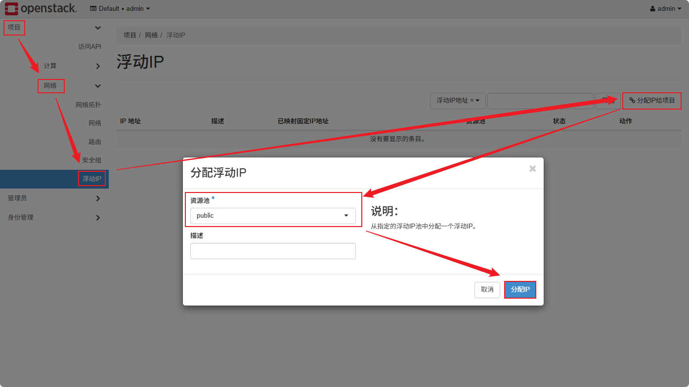

    [项目] -> [计算] -> [实例] -> [绑定浮动IP]；为实例绑定浮动IP，实际上这个浮动IP是绑定在了private router上，当外部请求通过Neutron节点的外网接口将请求转交到router时，router会根据NAT地址表将外部IP映射到具体实例上
    
    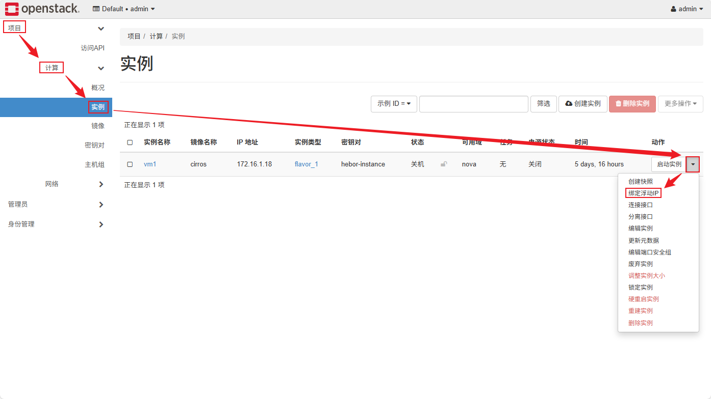
    
    此时观察router的namespace可以看到，router的外部接口上已经存在两个外部IP，一个用于实例出站的SNAT转换，另一个则是浮动IP
    
    ```bash
    [root@controller ~]# ip netns exec qrouter-7ec138f2-b899-4408-929c-25f88890958e /bin/bash
    [root@controller ~]# ip add show 
    1: lo: <LOOPBACK,UP,LOWER_UP> mtu 65536 qdisc noqueue state UNKNOWN group default qlen 1000
        link/loopback 00:00:00:00:00:00 brd 00:00:00:00:00:00
        inet 127.0.0.1/8 scope host lo
           valid_lft forever preferred_lft forever
        inet6 ::1/128 scope host 
           valid_lft forever preferred_lft forever
    2: qr-c001f9db-6a@if8: <BROADCAST,MULTICAST,UP,LOWER_UP> mtu 1450 qdisc noqueue state UP group default qlen 1000
        link/ether fa:16:3e:e6:f5:02 brd ff:ff:ff:ff:ff:ff link-netnsid 0
        inet 172.16.1.1/24 brd 172.16.1.255 scope global qr-c001f9db-6a
           valid_lft forever preferred_lft forever
        inet6 fe80::f816:3eff:fee6:f502/64 scope link 
           valid_lft forever preferred_lft forever
    3: qg-7c5d91e1-b7@if15: <BROADCAST,MULTICAST,UP,LOWER_UP> mtu 1500 qdisc noqueue state UP group default qlen 1000
        link/ether fa:16:3e:c7:c7:c5 brd ff:ff:ff:ff:ff:ff link-netnsid 0
        inet 192.168.31.75/24 brd 192.168.31.255 scope global qg-7c5d91e1-b7
           valid_lft forever preferred_lft forever
        inet 192.168.31.73/32 brd 192.168.31.73 scope global qg-7c5d91e1-b7
           valid_lft forever preferred_lft forever    # 此外部IP用于VM1实例的一对一映射
        inet6 fe80::f816:3eff:fec7:c7c5/64 scope link 
           valid_lft forever preferred_lft forever
    [root@controller ~]# exit
    [root@controller ~]# openstack server list    # 查看实例列表
    ```
    
    >VMware网络须知
    >
    >如果实验环境使用VMware Workstation实现，那么在NAT网络模式下，实例可能无法实现正常连接互联网，OpenStack所使用的外部网络的IP不是由VMware直接分配的，VMware Workstation可能不会对OpenStack所使用的IP做NAT转换。但这不影响实例最远能够访问到本地宿主机IP

9. 验证实例的外部访问

   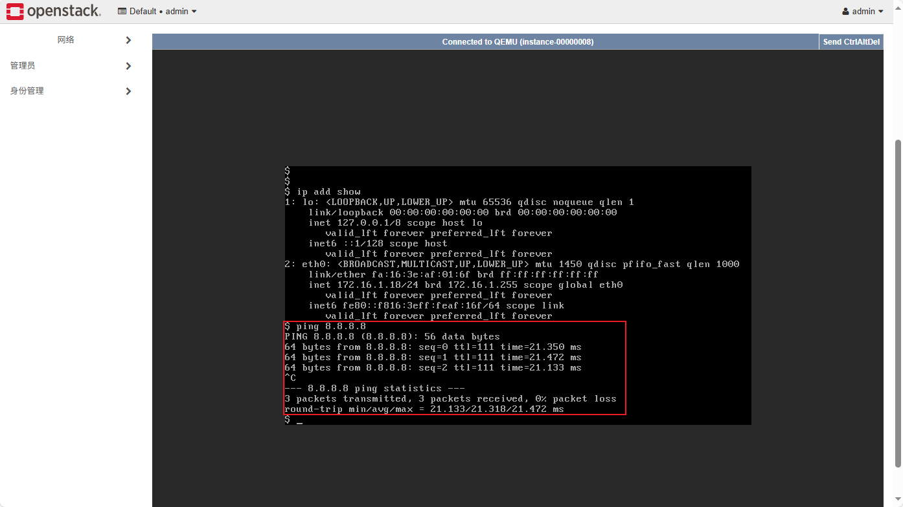

   验证外部访问时需要注意，除了OpenStack的安全组和浮动IP配置需要检查以外，还需要了解image本身的SSH配置，对于不熟悉的image还需要检查下系统是否允许root登录、是否允许密码登录等。此实验目前使用cirros镜像做测试，在cirros系统上没有找到有关SSH服务的配置文件，因此无法测试外部网络SSH连接到cirros上，ICMP测试正常。

## 四、Provider networks网络模型（仅作演示）

**此配置属于不合规操作，仅作学习理解演示作用**

目前的实验环境中使用Self-service networks网络模型，这种网络模型的特点在于，从创建租户网络到创建外部网络的过程，所有步骤都不可省略，所有实例的流量都需要通过Neutron节点出站，这可能会对Neutron节点造成较大压力，这个问题可以通过分布式router解决，或使用provider networks网络模型解决。provider networks模型的网络隔离通过物理网络VLAN实现，相比较之下Self-service networks使用VXLAN实现网络隔离

在OpenStack官方指南上仅描述了每种网络模型的单一的配置步骤，在本实验环境中通过同时配置provider networks和Self-service networks模型来描述两种模型的差异，但在VMware Workstation虚拟化环境下无法对provider networks模型进行验证

在OpenStack官方指南对于provider networks模型的配置中，关于Neutron服务的`/etc/neutron/plugins/ml2/ml2_config.ini`配置文件如下：

```bash
[ml2]
type_drivers = flat,vlan    # 在现有的配置文件中，已经配置了vlan类型
tenant_network_types =      # provider networks模型的租户网络类型指定为空，为空表示禁用租户自定义网络，即禁用Self-service networks
```

**此配置属于不合规操作，仅作学习理解演示作用**

1. 通过VMware Workstation为Controller和Compute节点添加一块网卡，单独用于测试provider networks模型

2. 配置新网卡“ens38”

   ```bash
   [root@controller ~]# nmcli connection delete "Wired connection 1"
   [root@controller ~]# nmcli connection add type ethernet ifname ens38 con-name ens38 autoconnect yes ipv4.method manual ipv4.addresses 10.0.0.1/24
   [root@controller ~]# nmcli connection show
   ```

3. 基于Self-service networks模型的配置文件进行修改，Neutron与Compute节点都需要修改

   ```bash
   [root@controller ~]# vim /etc/neutron/plugins/ml2/ml2_conf.ini
   [ml2]
   type_drivers = flat,vlan,vxlan    # 需要同时具备vlan和vxlan参数
   
   [ml2_type_vxlan]    # 此选项需要type_drivers选项具备vxlan参数的情况下，才会有效
   vni_ranges = 1:1000
   
   [ml2_type_vlan]     # 新增vlan相关配置
   network_vlan_ranges = default:1:1000    # 为vlan网络命名为default，并划分vlan标签ID1~1000
   
   [root@controller ~]# vim /etc/neutron/plugins/ml2/linuxbridge_agent.ini
   [linux_bridge]
   physical_interface_mappings = provider:ens33,default:ens38    # 存在多个映射的情况下，用“,”号分隔
   ```

   
