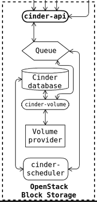

# Cinder

Cinder，OpenStack官方指南对Cinder的定义是Block Storage Service，Cinder为实例提供块存储服务。预置和使用存储的方法由Block Storage驱动程序决定，有多种驱动程序可用：NAS/SAN、NFS、iSCSI、Ceph等。Block Storage API和调度程序服务通常在控制器节点上运行，根据所使用的驱动程序，Volume服务可以在控制器节点、计算节点或独立存储节点上运行

在学习Cinder之前首先需要了解一下什么是Block Storage（块存储）、以及什么是Block Storage Service（块存储服务）

> **Block Storage**

操作系统获得存储空间的方式一般有两种：

1. 通过某种协议（SAS，SCSI，SAN，iSCSI等）挂接裸硬盘，然后分区、格式化、创建文件系统；或者直接使用裸硬盘存储数据（数据库）。这种裸硬盘的方式就是Block Storage，每个裸硬盘通常也称作Volume（卷）
2. 通过NFS、CIFS等协议，直接挂载远程的文件系统。这种直接挂载远程文件系统的方式被称为文件系统存储，NAS和NFS服务器、以及各种分布式文件系统提供的都是这种文件系统存储

> **Block Storage Service**

Block Storage Service提供对Volume从创建到删除整个生命周期的管理。从实例的角度看，挂载的每一个Volume都是一块硬盘。Cinder作为OpenStack的Block Storage Service，其具体功能包括：

1. 提供REST API使用户能够查询和管理Volume、Volume snapshot以及Volume type
2. 提供Scheduler调度Volume创建请求，合理优化存储资源的分配
3. 通过Driver架构支持多种back-end（后端）存储方式，包括LVM、NFS、Ceph和其他诸如EMC、IBM等商业存储产品和方案

## Cinder架构



Cinder服务包含以下几个组件：

- cinder-api

  用于接收和响应客户端的API调用请求，并分析客户端请求的参数是否合法。cinder-api组件需要通过Queue实现与其他组件的通信，对于Cinder服务而言，cinder-api组件是部署在Controller节点上的

- cinder-volume

  管理Volume的组件，与volume provider协调工作，管理Volume的生命周期。运行 cinder-volume组件的节点被称作为存储节点，但cinder-volume组件并不直接提供实际的存储，它实现的功能是通过不同的Driver来对接不同类型的存储

- cinder-scheduler

  Scheduler通过调度算法选择最合适的存储节点创建Volume。cinder-scheduler是考虑到架构中存在多个cinder-volume的场景，即存在多个存储节点的场景下，需要划分一个存储空间时就需要通过Scheduler实现调度

- volume provider

  数据的物理存储设备，为Volume提供物理存储空间。cinder-volume支持多种volume provider，每种volume provider通过自己的driver与cinder-volume协调对接工作。volume provider可以是LVM、Ceph等存储

- Message Queue
  Cinder各个组件通过消息队列实现进程间通信和相互协作。因为有了消息队列，组件之间实现了解耦，这种松散的结构也是分布式系统的重要特征

- Database Cinder

  有一些数据需要存放到数据库中，一般使用MySQL。数据库是安装在控制节点上的，比如在我们的实验环境中，可以访问名称为“cinder”的数据库

## 一、先决条件

1. 数据库配置

   ```bash
   mysql -uroot -predhat
   CREATE DATABASE cinder;
   GRANT ALL PRIVILEGES ON cinder.* TO 'cinder'@'localhost' IDENTIFIED BY 'openstack_cinder';
   GRANT ALL PRIVILEGES ON cinder.* TO 'cinder'@'%' IDENTIFIED BY 'openstack_cinder';
   FLUSH PRIVILEGES;
   ```

2. 创建Cinder服务凭证

   ```bash
   openstack user create --domain default --password openstack_cinder cinder
   openstack role add --project service --user cinder admin
   openstack service create --name cinderv2 --description "OpenStack Block Storage" volumev2
   openstack service create --name cinderv3 --description "OpenStack Block Storage" volumev3
   openstack service list    # 查看服务列表
   ```

3. 为服务实体创建API EndPoint

   ```bash
   openstack endpoint create --region RegionOne volumev2 public http://controller:8776/v2/%\(project_id\)s
   openstack endpoint create --region RegionOne volumev2 internal http://controller:8776/v2/%\(project_id\)s
   openstack endpoint create --region RegionOne volumev2 admin http://controller:8776/v2/%\(project_id\)s
   
   openstack endpoint create --region RegionOne volumev3 public http://controller:8776/v3/%\(project_id\)s
   openstack endpoint create --region RegionOne volumev3 internal http://controller:8776/v3/%\(project_id\)s
   openstack endpoint create --region RegionOne volumev3 admin http://controller:8776/v3/%\(project_id\)s
   ```

## 二、安装配置

1. 安装Cinder

   ```bash
   yum install -y openstack-cinder
   ```

2. 修改Cinder配置文件，连接数据库
