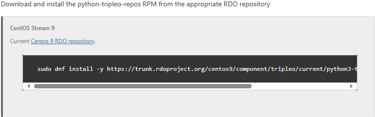

# TripleO

前期手动部署OpenStack的各个服务，是为了解OpenStack各个服务本身的部署过程、关键配置以及各个服务之间的关联关系，然而手动部署的弊端也很明显，各个服务的配置文件复杂易错、部署时间冗长，并且一般情况下在生产环境中Controller节点需要集群部署以确保高可靠性，为了更加便捷的、可靠的部署OpenStack平台，TripleO成为首选工具

TripleO是OpenStack官方推出的自动化部署框架，其核心思想是利用*现有OpenStack云环境*部署和管理*新的OpenStack环境*，TripleO使用“云上云”架构，整个工具框架分为两个部分：**Undercloud（底层云）**、**Overcloud（上层云）**

- Undercloud

  Undercloud本身是一个All in One的OpenStack云环境，它本身具备一个正常的OpenStack云环境所需要的各个服务。在TripleO架构中，Undercloud的角色是**管理云**，它一般部署在一台单独的物理节点或虚拟机实例上。正如TripleO工具的核心思想，Undercloud作为安装和部署Overcloud的工具，也被用于管理Overcloud的生命周期

- Overcloud

  Overcloud的角色是**业务云**，它包含计算、存储、网络等节点，承载实际的工作负载

## 关键服务组件

综上，如果想要通过TripleO工具在生产环境中部署一套OpenStack云环境，首先需要具备一个Undercloud，然后使用Undercloud工具部署Overcloud

- Ironic

  实际上Overcloud环境只需要准备几台裸服务器即可，OpenStack的Ironic服务可以实现裸服务器的生命周期控制，将裸服务器视作”计算实例“纳入云平台进行统一管理。Ironic服务实现了两个重要功能，一是通过IPMI/BMC实现了对裸服务器的电源控制和KVM远程访问、二是通过PXE实现了网络引导部署操作系统，因此Undercloud通过Ironic服务即可实现对裸服务器的生命周期管理，前提是物理节点需要支持带外管理接口，通常是智能平台管理接口IPMI或BMC

- Heat

  在生产环境中，真正能够产生价值的是运行在操作系统之上的应用程序，因此基于Ironic服务完成操作系统的安装并不是最终目的，操作系统安装完成后就需要考虑应用程序的部署。OpenStack的Heat服务通过YAML模板的方式实现各种云资源的自动化部署、配置和管理应用程序，因此Overcloud上的各个OpenStack的服务都可以通过Undercloud的Heat服务实现编排自动化部署

## Undercloud

Undercloud使用OpenStack服务作为它的基本工具组，每个服务都在Undercloud中的一个独立容器内运行，其服务包括：

- OpenStack Identity（keystone）：提供Undercloud组件的验证和授权功能
- OpenStack Bare Metal（Ironic）和OpenStack Compute（Nova）：管理裸机节点
- OpenStack Networking（Neutron）和Open vSwitch：控制裸机节点的网络
- OpenStack Image Service（Glance）：管理Undercloud写入裸机的镜像
- OpenStack Orchestration（Heat）和Puppet：提供对节点的编配功能，并在Undercloud把Overcloud镜像写入磁盘后配置节点
- OpenStack Workflow Service（Mistral）：为特定Undercloud操作提供一组工作流程，例如导入和部署计划。通过Undercloud部署Overcloud要实现的内容很多，这就需要对每一个操作定义一个工作流
- OpenStack Messaging Service（Zaqar）：为OpenStack Workflow Service提供一个消息服务
- OpenStack Object Storage（Swift）：为不同的OpenStack服务组件提供对象存储，包括：
  - 为OpenStack Image Service提供镜像存储
  - 为OpenStack Bare Metal提供内省数据。通过Ironic服务将裸机接入Undercloud平台后，首先需要对硬件资源做检查统计，所有物理节点的硬件资源信息就是内省数据，保存在swift服务中
  - 为OpenStack Wrokflow Service提供部署计划

### 一、Undercloud规划

在部署Undercloud前，必须规划Undercloud主机以确保其满足部署要求

#### 1.1 容器化Undercloud

现在的TripleO版本，Undercloud和Overcloud都使用容器化部署，它们使用相同的架构来拉取、配置和运行容器，这意味着Undercloud从Registry源拉取一组容器镜像、生成容器的配置，然后以容器的形式运行各项OpenStack服务。因此，Undercloud提供一组容器化服务，这些服务可以用作创建和管理Overcloud的工具组。此架构基于Heat服务并使用Ansible配置服务和容器

TripleO所用到的容器管理工具是podman，而非docker；容器镜像可以通过社区版仓库下载，如果使用RHEL并具备订阅权限，也可以使用RHEL专有的镜像，无论使用哪种方式都无需自定义容器镜像，如果业务有特殊要求，也可以实现自定义OpenStack组件的镜像

#### 1.2 Undercloud网络

Undercloud至少需要访问两个主要网络：

- Provisioning网络或Control Plane网络

  这是Undercloud用于PXE和在执行Ansible配置时通过SSH访问物理节点的网络。Provisioning网络用于Undercloud实现PXE网络引导部署操作系统，Control Plane网络用于实现Undercloud到Overcloud节点的SSH访问和Ansible的编排自动化，对然被分为两种网络，但两种网络的功能可以集中到一个网络内实现，在此网络中还应该由Undercloud为物理节点提供DHCP服务，这意味着此网络上不应该存在其他DHCP服务

- External网络

  支持访问OpenStack软件仓库、容器镜像源、DNS服务器、NTP服务器等其他服务器的网络。使用此网络对Undercloud进行标准访问，必须在Undercloud手动配置一个接口以访问外部网络

Undercloud至少需要准备两个网络接口卡，一个用于Provisioning网络或Control Plane网络，一个用于External网络。但实际上Undercloud应该具备三个网络，还有一个网络应该用于IPMI/BMC网络，Undercloud需要连接所有物理节点的带外管理接口。IPMI/BMC网络可以通过External网络实现访问，但不可通过Provisioning网络或Control Plane网络混用

在实验环境中无法提供物理节点的带外管理接口，因此需要通过一个Virtual BMC软件来模拟Undercloud实现对物理节点的电源管理，但Virtual BMC软件要求物理节点需要在同一个宿主机上才能实现模拟电源管理功能。这就意味着在实验环境中不能直接通过VMware Workstation创建多个虚拟机来模拟实验，而是需要通过VMware Workstation创建一台具备足够资源的虚拟机，然后在此虚拟机内部再部署嵌套虚拟化环境，在虚拟机内部再创建子虚拟机，这其中子虚拟机就需要包括Virtual BMC节点

#### 1.3 环境规模

Undercloud上的大部分OpenStack服务会使用一组worker，每个worker执行特定于该服务的一个操作，多个worker提供同步操作。Undercloud上worker的默认数量是Undercloud节点上CPU线程总数的一半，如果Undercloud节点的CPU是16线程，则OpenStack服务默认生成8个worker。Undercloud默认使用一组最小值和最大值限制：

| 服务         | 最小值 | 最大值 |
| ------------ | ------ | ------ |
| Heat         | 4      | 24     |
| 所有其他服务 | 2      | 12     |

Undercloud具有最小CPU和内存要求：

- 支持Intel 64或AMD 64 CPU 扩展的8线程64位x86处理器，这可为每个Undercloud服务提供4个worker

- 最少24G内存

  每10个由Undercloud部署的主机，`ceph-ansible`playbook需要占用1G常驻集合大小（RSS）。如果要在部署中使用新的或现有Ceph集群，您必须相应地置备Undercloud内存

要使用更多的worker，使用以下建议增加的Undercloud的vCPU和内存：

- 最小值：每个线程使用1.5G内存。例如，一台有48线程的机器需要72G内存来为24个heat worker和12个其他服务的worker提供最小的覆盖范围
- 建议值：每个线程使用3G内存。例如，一台有48线程的机器需要144G内存来为24个heat worker和12个其他服务的worker提供建议的覆盖范围

#### 1.4 Undercloud磁盘容量

建议的最小Undercloud磁盘大小是跟磁盘上有100G可用容量：

- 20G用于容器镜像

  Undercloud上的OpenStack服务组件都使用容器化部署，因此Undercloud本身需要从镜像仓库中下载容器镜像，在Undercloud服务部署完成后会自建一个本地镜像仓库，并将Overcloud所需的容器镜像从外部网络拉取并存放在本地镜像仓库中。Overcloud的主机在安装部署过程中，如果需要下载容器镜像，它会从Undercloud的镜像仓库中下载，而不是直接从外部网络拉取镜像

- 10G在节点部署过程中用于QCOW2镜像转换和缓存（PXE镜像缓存）

- 70G或更大空间供常规使用、保存日志和指标以及满足增长需要

#### 1.5 虚拟化支持

Undercloud节点建议使用虚拟机形式部署，RedHat仅支持4个平台上的虚拟化Undercloud：KVM、RHV、Hyper-V、VMware ESX和ESXi。VMware Workstation也可以用于模拟实验

OpenStack官方指南的社区版文档，使用TripleO构建OpenStack云环境都是基于较新的CentOS版本，但较新的CentOS版本可能不支持ceph，例如CentOS Stream 9似乎没有ceph-ansible软件包。因此，实现环境中仍采用CentOS 7版本，通过TripleO工具部署OpenStack Train版本的云环境

### 二、Undercloud部署

#### 2.1 实验环境准备

| 资源                   | 说明                                 |
| ---------------------- | ------------------------------------ |
| 宿主机操作系统版本     | Windows 10                           |
| 虚拟化程序             | VMware Workstation 17 Pro            |
| 虚拟机规格             | 8 vCPU、32G vMEM、3 vNIC、120G vDisk |
| 虚拟机操作系统版本     | CentOS-7-x86_64-DVD-2009             |
| 虚拟机操作系统安装软件 | Server with GUI                      |
| OpenStack版本          | Train                                |

实现环境中Undercloud节点建议使用8个vCPU、24G内存、3个网卡的虚拟机部署，如果懒得计算24G内存的大小，也可以直接使用32G内存，vCPU数量调整需要谨慎，更多的vCPU意味着需要更大的内存，且如果对Undercloud节点的磁盘分区没有特殊要求的话，建议根分区至少需要挂载100G容量

| 网络          | 网卡  | 网络连接名称 | IP规划            |
| ------------- | ----- | ------------ | ----------------- |
| Control Plane | ens34 | provisioning | 192.168.0.43/24   |
| External      | ens33 | external     | DHCP              |
| IPMI/BMC      | ens35 | ipmi         | 192.168.104.43/24 |

#### 2.2 先决条件

系统安装完成后首先需要检查libvirtd服务是否设置为自启动，如果该服务出于启动状态，务必需要停止该服务。在KVM虚拟化场景下，libvirtd服务是用于管理虚拟机的主要守护进程，当libvirtd服务启动时会自动创建一个名为virbr0的虚拟网桥，并启动一个dnsmasq进程用于为该网桥实现轻量级的DNS和DHCP服务的管理，这意味着dnsmasq实际上是libvirtd的一个子服务

停止libvirtd服务，本质上是为了解决端口冲突和服务隔离问题，Undercloud在部署时会自动自己的dnsmasq服务，用于管理Overcloud节点的PXE引导和DHCP分配，若libvirtd的dnsmasq已占用53端口，Undercloud的dnsmasq将因端口冲突而无法启动，导致部署失败

```bash
[root@undercloud ~]# systemctl disable --now libvirtd
```

#### 2.3 安装部署

##### 2.3.1 基本环境准备

Undercloud旨在与SELinux enforcing一起正常工作，不建议将SELinux设置为permissive/disabled后进行安装，undercloud_enable_selinux_conf选项控制该设置

```bash
# 禁用防火墙
[root@undercloud ~]# systemctl disable --now firewalld

# 创建一个专有用户，并为其设置免密的sudo权限
[root@undercloud ~]# useradd stack
[root@undercloud ~]# echo stack:redhat | chpasswd
[root@undercloud ~]# echo "stack ALL=(root) NOPASSWD:ALL" | tee -a /etc/sudoers.d/stack
[root@undercloud ~]# chmod 0440 /etc/sudoers.d/stack

# 配置宿主机的FQDN
[root@undercloud ~]# hostnamectl set-hostname undercloud.example.com
[root@undercloud ~]# hostnamectl set-hostname --transient undercloud.example.com    # 
[root@undercloud ~]# echo "127.0.0.1 undercloud.example.com undercloud" >> /etc/hosts
```

##### 2.3.2 软件仓库准备

OpenStack官方指南中提供的是CentOS Stream 9的tripleo-repos RPM包的下载地址，实验环境中使用CentOS 7版本的操作系统，由于RDO官方从2024年起停止为CentOS 7构建新的tripleo-repos RPM包，因此RDO官网地址`trunk.rdoproject.org`已移除CentOS 7目录，CentOS 7的tripleo-repos RPM包无法再通过官方途径安装



tripleo-repos软件包本身只是一个用于管理YUM仓库的工具，通过这个工具管理多个OpenStack版本和Ceph版本的YUM仓库源，它用于实现启用指定软件版本的YUM仓库。例如，通过`tripleo-repos -b train current ceph`命令实现部署OpenStack的Train版本和Ceph

基于以上情况，使用tripleo-repos工具的最终目的也只是为了部署软件的YUM仓库源，实验环境下至少具备两种方式处理tripleo-repos RPM的问题，一是通过第三方平台获取tripleo-repos RPM包、二是跳过tripleo-repos RPM包的安装，转而直接手动部署软件包的YUM仓库，本实验环境中采用第二种方式处理

```bash
# 删除CentOS 7镜像自带的YUM源
[root@controller ~]# \rm /etc/yum.repos.d/*

# 下载阿里云YUM源
[root@controller ~]# curl -o /etc/yum.repos.d/CentOS-Base.repo https://mirrors.aliyun.com/repo/Centos-7.repo
[root@controller ~]# yum install -y centos-release-openstack-train

# 修改OpenStack的YUM源配置，统一使用阿里云的YUM源仓库
[root@undercloud ~]# sed -i \
> -e 's/mirrorlist/#mirrorlist/g' \
> -e 's|#baseurl=http://mirror.centos.org|baseurl=http://mirrors.aliyun.com|g' \
> /etc/yum.repos.d/CentOS-OpenStack-train.repo
[root@undercloud yum.repos.d]# yum repolist
[root@undercloud yum.repos.d]# yum upgrade -y && reboot
```

##### 2.3.3 安装TripleO客户端工具

```bash
[root@undercloud ~]# yum install -y python2-tripleoclient.noarch
yum install -y ceph-ansible
```

##### 2.3.4 安装Undercloud

```bash
su - stack    # 安装undercloud必须以stack账户执行
cp /usr/share/python-tripleoclient/undercloud.conf.sample ~/undercloud.conf    # 拷贝undercloud配置模板文件

# 准备容器镜像下载
openstack tripleo container image prepare default \
--local-push-destination \
--output-env-file ~/containers-prepare-parameter.yaml
```

