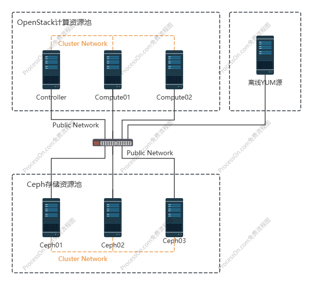

# OpenStack

OpenStack，一个开源的云计算管理平台，又称为云操作系统。属于IaaS（基础设施即服务）层，旨在为公有云或私有云提供可扩展的、弹性伸缩的计算、存储、网络资源，其中，计算资源通过虚拟机的方式提供，在OpenStack平台中，虚拟机又被称为实例

## 一、OpenStack架构

架构可以帮助我们站在高处看清事物的整体结果，避免过早的进入细节而迷失方向

从OpenStack架构图中基本上就能看到OpenStack中的所有重要模块（OpenStack官方称其为服务，下文统一使用服务这个术语）。OpenStack最终要对用户提供计算资源，而计算资源又是以虚拟机实例的形式提供，因此在架构图中可以看到所有的服务最终都是围绕VMs的。

1. Keystone：身份认证服务，提供用户权限管理和API访问控制；

   任何一个用户（包含租户用户或服务用户）要访问OpenStack时，都需要先通过Keystone的身份认证和授权，认证通过才能登录、授权通过才能使用资源。

2. Glance：镜像服务，提供虚拟机镜像文件的管理功能；

   虚拟机镜像文件（image）又称为虚拟机模板，管理功能则是指的image的上传、下载、搜索等功能，image实际上就是一个包含了操作系统的磁盘文件，被称为模板。

   Glance服务本身并不提供镜像文件的存储，因此Glance服务需要对接存储资源，例如Ceph、GlusterFS、本地目录等，从架构图中可以看到Glance服务有一个箭头指向Swift服务，Swift服务用于提供分布式对象存储。

3. Nova：计算服务，管理实例的生命周期；

   管理实例的生命周期则意味着虚拟机的创建、调度、迁移等操作都是由Nova服务完成的，从架构图中可以看到Nova有一个箭头直接指向了VMs。

   显而易见的，如果Nova服务需要完成对实例的生命周期的管理，那么它就必须对接虚拟化技术。Nova服务提供如CPU、内存资源等计算资源，因此它也被称为计算节点，而实际上这些计算资源都是由Nova所对接的虚拟化技术提供的。OpenStack是一个异构的平台，它可以通过不同的插件（或称为驱动）可以接入不同的虚拟化技术，例如KVM、VMware、FusionCompute等虚拟化技术。

   虚拟化技术的接入都由Nova服务实现，Nova可以通过不同虚拟化技术厂家提供的插件来接入不同的虚拟化技术，Nova本身可以接入的虚拟化技术有很多种，KVM是Nova接入的最多的虚拟化技术。当然，各个云厂商也有自己的云OS，例如华为自己的云OS架构下的Nova就有一个专门的驱动用于接入自己的FusionCompute虚拟化技术

   至此，Nova服务的功能分2大块，**对下需要通过不同的插件接入各种虚拟化技术、对上需要提供实例的生命周期管理**。

4. Cinder：块存储服务，为虚拟机提供持久化存储卷（volume），对于实例而言，volume就类似虚拟硬盘；

   与Glance服务类似，Cinder服务实现的是对持久化块存储资源的管理，也就是说Cinder服务本身并不提供存储资源，他需要与实际的存储设备或服务对接，然后将后端存储空间调度给实例，提供持久化块存储。

   与Nova服务类似，Cinder服务也需要通过不同的插件或驱动对接不同类型的后端存储，例如，通过Cinder对接Ceph、LVM、FC SAN、FusionStorage。相对而言对接FusionStrorage比较困难，需要拿到FusionStrorage的驱动

5. Neutron：网络服务，负责虚拟网络的构建与管理，支持子网划分、负载均衡和防火墙策略；

6. Horizon：Web 控制台，提供可视化界面管理云资源；

7. Ironic：裸金属服务器全生命周期管理服务，提供裸机即服务（BMaaS）；

   通过自动化技术和标准API实现物理机的电源控制、操作系统部署、硬件配置等操作，将物理机资源纳入云平台统一管理，使其成为云资源池的一部分

   Ironic服务依赖几个核心技术：IPMI/BMC、PXE、DHCP/TFTP。通过IPMI/BMC实现服务器远程电源控制和KVM访问、通过PXE实现网络引导部署系统、通过DHCP/TFTP分配临时IP并传输引导文件。通过Ironic服务可以实现直接向裸金属服务器安装系统，并将物理服务器视作OpenStack的一个实例进行管理

   OpenStack的自动化安装工具TripleO在实现上云部署的过程中，就利用到了Ironci的裸金属的功能，当然，TripleO不仅仅使用到了Ironic提供的裸金属功能，还用到了Heat的提供的编排功能

8. Heat：基础设施编排服务，通过模板化方式实现云资源的自动化部署、配置和管理；

9. Swift：分布式对象存储服务；

   分布式对象存储服务适用于大规模非结构化数据的存储场景，例如虚拟机镜像、图片、视频、日志等。与Cinder服务不同的是，Swift本身就是存储服务，从架构图中可以看到Glance、Cinder服务都有箭头直接指向Swift服务，Glance服务可以通过Swift服务存储镜像、Cinder服务可以通过Swift服务提供持久化存储

在整个OpenStack架构中，真正必不可少的核心服务只有前5个，Horizon服务提供友好的Web控制台页面，但通过命令行同样可以实现OpenStack的管理

## 二、OpenStack逻辑结构

现在，OpenStack的核心服务明确了，接下来将视角放低，看看核心服务的内部组成结构。实际上OpenStack有一个更加复杂的逻辑结构，当你需要去了解和设计OpenStack系统架构时，就必须清楚OpenStack的逻辑结构。

在逻辑结构中可以看到每个服务又由若干组件构成，以Glance服务为例，Glance服务中就包含`glance-api`、`galnce-registry`、`glance-database`三个组件。作为初学者而言，在OpenStack的逻辑结构中只需要关注两点

1. 消息队列

   OpenStack由多个服务组合而成，而每个服务内部又包含了多个组件，几乎所有的服务内的各个组件之间都需要通过消息队列进行通信。例如Nova服务，在OpenStack逻辑结构中，Nova服务内部包含`nova-scheduler`、`nova-console`、`nova-cert`等组件，但这些组件之间大多并不直接通信，而是通过消息队列`Queue`实现通信

   消息队列的优势在于解耦和分布式，例如将一个服务的多个组件部署在不同的节点上，通常情况下各个服务的API组件会部署在Controller节点上

2. API

   除了Neutron服务以外，OpenStack的每个服务都有自己的API组件，Neutron服务同样需要一个API组件，只不过Neuturn的API组件被集成到了`neutron-server`组件中。服务内部的多个组件之间需要通过消息队列通信，而不同的服务之间则需要通过各个服务的API组件进行通信

   服务的API组件会对外监听，API接口收到请求后会对请求的资源做解析，解析请求参数正常后API组件会将请求消息写入`Queue`，这个服务内的其他组件如果和请求的资源相关联，那么该组件自然会从`Queue`中订阅、消费消息，从而做下一步处理，最终的处理结果仍由API接口返回

OpenStack本身就是一个分布式系统，不但各个服务可以分布部署，服务中的组件也可以分布部署。这种分布式特性让OpenStack具备极大的灵活性、伸缩性和高可用性。当然从另一个角度讲，这也使得OpenStack比一般系统复杂，学习难度也更大。

## 三、OpenStack部署

一个OpenStack平台的部署，首要的事情就是集群规划

### 3.1 实验环境说明

- 宿主机操作系统：Windows 10 64位专业版
- 宿主机使用软件：VMware Workstation 17 Pro
- OpenStack版本：Train
- Ceph版本：14.2.22（Nautilus）
- 虚拟机操作系统：CentOS-7-x86_64-DVD-2009

### 3.2 实验规划

#### 3.2.1 组网规划

OpenStack节点与Ceph节点之间使用Cluster Network通信，Public Network作为Compute节点的外网和管理网络，VXLAN网络没有体现在组网规划中

#### 3.2.2 VMware虚拟机规划

<table>
  <tr>
    <th>节点类型</th>
    <th>CPU</th>
    <th>磁盘</th>
    <th>内存</th>
    <th>Provider IP（公共网络）</th>
    <th>vxlan隧道IP（租户网络）</th>
    <th>集群网络</th>
  </tr>
  <tr>
    <td>虚拟机模板</td>
    <td>4</td>
    <td>sda/300G</td>
    <td>8G</td>
    <td>192.168.31.238/24</td>
    <td></td>
    <td></td>
  </tr>
  <tr>
    <td>本地YUM源仓库</td>
    <td>2</td>
    <td>sda/300G</td>
    <td>4G</td>
    <td>192.168.31.239/24</td>
    <td></td>
    <td>192.168.0.239/24</td>
  </tr>
  <tr>
    <td>Controller</td>
    <td>8</td>
    <td>sda/300G</td>
    <td>8G</td>
    <td>192.168.31.40/24</td>
    <td>172.16.31.40/24</td>
    <td>192.168.0.40/24</td>
  </tr>
  <tr>
    <td>Compute01</td>
    <td>8</td>
    <td>sda/300G、sdb/50G</td>
    <td>8G</td>
    <td>192.168.31.41/24</td>
    <td>172.16.31.41/24</td>
    <td>192.168.0.41/24</td>
  </tr>
  <tr>
    <td>Compute02</td>
    <td>8</td>
    <td>sda/300G、sdb/50G</td>
    <td>8G</td>
    <td>192.168.31.42/24</td>
    <td>172.16.31.42/24</td>
    <td>192.168.0.42/24</td>
  </tr>
  <tr>
    <td>Ceph01</td>
    <td>4</td>
    <td>sda/300G、sdb/100G、sdc/100G、sdd/100G</td>
    <td>8G</td>
    <td>192.168.31.90/24</td>
    <td></td>
    <td>192.168.0.90/24</td>
  </tr>
  <tr>
    <td>Ceph02</td>
    <td>4</td>
    <td>sda/300G、sdb/100G、sdc/100G、sdd/100G</td>
    <td>8G</td>
    <td>192.168.31.91/24</td>
    <td></td>
    <td>192.168.0.91/24</td>
  </tr>
  <tr>
    <td>Ceph03</td>
    <td>4</td>
    <td>sda/300G、sdb/100G、sdc/100G、sdd/100G</td>
    <td>8G</td>
    <td>192.168.31.92/24</td>
    <td></td>
    <td>192.168.0.92/24</td>
  </tr>
</table>

在宿主机配置不够的情况下，Compute节点与Ceph节点的内存配置可以适当降低，并在VMware虚拟机上启用与内存容量一致的Swap分区，避免VMware虚拟机OOM。生产环境下只建议在Compute节点上分配Swap，且不宜过大，避免影响实例性能。某些场景下不建议分配Swap分区，使用到Swap分区时会影响到应用程序的性能，且由Swap分区引起的性能问题比较难通过应用程序的日志排查出来

虚拟机模板在完成系统安装以及相关参数设置以后就可以关闭，此虚拟机仅作模板克隆用，使用模板的目的是保证所有主机软件包及参数一致。生产环境一般使用cobbler或kickstart无人值守来完成系统安装及参数设置

#### 3.2.3 节点职责

**Controller**

控制器节点运行 Identity service（身份服务）、Image service（镜像服务）、Placement service（放置服务）、Compute的管理服务、Neutron的管理服务、Horizon服务。它还包括其他支撑服务，如SQL数据库、消息队列和NTP。Compute的管理服务、Neutron的管理服务，基本上都是API组件，OpenStack每个服务内部的组件通信需要用到消息队列

**Compute**

计算节点运行操作实例的虚拟机管理程序部分。默认情况下，Compute使用KVM虚拟机管理程序。计算节点还运行网络服务代理，该代理将实例连接到虚拟网络，并通过安全组为实例提供防火墙服务。

**Block Storage**

可选的块存储节点包含块存储和共享文件系统服务为实例调配的磁盘。为简单起见，计算节点和该节点之间的服务流量使用管理网络。生产环境应该实施单独的存储网络，以提高性能和安全性。可以部署多个数据块存储节点。

#### 3.2.4 网络类型

- Provider networks

  Provider networks，以最简单的方式部署OpenStack网络服务，主要采用第2层（桥接/交换）服务和VLAN网络分段。本质上，它将虚拟网络连接到物理网络，并依赖物理网络基础设施提供第3层（路由）服务。此外，DHCP服务向实例提供IP地址信息。OpenStack用户需要更多关于底层网络基础设施的信息，以创建与基础设施完全匹配的虚拟网络。

- Self-service networks

  Self-service networks，通过第3层（路由）服务增强了提供商网络选项，支持使用覆盖分段方法（如VXLAN）的自助服务网络。本质上，它使用NAT将虚拟网络路由到物理网络。此外，该选项为LBaaS和FWaaS等高级服务提供了基础。OpenStack用户可以在不了解数据网络底层基础设施的情况下创建虚拟网络。如果相应地配置了第2层插件，这也可以包括VLAN网络。